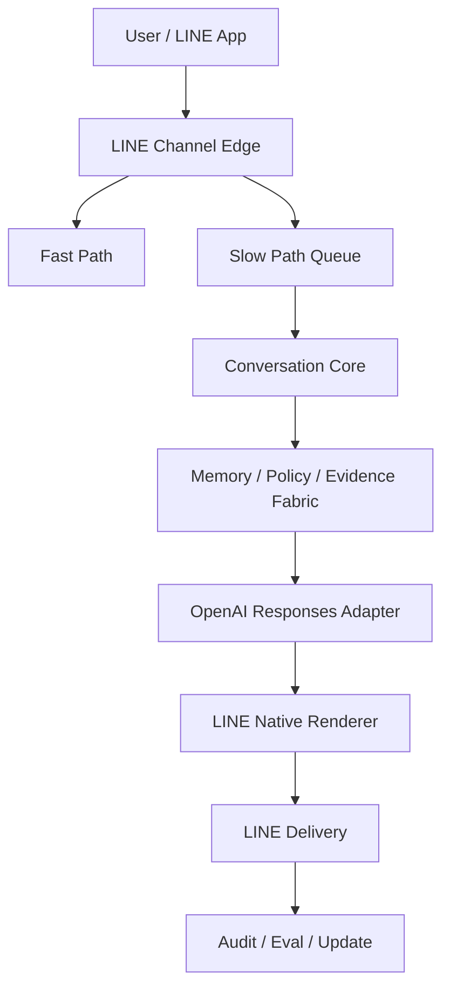
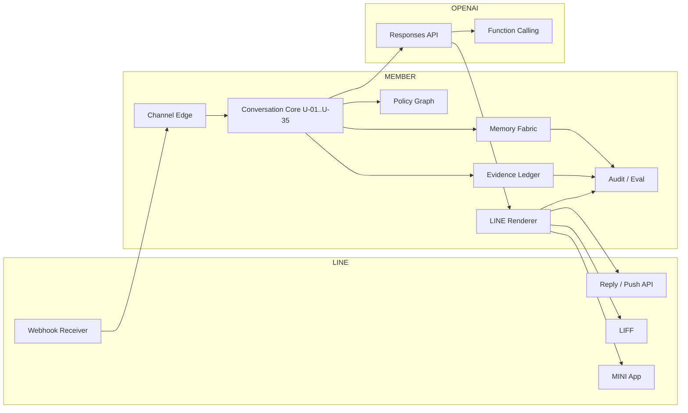
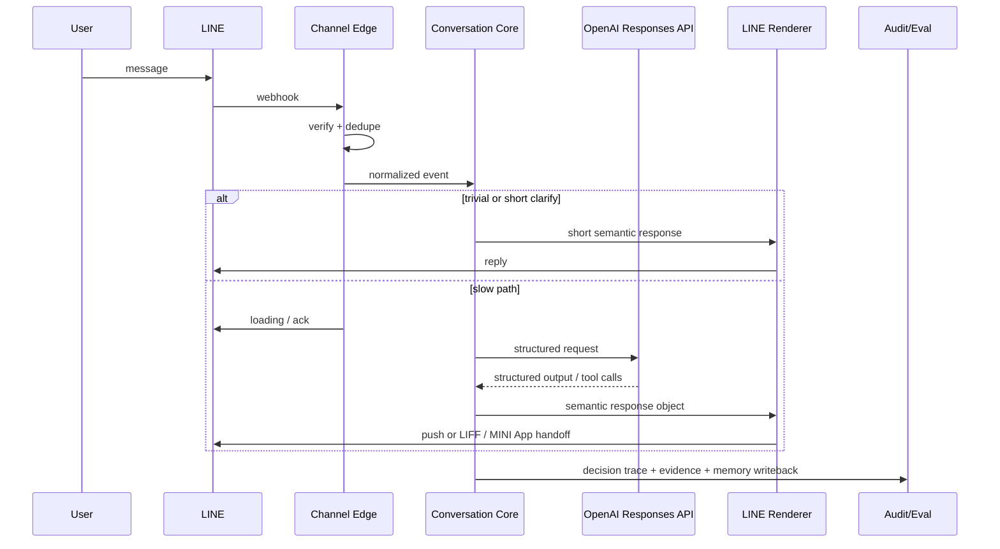
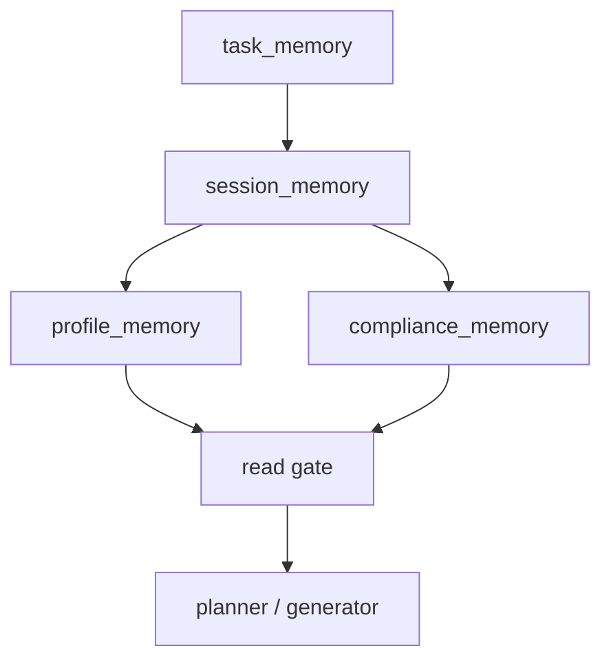
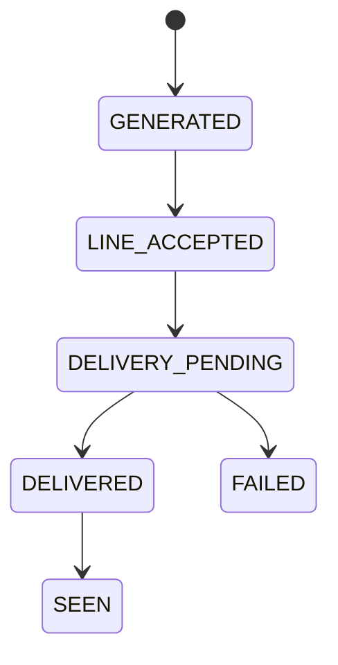

# Member LINE × OpenAI API LLM統合仕様 V1

## 0. 文書情報

- 文書名: Member LINE × OpenAI API LLM統合仕様
- 版数: V1.0
- 文書ID: MEMBER-LINE-OPENAI-CONV-ENGINE-V1
- 親仕様: `MEMBER-US-AZ-LLM-CONTRACT-001`
- 更新日: 2026-03-08
- ステータス: Draft for implementation
- 主対象: Member 米国赴任AtoZ支援Bot
- インターフェース前提: LINE公式アカウント / Messaging API / LIFF / LINE MINI App
- LLM実行前提: OpenAI Responses API / Structured Outputs / Function Calling

---

## 1. 目的

本仕様は、Memberプロジェクトにおいて、**LINEを唯一の主要会話インターフェース**とし、**OpenAI APIを推論ランタイム**として採用する前提で、制度正確性・日本語応対品質・文化適合・運用統制を両立するための統合会話エンジンを定義する。

この仕様の目的は次の4点である。

1. ユーザーが「次の一手」を迷わず理解できる応答を返す。
2. 公式ソース優先・監査可能・再現可能な処理を行う。
3. 日本語の文化・習慣・心理距離・配慮を設計上の制御対象にする。
4. LINEの技術制約と OpenAI API の実装制約を最上位前提として、破綻しない構造を定義する。

---

## 2. スコープ

### 2.1 含むもの

- LINE公式アカウント上の1:1相談
- LINE group / room での限定的な一般相談
- LIFF / LINE MINI App による構造化入力
- 米国赴任AtoZ支援における制度説明、手順整理、草案生成、限定的支援
- 監査ログ、証拠台帳、メモリ制御、エスカレーション制御

### 2.2 含まないもの

- 法律・税務・医療の最終助言
- 申請の代理提出
- 送金、契約締結、採否判断、診断
- 口コミを根拠とする断定
- LINE以外を主導線とするUX設計

---

## 3. 仕様原則

### 3.1 基本原則

- **Official First**: 制度判断は一次情報を優先する。
- **LINE Native**: 長文で押し切らず、surface を分ける。
- **Culture Before Generation**: 文化・習慣・配慮は生成直前ではなく計画前に決定する。
- **Scoped Memory**: task / session / profile / compliance を分離する。
- **Evidence Before Fluency**: 流暢さより根拠を優先する。
- **Action Gated**: assist 以上は確認必須、人間専用領域は突破させない。
- **Counterexample Driven**: 反例とドリフトを仕様に戻す。
- **Additive Compatibility**: 親仕様の deterministic spine を壊さず拡張する。

### 3.2 主従関係

本仕様では、責務を以下のように分ける。

- **LINE**: チャネル、配送、surface、Webhook
- **OpenAI API**: 推論、構造化生成、関数呼び出し
- **Member**: メモリ、ポリシー、監査、証拠、最終描画

---

## 4. 親仕様から継承する要素

本仕様は、親仕様 `MEMBER-US-AZ-LLM-CONTRACT-001` の以下を**そのまま継承**する。

### 4.1 Source of Truth 順序

1. `TIER0_LAW_FORM`
2. `TIER1_OFFICIAL_OPERATION`
3. `TIER2_PUBLIC_DATA`
4. `TIER3_VENDOR`
5. `TIER4_COMMUNITY`

### 4.2 Product 定義

- 名称: `Member 米国赴任AtoZ支援Bot`
- ミッション: ユーザーの状況を case facts に落とし込み、公式ソースと rule_set に基づいて次の一手を返す

### 4.3 Non-goals

- 法律・税務・医療の最終助言
- 申請の代理提出
- 口コミを根拠とする断定

### 4.4 既存 enums

#### lifecycle_stage
- PRE_ASSIGNMENT
- PRE_DEPARTURE
- ENTRY_TRAVEL
- ARRIVAL_0_7
- ARRIVAL_0_30
- SETTLEMENT_30_90
- STEADY_STATE
- RENEWAL_CHANGE
- RETURN_REPAT

#### intent_type
- NEXT_STEP
- HOW_TO
- DOCUMENTS_REQUIRED
- ELIGIBILITY_CHECK
- DEADLINE_CHECK
- STATUS_EXPLANATION
- STATE_RULE_DIFF
- TIMELINE_PLAN
- BLOCKER_HELP
- EXCEPTION_ESCALATION
- COST_ESTIMATE
- RETURN_PLAN
- GENERAL_OVERVIEW

#### answer_mode
- ACTION_PLAN
- CHECKLIST
- EXPLANATION
- COMPARISON
- WARNING_ONLY
- ESCALATION_NOTICE
- TIMELINE
- REVERSE_LOOKUP

#### risk_level
- LOW
- MEDIUM
- HIGH
- CRITICAL

#### freshness_status
- FRESH
- NEAR_STALE
- STALE
- UNKNOWN

#### authority_tier
- TIER0_LAW_FORM
- TIER1_OFFICIAL_OPERATION
- TIER2_PUBLIC_DATA
- TIER3_VENDOR
- TIER4_COMMUNITY

### 4.5 既存 routing

#### chapters
- A: Assignment Blueprint
- B: Before Departure
- C: Crossing the Border
- D: Day 0-7
- E: Essentials 0-30
- F: Family
- G: Getting Settled
- H: Health & Insurance
- I: Immigration Lifecycle
- J: Job & Workplace
- K: Kids & Education
- L: Lease & Housing
- M: Money & Credit
- N: Numbers & IDs
- O: Ongoing Ops
- P: Protection & Emergencies
- Q: Quality of Life
- R: Return / Reassignment
- S: State & City Overlays
- T: Tax
- U: Utilities & Connectivity
- V: Vehicles & Driving
- W: Work Authorization of Family
- X: Exceptions & Escalations
- Y: Your Docs Vault
- Z: Zero-day Troubleshooting

#### domain_to_chapter
- immigration: I
- entry: C
- arrival: D
- ssn_payroll: E
- housing: L
- family: F
- school: K
- health: H
- tax: T
- dmv_id: N
- driving_vehicle: V
- safety: P
- reverse_lookup: Z

### 4.6 既存 case fact priority

1. document_verified
2. operator
3. intake_form
4. user_message
5. system_inferred

### 4.7 既存 required_core_facts

- assignment_type
- planned_entry_date
- assignment_start_date
- destination_state
- destination_city
- primary_visa_class
- dependents_present
- housing_stage
- school_needed_flag
- spouse_work_intent

### 4.8 既存 response contract

必須項目:
- intent
- stage
- answer_mode
- tasks
- warnings
- citations
- response_markdown

task fields:
- task_id
- title
- status
- priority
- due_at
- required_docs
- blockers

### 4.9 既存 golden personas

- GP-01: L-1 + L-2S + 子2人 + CA + 到着10日目
- GP-02: E-2 + spouse + TX + 渡航前
- GP-03: H-1B + H-4 + NY + 到着25日目
- GP-04: J-1 + J-2 + MA + school search
- GP-05: 帰任直前 + lease termination + school withdrawal

---

## 5. 新規 enums

### 5.1 channel_surface
- chat_1to1
- chat_group
- chat_room
- liff
- mini_app
- push_reentry

### 5.2 service_surface
- text
- quick_reply
- flex
- liff
- mini_app
- push
- service_message

### 5.3 action_class
- lookup
- draft
- assist
- human_only

### 5.4 confidence_band
- HIGH
- MEDIUM
- LOW
- UNKNOWN

### 5.5 handoff_state
- NONE
- OFFERED
- REQUIRED
- IN_PROGRESS
- COMPLETED

### 5.6 chat_mode
- NORMAL
- TEMPORARY
- GROUP_GENERIC
- LIFF_FORM
- WORKFLOW

---

## 6. 技術前提と制約

### 6.1 LINE 側の前提

#### Webhook
- 非同期処理を前提とする。
- 署名検証を必須とする。
- bot server が長時間 webhook を受けられない状態を作らない。
- `webhookEventId` を使用して重複排除を行う。
- `deliveryContext.isRedelivery` を記録する。

#### reply / push
- reply message は `replyToken` を使う。
- 1回の送信で最大 5 message objects。
- 長い処理は reply path に載せない。
- loading animation を利用できる構造を持つ。

#### テキスト制約
- text / textV2 は最大 5000 文字。
- 文字数は UTF-16 code units でカウントする。
- 表示上の文字数ではなく、API上の文字数で検証する。

#### Rate limit
- endpoint ごとの channel 単位 rate limit を考慮する。
- 再試行は `X-Line-Retry-Key` を用いる。
- accepted と delivered は別状態で管理する。

### 6.2 LIFF 側の前提

- LIFF は chat コンテキストから起動されることがある。
- `liff.sendMessages()` は現在の chat room に対してのみ有効。
- 1回の送信で最大 5 message objects。
- template / Flex の user send では webhook が来ない可能性がある。
- したがって、LIFF からの送信結果に依存した状態更新は行わない。

### 6.3 LINE MINI App 側の前提

- 継続ワークフローの主面として使用する。
- verified app では service message を利用できる。
- token の寿命と送信上限を考慮する。

### 6.4 OpenAI 側の前提

- 新規実装は **Responses API** を使用する。
- **Assistants API は新規採用しない**。
- OpenAI アプリ製品の memory や personality controls を前提にしない。
- 出力は **Structured Outputs** による JSON Schema 準拠とする。
- 外部操作は Function Calling でのみ行う。
- Member 側で tool allowlist を管理する。

### 6.5 禁止前提

以下の前提を仕様上禁止する。

- ChatGPT の UI memory がそのまま API 実装に存在する前提
- 長い推論を webhook reply path で安全に処理できる前提
- LIFF 由来の送信が必ず webhook を発火する前提
- 200 / 202 が配信保証である前提
- group chat で profile memory を個別最適化に使ってよい前提

---

## 7. 全体アーキテクチャ

## 7.1 全体図



## 7.2 詳細責務図



### 7.3 Fast Path / Slow Path 分離

#### Fast Path の目的
- 受理を返す
- 1〜2件の確認質問を返す
- 安全な短文を返す
- loading animation を起動する

#### Slow Path の目的
- 完全な retrieval を行う
- verification を通す
- OpenAI 推論を実行する
- push / LIFF / MINI App へ最適化して返す

---

## 8. コンポーネント仕様

## 8.1 既存ユニット

| ID | Name | Owner | Role |
|---|---|---|---|
| U-01 | Message Normalizer | llm | 入力正規化 |
| U-02 | Intent Classifier | llm | 意図分類 |
| U-03 | Fact Extractor | llm | facts 抽出 |
| U-04 | Missing Fact Prioritizer | llm | 欠落 facts 整理 |
| U-05 | Lifecycle Resolver | deterministic | stage 決定 |
| U-06 | Domain Router | deterministic | chapter 振分 |
| U-07 | Source Filter Builder | deterministic | source 制約生成 |
| U-08 | Query Builder | llm | 検索クエリ生成 |
| U-09 | Evidence Retriever | deterministic | 候補取得 |
| U-10 | Evidence Ranker | deterministic | 候補選別 |
| U-11 | Freshness & Authority Gate | deterministic | freshness / authority 判定 |
| U-12 | Rule Evaluator | deterministic | 適用タスク判定 |
| U-13 | Task Planner | deterministic | 実行順序計画 |
| U-14 | Exception Detector | deterministic | 例外検出 |
| U-15 | Safety Gate | deterministic | 安全制御 |
| U-16 | Citation Assembler | deterministic | citation 生成 |
| U-17 | Response Renderer | llm | 中間応答生成 |
| U-18 | Audit Logger | deterministic | 監査記録 |

## 8.2 追加ユニット

| ID | Name | Owner | Role |
|---|---|---|---|
| U-19 | Conversation State Manager | deterministic | thread 状態管理 |
| U-20 | Culture & Habit Engine | hybrid | 文化・習慣制御 |
| U-21 | Tone Governor | deterministic | 文体制約 |
| U-22 | Clarification Strategist | llm | 確認質問設計 |
| U-23 | Supervisor Planner | deterministic | subtask 制御 |
| U-24 | Specialist Agent Registry | deterministic | specialist 割当 |
| U-25 | Memory Writeback Policy | deterministic | 書戻し制御 |
| U-26 | LINE Interaction Policy | deterministic | surface 決定 |
| U-27 | LINE Channel Renderer | deterministic | LINE payload 生成 |
| U-28 | Satisfaction Estimator | hybrid | 満足度推定 |
| U-29 | Cultural Adherence Evaluator | hybrid | 文化適合評価 |
| U-30 | Counterexample Watcher | deterministic | 反例検知 |
| U-31 | Drift & Update Manager | deterministic | 更新監視 |
| U-32 | Human Handoff Manager | deterministic | handoff 制御 |
| U-33 | Evidence Ledger Manager | deterministic | 証拠台帳管理 |
| U-34 | Group Chat Privacy Gate | deterministic | group privacy 制御 |
| U-35 | Surface Experiment Controller | deterministic | A/B surface 実験 |

---

## 9. 会話処理パイプライン

## 9.1 正式処理順序

1. InboundEvent 受信
2. 署名検証
3. 重複排除
4. source type 判定
5. chat_mode 判定
6. Message Normalizer
7. Intent Classifier
8. Fact Extractor
9. Missing Fact Prioritizer
10. Lifecycle Resolver
11. Domain Router
12. Group Chat Privacy Gate
13. Culture & Habit Engine
14. Tone Governor
15. Clarification Strategist
16. Source Filter Builder
17. Query Builder
18. Evidence Retriever
19. Evidence Ranker
20. Freshness & Authority Gate
21. Rule Evaluator
22. Task Planner
23. Exception Detector
24. Safety Gate
25. Supervisor Planner
26. OpenAI Responses Adapter
27. Citation Assembler
28. LINE Interaction Policy
29. LINE Channel Renderer
30. Memory Writeback Policy
31. Audit Logger
32. Satisfaction / Cultural / Counterexample 評価
33. Drift & Update Manager

## 9.2 シーケンス図



---

## 10. Memory Fabric 仕様

## 10.1 メモリ種別

### task_memory
- 目的: 現在タスクの作業記憶
- 主内容:
  - current_goal
  - missing_slots
  - constraints
  - selected_options
- TTL: task_end

### session_memory
- 目的: セッション内の文脈保持
- 主内容:
  - clarification_history
  - user_decisions
  - shown_options
  - unresolved_items
- TTL: session_retention_policy

### profile_memory
- 目的: 長期前提と好み
- 主内容:
  - language_preference
  - family_structure
  - recurring_constraints
  - communication_style
  - recurring_destinations
- TTL: until_delete_or_review

### compliance_memory
- 目的: 監査・証跡・リスク記録
- 主内容:
  - source_snapshot_refs
  - effective_dates
  - confirmations
  - action_class_used
  - escalations
  - disclaimers_shown
- TTL: policy_defined

## 10.2 メモリ制御ルール

- temporary mode では profile_memory 書き込み禁止
- group chat では profile_memory 読み取りを原則禁止
- profile_memory は current turn を上書きしない
- 削除された source に依存する cache は無効化する
- retrieval は lane-scoped とする
- speculative trait は保存しない

## 10.3 メモリ構造図



---

## 11. Policy Graph 仕様

## 11.1 action_class 定義

### lookup
- 説明のみ
- 制度説明
- 必要書類案内
- 期限確認
- 比較

### draft
- 草案生成のみ
- メール草案
- 申請文面草案
- 質問リスト草案
- 自動送信は禁止

### assist
- 低リスク支援
- 実行前に確認必須
- evidence_pass 必須
- policy_pass 必須

### human_only
- 人間対応のみ
- 最終提出禁止
- 送金禁止
- 契約締結禁止
- 診断禁止
- 高リスク判断禁止

## 11.2 group privacy ルール

- group chat は `GROUP_GENERIC` を既定とする
- profile_memory 読み取りは off を既定とする
- sensitive workflow は LIFF へ移す
- PII を chat 上で反復しない

---

## 12. Culture & Habit Engine 仕様

## 12.1 目的

Culture & Habit Engine は、日本語・文化・心理距離・配慮を**計画前に決定**するための制御層である。

## 12.2 入力

- lane
- lifecycle_stage
- user_profile
- counterparty_type
- urgency
- emotion_state
- line_surface
- local_time
- seasonality_context

## 12.3 出力

- honorific_level
- relationship_distance
- directness_level
- empathy_order
- burden_budget
- face_saving_mode
- wabi_sabi_mode
- bilingual_mode
- reassurance_bandwidth
- apology_mode

## 12.4 運用定義

### honorific_level
- casual
- polite
- business_polite
- administrative_polite

### relationship_distance
- close
- friendly
- work_peer
- manager
- institution
- authority

### directness_level
- direct
- softened
- indirect

### empathy_order
- emotion_first
- facts_first
- blended

### burden_budget
- minimal
- balanced
- detailed

### face_saving_mode
- off
- moderate
- strong

### wabi_sabi_mode
- off
- subtle
- strong

## 12.5 侘び寂びの proxy 定義

本仕様では「侘び寂び」を美学概念としてではなく、応対上の proxy として使う。

- 言い切りすぎない
- 情報を詰め込みすぎない
- 選べる余白を残す
- 静かな簡潔さを優先する

## 12.6 文化安全ルール

- 文化推定で属性を固定しない
- 過去の好みを現在の意思として決め打ちしない
- 感情推定が低信頼なら tone のみ軽く反映し、行動判断には使わない

---

## 13. LINE Native Rendering 仕様

## 13.1 surface 選択基準

### text
使用条件:
- 単純回答
- 1〜2件の確認質問
- 短い警告

### quick_reply
使用条件:
- yes / no
- 3〜8択
- 州・時期・対象者の分岐

### flex
使用条件:
- 比較
- チェックリスト
- タイムライン
- citation summary

### rich_menu
使用条件:
- 恒常導線
- lane切替
- 人間サポート導線
- 書類庫導線

### LIFF
使用条件:
- 構造化フォーム
- 書類アップロード
- 提出前レビュー
- sensitive intake

### MINI App
使用条件:
- 継続ワークフロー
- 予約
- 申込
- 状況確認
- 再訪導線

### push / service_message
使用条件:
- 期限通知
- slow path 完成回答
- 未完了フォロー
- 再入場リマインド

## 13.2 rendering rules

- 1メッセージ1目的
- 長文回答より surface 分割を優先
- multi-field 入力は text で完結させない
- group chat では個人最適化を弱める
- sensitive lane は chat で詳細 PII を聞かず LIFF に移す
- 5000文字・5 message objects を renderer で必ず検査する

---

## 14. OpenAI Adapter 仕様

## 14.1 採用 API

- Responses API
- Structured Outputs
- Function Calling
- Streaming

## 14.2 出力方針

OpenAI には自然文の最終回答を直接作らせない。OpenAI の責務は次とする。

- semantic response object の生成
- clarification candidate の生成
- retrieval query の補強
- allowlisted function の呼び出し提案

## 14.3 OpenAI への入力

- normalized_message
- resolved facts
- lifecycle_stage
- domain
- approved evidence
- memory read pack
- cultural controls
- output schema

## 14.4 OpenAI からの出力

- schema-compliant JSON
- optional tool call request
- optional confidence hints

## 14.5 禁止事項

- OpenAI 出力をそのまま LINE に流さない
- tool schema に human_only 操作を公開しない
- ChatGPT product memory を前提に設計しない

---

## 15. Semantic Response Object 仕様

```yaml
SemanticResponseObject:
  intent: string
  stage: string
  answer_mode: string
  action_class: lookup|draft|assist|human_only
  confidence_band: HIGH|MEDIUM|LOW|UNKNOWN
  service_surface: text|quick_reply|flex|liff|mini_app|push|service_message
  handoff_state: NONE|OFFERED|REQUIRED|IN_PROGRESS|COMPLETED
  tasks:
    - task_id: string
      title: string
      status: string
      priority: string
      due_at: datetime|null
      required_docs: list
      blockers: list
  warnings: list
  evidence_refs: list
  follow_up_questions: list
  memory_read_scopes: list
  memory_write_scopes: list
  response_chunks: list
```

## 15.1 既存 contract との互換性

- 既存 `response_markdown` は最終生成物ではなく、renderer 用中間表現から導出する
- 既存必須項目は残す
- 新規項目は加法的に追加する

---

## 16. Safety / Escalation 仕様

## 16.1 must_escalate 条件

- risk_level = CRITICAL
- freshness_status = STALE かつ regulated lane
- authority floor 未満
- detected_exception が severe
- human_only 操作要求
- emotional distress が高く安全リスクあり

## 16.2 disclaimer rules

- 法律・税務・医療の最終判断では disclaimer 必須
- 公式ソースが取得不能なら不確実性を明示
- stale 情報の可能性がある場合は date を必ず出す

## 16.3 Human Handoff Packet

handoff packet には以下を含む。

- user summary
- current stage
- lane
- asked question
- facts used
- evidence refs
- blocked reason
- recommended next human action

---

## 17. Audit / Evidence Ledger 仕様

## 17.1 必須監査項目

- audit_event_id
- webhookEventId
- channel_surface
- chosen_service_surface
- action_class
- stage
- facts_used
- facts_missing
- evidence_snapshot_ids
- citations
- disclaimers_shown
- confirmation_events
- handoff_state
- decision_trace

## 17.2 Evidence Ledger

証拠台帳には以下を格納する。

- source_url
- source_tier
- snapshot_id
- retrieved_at
- effective_date
- jurisdiction
- freshness_status
- authority_status
- dependent_answer_ids

## 17.3 Delivery state

### states
- GENERATED
- LINE_ACCEPTED
- DELIVERY_PENDING
- DELIVERED
- FAILED
- SEEN

### state machine



---

## 18. Evaluation Harness 仕様

## 18.1 offline evaluation

- factuality_by_lane
- citation_coverage
- clarification_precision_recall
- task_resolution_prediction
- keigo_appropriateness
- perceived_empathy_score
- cultural_adherence_score
- line_surface_selection_accuracy

## 18.2 online evaluation

- self_resolution_rate
- liff_completion_rate
- quick_reply_tap_rate
- repeat_usage_rate
- user_correction_rate
- escalation_appropriateness
- abandonment_rate

## 18.3 adversarial evaluation

- stale_source_injection
- contradictory_source_swap
- memory_conflict_case
- prompt_injection_in_retrieved_text
- emoji_noise_short_utterance
- group_chat_privacy_probe
- action_without_confirmation_probe

## 18.4 scoring dimensions

| Dimension | Weight |
|---|---:|
| factuality | 0.30 |
| procedural_utility | 0.20 |
| japanese_service_quality | 0.15 |
| empathy | 0.10 |
| cultural_fit | 0.10 |
| line_fit | 0.10 |
| governance | 0.05 |

## 18.5 release gates

数値閾値は `release_profile.yaml` 側で管理する。本仕様では gate の存在のみ固定する。

- factuality_pass
- process_adherence_pass
- perceived_empathy_min
- cultural_fit_min
- minority_segment_no_critical_drop
- line_surface_pass
- governance_no_critical_fail

---

## 19. Counterexample Register

### CE-01 Memory overreach
- 過去の好みを現在の意思と誤認
- stale family state の適用
- 対策: current turn 優先、profile review prompt、temporary mode

### CE-02 Audit gap
- provider native audit に依存しすぎる
- 対策: own audit ledger、evidence refs、decision trace

### CE-03 Minority dissatisfaction
- 多数派最適化で少数派ユーザー満足を落とす
- 対策: persona-segmented evaluation、minority_risk_flag

### CE-04 Culture blind output
- 翻訳としては正しいが日本語として不自然
- 対策: Culture & Habit Engine、Cultural Adherence Evaluator

### CE-05 Strong talk / weak act
- 会話は自然だが agentic action が失敗
- 対策: talk_score と act_score の分離、assist confirmation gate

### CE-06 Over-clarification on LINE
- 質問が多く、離脱が増える
- 対策: burden_budget、choice formatting、LIFF handoff

### CE-07 Group privacy leak
- group で個別最適化が漏れる
- 対策: group generic mode、profile read off

### CE-08 Stale source lock-in
- 古い official source を引きずる
- 対策: freshness gate、source drift monitor、dependent cache invalidation

---

## 20. 運用更新モデル

## 20.1 cadence

### daily
- official source freshness scan
- critical policy change detection

### weekly
- counterexample triage
- prompt / tone regression review

### monthly
- lane quality report
- minority segment review
- line surface performance review

### quarterly
- source registry recertification
- provider capability reassessment
- culture engine recalibration

## 20.2 watchlist

### provider trends
- OpenAI memory / confirmation controls
- Google personalization / memory bank / tool governance
- Anthropic memory / search / MCP
- Microsoft enterprise memory governance
- AWS policy / evaluations / multi-agent / memory
- LINE Official Account / LIFF / MINI App product changes

### research trends
- empathetic dialogue evaluation
- minority-aware satisfaction estimation
- cross-cultural conversational benchmarks
- Japanese empathy datasets
- agentic evaluation frameworks

---

## 21. ロールアウト計画

### Phase 1: safe_answering
- lookup + draft
- culture engine lite
- text + quick reply + flex

### Phase 2: guided_workflow
- LIFF handoff
- assist with confirmation
- scoped profile memory

### Phase 3: persistent_concierge
- MINI App workflows
- advanced personalization
- surface experiments
- counterexample-driven update loop

---

## 22. 未解決論点

- wabi_sabi_mode の評価 proxy をどの指標で固定するか
- minority satisfaction labels をどの運用セグメントで切るか
- group chat で profile memory を例外許可する条件
- LIFF と MINI App の境界
- human handoff の lane別 SLA
- response_markdown をどこまで残し、どこから semantic object に完全移行するか

---

## 23. 正式化の判断

本仕様 V1 は、以下を満たした時点で正式採用とみなす。

1. 親仕様の deterministic spine と互換である
2. LINE 制約が architecture 上で最上位に置かれている
3. OpenAI API は Responses API 前提で定義されている
4. memory / policy / audit を Member が所有している
5. 実装チームが I/O を解釈できる粒度で定義されている
6. release gate と counterexample register が仕様に埋め込まれている

---

## 24. 次文書

V1 の次に作成する文書は以下とする。

1. `semantic_response_object.schema.json`
2. `fast_path_slow_path_state_machine.md`
3. `U-20_to_U-27_io_contract.md`
4. `release_profile.yaml`
5. `counterexample_regression_suite.md`

---

## 25. 参考仕様・公式ドキュメント

### LINE
- Messaging API overview: https://developers.line.biz/en/docs/messaging-api/overview/
- Receiving messages (webhook): https://developers.line.biz/en/docs/messaging-api/receiving-messages/
- Sending messages: https://developers.line.biz/en/docs/messaging-api/sending-messages/
- Text character count: https://developers.line.biz/en/docs/messaging-api/text-character-count/
- Messaging API reference: https://developers.line.biz/en/reference/messaging-api/
- LIFF overview: https://developers.line.biz/en/docs/liff/overview/
- LINE MINI App introduction: https://developers.line.biz/en/docs/line-mini-app/discover/introduction/
- LINE MINI App reference: https://developers.line.biz/en/reference/line-mini-app/

### OpenAI
- Responses API migration guide: https://developers.openai.com/api/docs/guides/migrate-to-responses/
- Structured Outputs guide: https://developers.openai.com/api/docs/guides/structured-outputs/
- Function calling guide: https://developers.openai.com/api/docs/guides/function-calling/
- Responses API reference: https://developers.openai.com/api/reference/responses/overview/

### Parent Spec
- `MEMBER-US-AZ-LLM-CONTRACT-001` (uploaded YAML contract pack)

