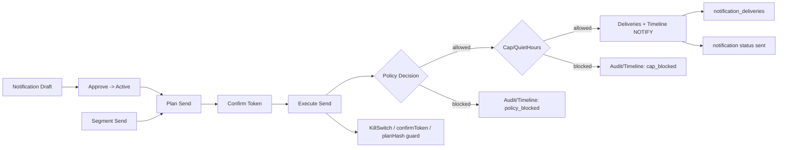

# 管理UI再設計（2026基準）設計・構造・実装計画

## Summary
- 既存の静的HTML/JS構成を維持しつつ、通知運用構造（カテゴリ/頻度/ステップ/抑制/証跡）を可視化する情報設計を行う。
- UI文言は `docs/ADMIN_UI_DICTIONARY_JA.md` に追加登録してSSOTを維持する。
- 2026年基準の信頼感UIを、データ密度・明確な危険警告・AI表示ラベル・レスポンシブ階層で実現する。

## Public Interfaces / Types
- 既存APIの意味変更は行わない方針。
- 必須表示項目を満たすための追加I/O候補（要確認）:
  - `read-model` に `notificationCategory` `policyDecision` `capSummary` `suppressionSummary` `targetCount` `trackingEnabled` を合流する構成案。
  - `ops`/`composer` で表示する `policyDecision` / `capDecision` / `quietHours` / `planHash` / `confirmToken` の要素は既存の監査ログ・plan実行結果に基づきUI表示のみで利用。

## Assumptions / Defaults
- UI実装は静的HTML + バニラJSのまま行う（ユーザー回答）。
- UI文言の新規追加は `docs/ADMIN_UI_DICTIONARY_JA.md` に登録する（ユーザー回答）。
- ブランド品質評価は 1-5 段階で評価する（ユーザー回答）。

---

# 出力形式（設計・計画の最終形）

## 1. 現状通知運用構造マップ

### 構造マップ（図解テキスト）

根拠:
- Draft/Approve/Plan/Executeの流れ: `/Users/parentyai.com/Projects/Member/apps/admin/composer.html:30-114` `/Users/parentyai.com/Projects/Member/src/usecases/adminOs/approveNotification.js:12-23` `/Users/parentyai.com/Projects/Member/src/usecases/adminOs/planNotificationSend.js:35-105` `/Users/parentyai.com/Projects/Member/src/usecases/adminOs/executeNotificationSend.js:142-255`
- Policy判定: `/Users/parentyai.com/Projects/Member/src/domain/notificationPolicy.js:55-121`
- Cap/QuietHours判定: `/Users/parentyai.com/Projects/Member/src/domain/notificationCaps.js:94-223` `/Users/parentyai.com/Projects/Member/src/usecases/notifications/checkNotificationCap.js:12-155`
- delivery・status更新: `/Users/parentyai.com/Projects/Member/src/usecases/notifications/sendNotification.js:108-206`
- 監査/タイムライン: `/Users/parentyai.com/Projects/Member/docs/ADMIN_UI_DICTIONARY_JA.md:60-65`

### 通知運用構造（抽出）
- 通知カテゴリ定義: `DEADLINE_REQUIRED` / `IMMEDIATE_ACTION` / `SEQUENCE_GUIDANCE` / `TARGETED_ONLY` / `COMPLETION_CONFIRMATION`
  根拠: `/Users/parentyai.com/Projects/Member/src/domain/notificationCategory.js:3-9`
- 通知状態: `draft` / `active` / `sent`
  根拠: `/Users/parentyai.com/Projects/Member/docs/ADMIN_UI_DICTIONARY_JA.md:29-33` `/Users/parentyai.com/Projects/Member/src/usecases/adminOs/approveNotification.js:12-23` `/Users/parentyai.com/Projects/Member/src/usecases/notifications/sendNotification.js:204-206`
- ステップ通知構造: scenarioKey=`A`/`C`, stepKey=`3mo`/`1mo`/`week`/`after1w`, 順序は `STEP_ORDER`
  根拠: `/Users/parentyai.com/Projects/Member/docs/ADMIN_UI_DICTIONARY_JA.md:53-55` `/Users/parentyai.com/Projects/Member/src/domain/constants.js:12-22` `/Users/parentyai.com/Projects/Member/src/usecases/notifications/createNotification.js:36-41`
- セグメント条件:
  - 通知送信の対象抽出: scenarioKey/stepKey/region/membersOnly/limit
    根拠: `/Users/parentyai.com/Projects/Member/src/usecases/adminOs/planNotificationSend.js:39-49` `/Users/parentyai.com/Projects/Member/src/repos/firestore/usersRepo.js:83-108`
  - Opsセグメント抽出: readinessStatus/needsAttention/hasMemberNumber/redacStatus/lineUserIds
    根拠: `/Users/parentyai.com/Projects/Member/src/usecases/phase66/buildSendSegment.js:92-145`
- 頻度制御・抑制:
  - Caps: perUserWeeklyCap / perUserDailyCap / perCategoryWeeklyCap / quietHours
    根拠: `/Users/parentyai.com/Projects/Member/src/domain/notificationCaps.js:45-223`
  - quietHoursはUTCで判定
    根拠: `/Users/parentyai.com/Projects/Member/src/domain/notificationCaps.js:80-88`
  - cap判定理由: `quiet_hours_active`, `per_user_daily_cap_exceeded`, `per_user_weekly_cap_exceeded`, `per_category_weekly_cap_exceeded` 等
    根拠: `/Users/parentyai.com/Projects/Member/src/domain/notificationCaps.js:125-207`
- policyDecision / reasonCode:
  - Policy判定理由: `policy_not_configured`, `invalid_notification_category`, `notification_category_required`, `notification_category_not_allowed`, `allowed`
    根拠: `/Users/parentyai.com/Projects/Member/src/domain/notificationPolicy.js:61-121`
  - reasonCodeは Ops 決定の任意文字列として保存
    根拠: `/Users/parentyai.com/Projects/Member/src/usecases/phase24/recordOpsNextAction.js:64-71`
- notification_deliveries ログ構造
  根拠: `/Users/parentyai.com/Projects/Member/docs/DATA_MAP.md:55-66` `/Users/parentyai.com/Projects/Member/src/repos/firestore/deliveriesRepo.js:5-210`

### 通知ライフサイクル
1. Draft作成: `createNotification` で `status=draft`
   根拠: `/Users/parentyai.com/Projects/Member/src/usecases/notifications/createNotification.js:52-68`
2. Approve: `status=active`
   根拠: `/Users/parentyai.com/Projects/Member/src/usecases/adminOs/approveNotification.js:12-23`
3. Plan Send: `planHash`/`confirmToken` 生成
   根拠: `/Users/parentyai.com/Projects/Member/src/usecases/adminOs/planNotificationSend.js:52-105`
4. Execute Send: policy/cap/killSwitchを評価
   根拠: `/Users/parentyai.com/Projects/Member/src/usecases/adminOs/executeNotificationSend.js:148-255`
5. Send完了: `status=sent`
   根拠: `/Users/parentyai.com/Projects/Member/src/usecases/notifications/sendNotification.js:204-206`

### 誤運用リスク箇所（証拠付き）
- policy未設定時は許可扱い
  根拠: `/Users/parentyai.com/Projects/Member/src/domain/notificationPolicy.js:61-70`
- cap未設定時は許可扱い
  根拠: `/Users/parentyai.com/Projects/Member/src/domain/notificationCaps.js:105-123`
- quietHours中は送信ブロック
  根拠: `/Users/parentyai.com/Projects/Member/src/domain/notificationCaps.js:125-139`
- confirmToken不一致/planHash不一致は送信失敗
  根拠: `/Users/parentyai.com/Projects/Member/src/usecases/adminOs/executeNotificationSend.js:137-146`
- killSwitch ON は送信停止
  根拠: `/Users/parentyai.com/Projects/Member/src/usecases/adminOs/executeNotificationSend.js:203-208` `/Users/parentyai.com/Projects/Member/docs/SSOT_ADMIN_UI_OS.md:15-16`
- delivery重複は skip
  根拠: `/Users/parentyai.com/Projects/Member/src/usecases/notifications/sendNotification.js:108-129`

---

## 2. UX評価結果（評価軸＋現状評価）

評価尺度: 1〜5（1=悪い、3=許容、5=優秀）

| 評価軸 | 定義 | 現状観測（根拠） | 現状スコア |
| --- | --- | --- | --- |
| 学習時間 | 非エンジニアが初回で主要操作を理解するまでの時間 | 操作説明は最小で、結果はJSON表示が中心（例: composer/ops/read-model） | 2 |
| 誤送信確率 | 誤送信や意図しない送信に至る確率 | confirmToken/killSwitch/planHashのガードあり | 3 |
| 操作ステップ数 | 1目的達成までの操作ステップ数 | Composerは draft→preview→approve→plan→execute の5段階 | 3 |
| 状態の可視性 | ポリシー/キャップ/抑制/証跡の見える化 | cap/policy/quietHoursはUIで直接可視化されていない | 2 |
| 復旧容易性 | 問題発生後に復旧できる導線の有無 | Masterに recovery、Errorsに再送誘導 | 3 |
| 情報過多度 | 1画面での情報量過多による理解阻害 | Ops Console に多セクションが集中 | 2 |

根拠:
- UI表示構成: `/Users/parentyai.com/Projects/Member/apps/admin/*.html`
- ガード: `/Users/parentyai.com/Projects/Member/docs/SSOT_ADMIN_UI_OS.md:12-17` `/Users/parentyai.com/Projects/Member/apps/admin/composer.html:30-114`

---

## 3. ページ別再設計方針表（見えないロジック禁止）

| ページ | 目的 | 操作内容 | 操作結果 | 想定事故 | 防止策 | 可視化対象 |
| --- | --- | --- | --- | --- | --- | --- |
| /admin/composer | 通知作成と送信準備 | draft/preview/approve/plan/execute | 通知作成・承認・送信計画 | 誤カテゴリ・誤対象・cap無視 | policyDecision/capDecision/quietHours/killswitch/confirmTokenを固定表示 | カテゴリ/ステップ/頻度上限/抑制条件/対象人数/ログリンク |
| /admin/monitor | 配信結果の監視 | フィルタ/閲覧 | CTR/healthの可視化 | 異常見落とし | health/trackingEnabledの明示 | カテゴリ/ステップ/頻度/抑制/ログリンク |
| /admin/read-model | 通知集計の一覧 | 一覧閲覧 | read-model可視化 | tracking無効/カテゴリ不整合の見落とし | trackingEnabled・policyDecision表示 | カテゴリ/ステップ/頻度/抑制/ログリンク |
| /admin/errors | 異常の一元確認 | reload | WARN link / retry / guard失敗の把握 | 再送やブロック理由の誤認 | reasonCode/policyReason/capReason可視化 | 抑制条件/頻度上限/ログリンク |
| /admin/master | 設定/回復 | config/automation/recovery | 通知基盤設定変更 | quietHours誤設定 | quietHours・cap影響プレビュー | 頻度上限/抑制条件/ポリシー |
| /admin/ops | Ops判断支援 | readiness/decision/trace | 運用判断の確定 | 見えないブロック理由 | blockingReasons + postCheck + policy/cap可視化 | ポリシー/頻度/抑制/証跡 |
| /admin/review | レビュー記録 | reviewedBy/At入力 | Opsレビュー記録 | 記録漏れ | traceId/actor必須化 | 監査ログリンク |
| /admin/login | 管理認証 | token入力 | 認証 | 誤認証 | ログ/認証状態の明示 | 監査ログリンク |
| /admin (redirect) | 入口 | 遷移 | /admin/opsへ | 入口迷子 | 入口UIで目的を説明 | 画面一覧 |

必須表示項目（通知系UI共通）:
- カテゴリ/ステップ番号/次通知までの待機日数/対象人数/抑制条件/頻度上限/policyDecision要素/ログリンク
  根拠: 既存データソースはカテゴリ/ステップ/頻度/抑制/ログに存在する（前述の構造マップ）。次通知までの待機日数は現行定義が未確認。

---

## 4. ブランド品質評価（1〜5）

- 信頼感スコア: 4
- 過剰装飾度: 1
- 読解負荷: 2
- 操作安心度: 4

評価基準:
- 信頼感: 透明性・警告・一貫性の有無
- 過剰装飾度: 不要装飾/派手色/過剰モーションの有無
- 読解負荷: 1画面1目的・階層構造の明確さ
- 操作安心度: confirmToken/killSwitch/traceId可視化

---

## 5. 実装タスク一覧（優先度付き）

P0（構造/基盤）
- 共通UIデザインシステム（CSS変数/2x grid/カード/警告バッジ）設計
- LLM/AI表示ラベルを必須化（提案のみ/自動実行禁止）
- データテーブルにAI項目表示を明示（AI presence）
- レスポンシブ階層（一覧→詳細の切り替え）

P1（ページ再設計）
- /admin/composer の構造再設計（policyDecision/capDecision/抑制/ログを固定表示）
- /admin/monitor, /admin/read-model の必須項目追加表示
- /admin/ops の readiness/ブロック理由/ポリシー/キャップのカード分解
- /admin/errors の reasonCode/policy/cap理由の表示

P2（運用補助）
- /admin/master の設定影響プレビューのUI再構成
- /admin/review /admin/login の統一UI化

---

## 6. リスク一覧
- 次通知までの待機日数のSSOTが未定義
- 対象人数の算出ソースが UI に無い（plan audit参照が必要）
- policy/cap/quietHoursの「理由コード」をUIで誤解するリスク
- 辞書未登録文言の混入リスク（SSOT違反）

---

## 7. 実装前に確定すべき前提事項
- 次通知までの待機日数のSSOT定義（どのデータから取得するか）
- 対象人数の算出元（audit_logs/plan結果/別read-modelのどれを使うか）
- UIで表示する policyDecision / capDecision の表示仕様（reasonの日本語表記）

---

## Trend採用要素 / 不採用要素（2026基準）

採用すべき要素:
- 2x gridでの空間設計と均一なレイアウト規律
- AIラベルの明示（提案/生成の明示）
- データテーブルのAI presence/情報密度の担保
- レスポンシブ階層による一覧/詳細の切替え

不採用要素:
- 派手色・装飾過多・過剰モーション（信頼感を損なう）

---

## Test Cases / Scenarios
- UI文言が `docs/ADMIN_UI_DICTIONARY_JA.md` に存在することの検証
- Ops Console で policyDecision/capDecision/quietHours が必ず可視化される
- Composer で対象人数・抑制条件・confirmToken が必ず視認できる
- Monitor/Read Model でカテゴリ/ステップ/頻度上限/ログリンクが表示される
- レスポンシブ時に一覧/詳細が階層分離される（600dp相当の切替）

---

## CI Integration
- `npm run test:docs` で辞書未登録UI文言を検出できるように拡張
- 既存の Audit Gate に docs検証を統合済みのため、その流れに接続

---

## Impact Scope
- UI: `/Users/parentyai.com/Projects/Member/apps/admin/*.html`
- 辞書: `/Users/parentyai.com/Projects/Member/docs/ADMIN_UI_DICTIONARY_JA.md`
- 影響する表示ロジック: `/Users/parentyai.com/Projects/Member/src/usecases/admin/*` `/Users/parentyai.com/Projects/Member/src/usecases/notifications/*`

---

## Rollback Plan
- 変更対象UIファイルと辞書ファイルのrevertで即時ロールバック可能

---

## Appendix: External References (UNVERIFIED)

本設計は一般的な2026年管理UIトレンド（情報密度設計、AI関与の明示、レスポンシブ階層設計等）を参考に構成している。
外部URLは将来必要に応じて追記する。
