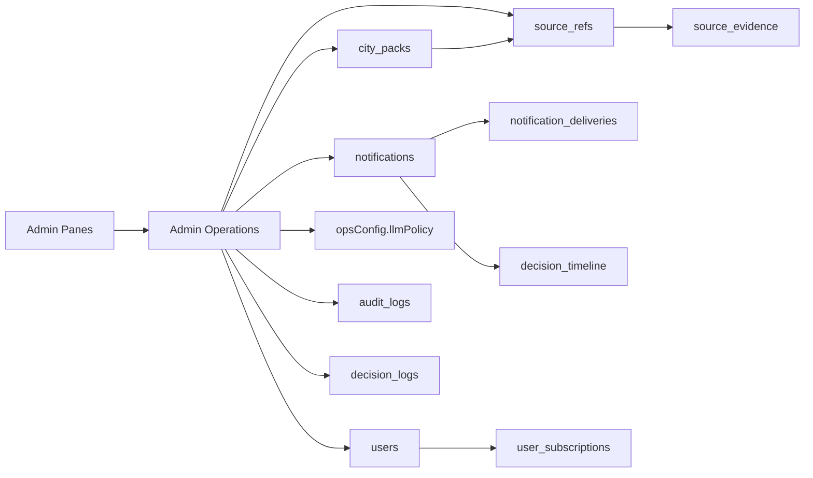

# ADMIN_UI_DATA_RELATION_MAP

- generatedAt: 2026-03-11T23:59:00-05:00
- purpose: 管理UIを「画面→操作→データ→証跡」の因果で追えるように固定する

## Canonical Entry and Route Contract
- Canonical shell: `/admin/app`（`src/shared/adminUiRoutesV2.js:5-10`）
- Legacy surfaces redirect to pane routes（`src/shared/adminUiRoutesV2.js:11-67`）
- API gateway for admin ops: `src/index.js:2207-2460`

## Pane -> Operation -> Entity Map

| Pane | Main Read Ops | Main Write Ops | Primary Entities | Evidence |
| --- | --- | --- | --- | --- |
| `home` | dashboard KPI | なし | `ops_read_model_snapshots` | `apps/admin/app.html:231-521` / `src/index.js:2215-2217` / `docs/knowledge-graph/runtime_probe.json:1866-1879` |
| `composer` | notifications list/status | draft/approve/plan/execute/archive | `notifications`, `notification_deliveries`, `decision_timeline` | `apps/admin/app.html:639-1015` / `apps/admin/assets/admin_app.js:15098-15292` / `src/routes/admin/osNotifications.js:122-495` |
| `monitor` | monitor insights/read model | task/journey policy writes (ops routes) | `users`, `notifications`, `tasks`, `step_rules` | `apps/admin/app.html:1019-2191` / `src/index.js:2235-2350,2374-2380` |
| `city-pack` | list/composition/inboxes/metrics | create/update/import/activate/retire | `city_packs`, `source_refs`, `decision_logs` | `apps/admin/app.html:2364-3298` / `src/routes/admin/cityPacks.js:136-571` / `src/usecases/cityPack/activateCityPack.js:9-160` |
| `vendors` | vendor list/shadow relevance | edit/activate/disable | link registry rows + events | `apps/admin/app.html:3672-3867` / `src/routes/admin/vendors.js:66-297` |
| `read-model` | users summary table | (read-mostly) | `users`, `notification_deliveries`, `notifications` | `apps/admin/app.html:3409-3670` / `src/index.js:2374-2380` / `src/repos/firestore/usersRepo.js:130-150` |
| `audit` | trace/audit search | retention/struct drift actions | `audit_logs`, `decision_logs`, `decision_timeline` | `apps/admin/app.html:3871-3938` / `docs/knowledge-graph/runtime_probe.json:1315-1348` |
| `llm` | policy status/history | policy plan/set | `opsConfig.llmPolicy`, `llm_policy_change_logs` | `apps/admin/app.html:4154-4467` / `src/routes/admin/llmPolicyConfig.js:111-349` |
| `errors` | errors summary | recovery-related ops routes | `send_retry_queue`, ops diagnostics | `apps/admin/app.html:3305-3406` / `src/index.js:2211-2213` / `docs/knowledge-graph/runtime_probe.json:1967-1983` |
| `maintenance` | health snapshots/read models | ops maintenance controls | `opsConfig`, `system_flags` | `apps/admin/app.html:4552-4621` / `docs/knowledge-graph/runtime_probe.json:1882-1898,2091-2103` |

## Data Relation Graph (Admin-Oriented)

## Join/Trace Anchors

| Relation | Join Field | Traceability | Evidence |
| --- | --- | --- | --- |
| notifications -> deliveries | `notificationId` | send outcome per user | `src/repos/firestore/deliveriesRepo.js:348-351` |
| notifications -> users(target) | `scenarioKey + stepKey + region` | recipient resolution | `src/usecases/adminOs/planNotificationSend.js:116-123` |
| city_packs -> source_refs | `sourceRefs[]` / `usedByCityPackIds[]` | source audit chain | `src/usecases/cityPack/activateCityPack.js:38-39,131-133` / `docs/knowledge-graph/runtime_probe.json:2029` |
| source_refs -> source_evidence | `sourceRefId` | evidence reconstruction | `src/repos/firestore/sourceEvidenceRepo.js:74-76,109-124` |
| all operations -> audit logs | `traceId + requestId + entityId` | who/when/what | `src/routes/admin/osNotifications.js:133-141` / `src/routes/admin/cityPacks.js:166-187` / `src/routes/admin/vendors.js:54-63` |

## UI Artifact Anchors (Playwright captures)
- `artifacts/ui-ux-system-20260312/home-1440x900.png`
- `artifacts/ui-ux-system-20260312/composer-1440x900.png`
- `artifacts/ui-ux-system-20260312/monitor-1440x900.png`
- `artifacts/ui-ux-system-20260312/city-pack-1440x900.png`
- `artifacts/ui-ux-system-20260312/vendors-1440x900.png`
- `artifacts/ui-ux-system-20260312/read-model-1440x900.png`
- `artifacts/ui-ux-system-20260312/audit-1440x900.png`
- `artifacts/ui-ux-system-20260312/llm-1440x900.png`
- `artifacts/ui-ux-system-20260312/errors-1440x900.png`
- `artifacts/ui-ux-system-20260312/maintenance-1440x900.png`

## Unobserved
- Runtime probe sampled list に `source_evidence` collection entry が未観測（repo 実装は存在）。
- 上記は runtime sample 差分として扱い、構造断定には使わない。

