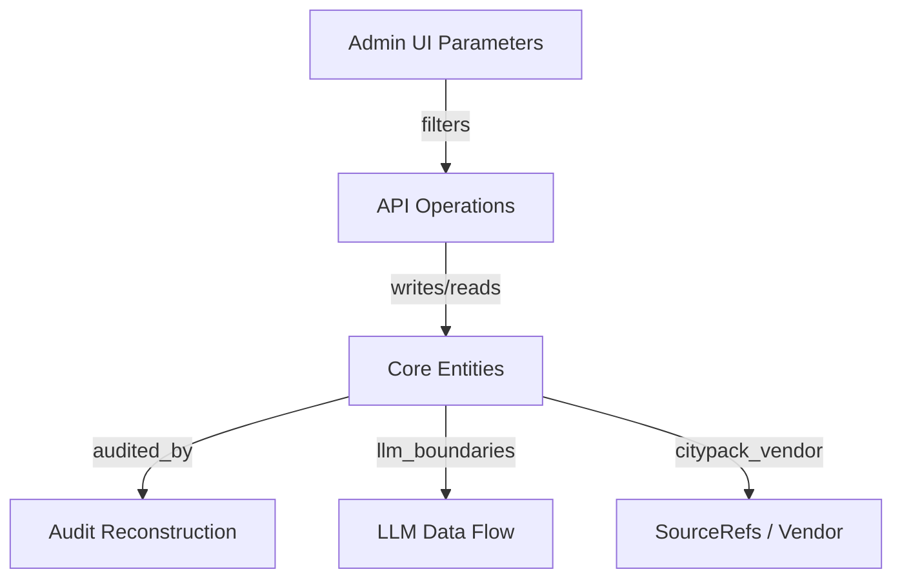

# ADMIN_UI_DATA_RELATION_MAP

- generatedAt: 2026-03-08T04:34:19.286Z
- source: docs/knowledge-graph/*.md + docs/knowledge-graph/runtime_probe.json

## UI Parameter Links
| Parameter | Entity | Relation | Evidence |
| --- | --- | --- | --- |
| notificationType | UNOBSERVED_IN_DOCS | UNOBSERVED_IN_DOCS | docs/knowledge-graph/ENTITY_SCHEMA.md:1 |
| scenario | UNOBSERVED_IN_DOCS | UNOBSERVED_IN_DOCS | docs/knowledge-graph/ENTITY_SCHEMA.md:1 |
| step | Checklists | field:step | src/repos/firestore/analyticsReadRepo.js:212 docs/knowledge-graph/ENTITY_SCHEMA.md:24 |
| step | Events | field:step | src/repos/firestore/analyticsReadRepo.js:212 docs/knowledge-graph/ENTITY_SCHEMA.md:242 |
| step | NotificationDeliveries | field:step | src/repos/firestore/analyticsReadRepo.js:212 docs/knowledge-graph/ENTITY_SCHEMA.md:312 |
| step | Notifications | field:step | src/repos/firestore/analyticsReadRepo.js:212 docs/knowledge-graph/ENTITY_SCHEMA.md:320 |
| step | Notifications | field:stepKey | src/repos/firestore/notificationsRepo.js:63 docs/knowledge-graph/ENTITY_SCHEMA.md:321 |
| step | StepRules | field:stepKey | src/repos/firestore/stepRulesRepo.js:265 docs/knowledge-graph/ENTITY_SCHEMA.md:409 |
| step | UserChecklists | field:step | src/repos/firestore/analyticsReadRepo.js:212 docs/knowledge-graph/ENTITY_SCHEMA.md:439 |
| step | Users | field:step | src/repos/firestore/analyticsReadRepo.js:212 docs/knowledge-graph/ENTITY_SCHEMA.md:452 |
| step | Users | field:stepKey | src/repos/firestore/usersRepo.js:132 docs/knowledge-graph/ENTITY_SCHEMA.md:453 |
| area | UNOBSERVED_IN_DOCS | UNOBSERVED_IN_DOCS | docs/knowledge-graph/ENTITY_SCHEMA.md:1 |
| cityPack | CityPackBulletins | field:cityPackId | src/repos/firestore/cityPackBulletinsRepo.js:45 docs/knowledge-graph/ENTITY_SCHEMA.md:26 |
| cityPack | CityPackMetricsDaily | field:cityPackId | src/repos/firestore/cityPackMetricsDailyRepo.js:97 docs/knowledge-graph/ENTITY_SCHEMA.md:64 |
| cityPack | CityPackRequests | field:draftCityPackIds | src/repos/firestore/cityPackRequestsRepo.js:77 docs/knowledge-graph/ENTITY_SCHEMA.md:67 |
| cityPack | CityPackUpdateProposals | field:cityPackId | src/repos/firestore/cityPackUpdateProposalsRepo.js:28 docs/knowledge-graph/ENTITY_SCHEMA.md:133 |
| cityPack | SourceRefs | field:usedByCityPackIds | src/repos/firestore/sourceRefsRepo.js:198 docs/knowledge-graph/ENTITY_SCHEMA.md:403 |
| vendor | UNOBSERVED_IN_DOCS | UNOBSERVED_IN_DOCS | docs/knowledge-graph/ENTITY_SCHEMA.md:1 |
| audience | UNOBSERVED_IN_DOCS | UNOBSERVED_IN_DOCS | docs/knowledge-graph/ENTITY_SCHEMA.md:1 |
| category | EmergencyBulletins | field:category | src/repos/firestore/emergencyBulletinsRepo.js:42 docs/knowledge-graph/ENTITY_SCHEMA.md:159 |
| category | EmergencyDiffs | field:category | src/repos/firestore/emergencyDiffsRepo.js:43 docs/knowledge-graph/ENTITY_SCHEMA.md:176 |
| category | EmergencyEventsNormalized | field:category | src/repos/firestore/emergencyEventsRepo.js:27 docs/knowledge-graph/ENTITY_SCHEMA.md:192 |
| category | NotificationDeliveries | field:notificationCategory | src/repos/firestore/deliveriesRepo.js:72 docs/knowledge-graph/ENTITY_SCHEMA.md:301 |
| status | CityPackBulletins | field:status | src/repos/firestore/cityPackBulletinsRepo.js:106 docs/knowledge-graph/ENTITY_SCHEMA.md:38 |
| status | CityPackBulletins | field:status | src/repos/firestore/cityPackBulletinsRepo.js:44 docs/knowledge-graph/ENTITY_SCHEMA.md:39 |
| status | CityPackFeedback | field:status | src/repos/firestore/cityPackFeedbackRepo.js:130 docs/knowledge-graph/ENTITY_SCHEMA.md:59 |
| status | CityPackFeedback | field:status | src/repos/firestore/cityPackFeedbackRepo.js:65 docs/knowledge-graph/ENTITY_SCHEMA.md:60 |
| status | CityPackRequests | field:status | src/repos/firestore/cityPackRequestsRepo.js:140 docs/knowledge-graph/ENTITY_SCHEMA.md:86 |
| status | CityPackRequests | field:status | src/repos/firestore/cityPackRequestsRepo.js:67 docs/knowledge-graph/ENTITY_SCHEMA.md:87 |
| status | CityPacks | field:status | src/repos/firestore/cityPacksRepo.js:210 docs/knowledge-graph/ENTITY_SCHEMA.md:111 |
| status | CityPacks | field:status | src/repos/firestore/cityPacksRepo.js:435 docs/knowledge-graph/ENTITY_SCHEMA.md:112 |
| status | CityPackTemplateLibrary | field:status | src/repos/firestore/cityPackTemplateLibraryRepo.js:32 docs/knowledge-graph/ENTITY_SCHEMA.md:125 |
| status | CityPackTemplateLibrary | field:status | src/repos/firestore/cityPackTemplateLibraryRepo.js:85 docs/knowledge-graph/ENTITY_SCHEMA.md:126 |
| status | CityPackUpdateProposals | field:status | src/repos/firestore/cityPackUpdateProposalsRepo.js:27 docs/knowledge-graph/ENTITY_SCHEMA.md:140 |
| status | CityPackUpdateProposals | field:status | src/repos/firestore/cityPackUpdateProposalsRepo.js:82 docs/knowledge-graph/ENTITY_SCHEMA.md:141 |
| status | EmergencyBulletins | field:status | src/repos/firestore/emergencyBulletinsRepo.js:40 docs/knowledge-graph/ENTITY_SCHEMA.md:172 |
| status | EmergencyBulletins | field:status | src/repos/firestore/emergencyBulletinsRepo.js:92 docs/knowledge-graph/ENTITY_SCHEMA.md:173 |
| status | EmergencyProviders | field:status | src/repos/firestore/emergencyProvidersRepo.js:69 docs/knowledge-graph/ENTITY_SCHEMA.md:220 |
| status | FaqArticles | field:status | src/repos/firestore/faqArticlesRepo.js:204 docs/knowledge-graph/ENTITY_SCHEMA.md:247 |
| status | FaqArticles | field:status | src/repos/firestore/faqArticlesRepo.js:247 docs/knowledge-graph/ENTITY_SCHEMA.md:248 |
| status | JourneyBranchQueue | field:status | src/repos/firestore/journeyBranchQueueRepo.js:165 docs/knowledge-graph/ENTITY_SCHEMA.md:253 |
| status | JourneyTodoItems | field:graphStatus | src/repos/firestore/journeyTodoItemsRepo.js:298 docs/knowledge-graph/ENTITY_SCHEMA.md:263 |
| status | JourneyTodoItems | field:status | src/repos/firestore/journeyTodoItemsRepo.js:296 docs/knowledge-graph/ENTITY_SCHEMA.md:270 |
| status | JourneyTodoItems | field:status | src/repos/firestore/journeyTodoItemsRepo.js:333 docs/knowledge-graph/ENTITY_SCHEMA.md:271 |
| status | Notices | field:status | src/repos/firestore/noticesRepo.js:58 docs/knowledge-graph/ENTITY_SCHEMA.md:289 |
| status | Notices | field:status | src/repos/firestore/noticesRepo.js:71 docs/knowledge-graph/ENTITY_SCHEMA.md:290 |
| status | Notifications | field:status | src/repos/firestore/notificationsRepo.js:61 docs/knowledge-graph/ENTITY_SCHEMA.md:319 |
| status | NotificationTemplates | field:status | src/repos/firestore/notificationTemplatesRepo.js:124 docs/knowledge-graph/ENTITY_SCHEMA.md:323 |
| status | NotificationTemplates | field:status | src/repos/firestore/notificationTemplatesRepo.js:65 docs/knowledge-graph/ENTITY_SCHEMA.md:324 |
| status | OpsSegments | field:status | src/repos/firestore/opsSegmentsRepo.js:62 docs/knowledge-graph/ENTITY_SCHEMA.md:340 |
| status | SchoolCalendarLinks | field:status | src/repos/firestore/schoolCalendarLinksRepo.js:79 docs/knowledge-graph/ENTITY_SCHEMA.md:365 |
| status | SendRetryQueue | field:status | src/repos/firestore/sendRetryQueueRepo.js:26 docs/knowledge-graph/ENTITY_SCHEMA.md:373 |
| status | SendRetryQueue | field:status | src/repos/firestore/sendRetryQueueRepo.js:45 docs/knowledge-graph/ENTITY_SCHEMA.md:374 |
| status | SourceRefs | field:status | src/repos/firestore/sourceRefsRepo.js:181 docs/knowledge-graph/ENTITY_SCHEMA.md:398 |
| status | SourceRefs | field:status | src/repos/firestore/sourceRefsRepo.js:277 docs/knowledge-graph/ENTITY_SCHEMA.md:399 |
| status | Tasks | field:status | src/repos/firestore/tasksRepo.js:216 docs/knowledge-graph/ENTITY_SCHEMA.md:430 |
| status | TemplatesV | field:status | src/repos/firestore/templatesVRepo.js:79 docs/knowledge-graph/ENTITY_SCHEMA.md:432 |
| llmSource | UNOBSERVED_IN_DOCS | UNOBSERVED_IN_DOCS | docs/knowledge-graph/ENTITY_SCHEMA.md:1 |

## Operation Links (Top 120)
| Operation | Entity | API | Evidence |
| --- | --- | --- | --- |
| appendAuditLog | AuditLogs | UNOBSERVED_IN_DOCS UNOBSERVED_IN_DOCS | src/routes/admin/cityPackBulletins.js:1 docs/REPO_AUDIT_INPUTS/dependency_graph.json:951 docs/knowledge-graph/ENTITY_RELATIONS.md:109 src/routes/admin/cityPackEducationLinks.js:1 docs/REPO_AUDIT_INPUTS/dependency_graph.json:955 docs/knowledge-graph/ENTITY_RELATIONS.md:112 src/routes/admin/cityPackEvidence.js:1 docs/REPO_AUDIT_INPUTS/dependency_graph.json:958 docs/knowledge-graph/ENTITY_RELATIONS.md:113 src/routes/admin/cityPackFeedback.js:1 docs/REPO_AUDIT_INPUTS/dependency_graph.json:961 docs/knowledge-graph/ENTITY_RELATIONS.md:114 src/routes/admin/cityPackRequests.js:1 docs/REPO_AUDIT_INPUTS/dependency_graph.json:964 docs/knowledge-graph/ENTITY_RELATIONS.md:116 src/routes/admin/cityPackReviewInbox.js:1 docs/REPO_AUDIT_INPUTS/dependency_graph.json:969 docs/knowledge-graph/ENTITY_RELATIONS.md:118 src/routes/admin/cityPacks.js:1 docs/REPO_AUDIT_INPUTS/dependency_graph.json:977 docs/knowledge-graph/ENTITY_RELATIONS.md:125 src/routes/admin/cityPackTemplateLibrary.js:1 docs/REPO_AUDIT_INPUTS/dependency_graph.json:982 docs/knowledge-graph/ENTITY_RELATIONS.md:128 src/routes/admin/cityPackUpdateProposals.js:1 docs/REPO_AUDIT_INPUTS/dependency_graph.json:985 docs/knowledge-graph/ENTITY_RELATIONS.md:129 src/routes/admin/emergencyLayer.js:1 docs/REPO_AUDIT_INPUTS/dependency_graph.json:988 docs/knowledge-graph/ENTITY_RELATIONS.md:134 src/routes/admin/journeyGraphBranchQueue.js:1 docs/REPO_AUDIT_INPUTS/dependency_graph.json:1003 docs/knowledge-graph/ENTITY_RELATIONS.md:147 src/routes/admin/journeyGraphCatalogConfig.js:1 docs/REPO_AUDIT_INPUTS/dependency_graph.json:1006 docs/knowledge-graph/ENTITY_RELATIONS.md:148 src/routes/admin/journeyGraphRuntime.js:1 docs/REPO_AUDIT_INPUTS/dependency_graph.json:1009 docs/knowledge-graph/ENTITY_RELATIONS.md:149 src/routes/admin/journeyParamConfig.js:1 docs/REPO_AUDIT_INPUTS/dependency_graph.json:1012 docs/knowledge-graph/ENTITY_RELATIONS.md:151 src/routes/admin/journeyPolicyConfig.js:1 docs/REPO_AUDIT_INPUTS/dependency_graph.json:1019 docs/knowledge-graph/ENTITY_RELATIONS.md:156 src/routes/admin/kbArticles.js:1 docs/REPO_AUDIT_INPUTS/dependency_graph.json:1022 docs/knowledge-graph/ENTITY_RELATIONS.md:158 src/routes/admin/legacyStatus.js:1 docs/REPO_AUDIT_INPUTS/dependency_graph.json:1025 docs/knowledge-graph/ENTITY_RELATIONS.md:159 src/routes/admin/linkRegistry.js:1 docs/REPO_AUDIT_INPUTS/dependency_graph.json:1028 docs/knowledge-graph/ENTITY_RELATIONS.md:160 src/routes/admin/llmConfig.js:1 docs/REPO_AUDIT_INPUTS/dependency_graph.json:1036 docs/knowledge-graph/ENTITY_RELATIONS.md:168 src/routes/admin/llmConsent.js:1 docs/REPO_AUDIT_INPUTS/dependency_graph.json:1039 docs/knowledge-graph/ENTITY_RELATIONS.md:169 src/routes/admin/llmPolicyConfig.js:1 docs/REPO_AUDIT_INPUTS/dependency_graph.json:1051 docs/knowledge-graph/ENTITY_RELATIONS.md:175 src/routes/admin/missingIndexSurface.js:1 docs/REPO_AUDIT_INPUTS/dependency_graph.json:1055 docs/knowledge-graph/ENTITY_RELATIONS.md:176 src/routes/admin/monitorInsights.js:1 docs/REPO_AUDIT_INPUTS/dependency_graph.json:1058 docs/knowledge-graph/ENTITY_RELATIONS.md:177 src/routes/admin/nextBestAction.js:1 docs/REPO_AUDIT_INPUTS/dependency_graph.json:1061 docs/knowledge-graph/ENTITY_RELATIONS.md:179 src/routes/admin/notifications.js:1 docs/REPO_AUDIT_INPUTS/dependency_graph.json:1069 docs/knowledge-graph/ENTITY_RELATIONS.md:183 src/routes/admin/notificationTest.js:1 docs/REPO_AUDIT_INPUTS/dependency_graph.json:1076 docs/knowledge-graph/ENTITY_RELATIONS.md:188 src/routes/admin/opsFeatureCatalogStatus.js:1 docs/REPO_AUDIT_INPUTS/dependency_graph.json:1080 docs/knowledge-graph/ENTITY_RELATIONS.md:190 src/routes/admin/opsOverview.js:1 docs/REPO_AUDIT_INPUTS/dependency_graph.json:1083 docs/knowledge-graph/ENTITY_RELATIONS.md:191 src/routes/admin/opsSnapshotHealth.js:1 docs/REPO_AUDIT_INPUTS/dependency_graph.json:1088 docs/knowledge-graph/ENTITY_RELATIONS.md:194 src/routes/admin/opsSystemSnapshot.js:1 docs/REPO_AUDIT_INPUTS/dependency_graph.json:1091 docs/knowledge-graph/ENTITY_RELATIONS.md:196 src/routes/admin/osAlerts.js:1 docs/REPO_AUDIT_INPUTS/dependency_graph.json:1095 docs/knowledge-graph/ENTITY_RELATIONS.md:198 src/routes/admin/osAutomationConfig.js:1 docs/REPO_AUDIT_INPUTS/dependency_graph.json:1099 docs/knowledge-graph/ENTITY_RELATIONS.md:200 src/routes/admin/osConfig.js:1 docs/REPO_AUDIT_INPUTS/dependency_graph.json:1102 docs/knowledge-graph/ENTITY_RELATIONS.md:201 src/routes/admin/osContext.js:1 docs/REPO_AUDIT_INPUTS/dependency_graph.json:1105 docs/knowledge-graph/ENTITY_RELATIONS.md:202 src/routes/admin/osDashboardKpi.js:1 docs/REPO_AUDIT_INPUTS/dependency_graph.json:1108 docs/knowledge-graph/ENTITY_RELATIONS.md:203 src/routes/admin/osDeliveryBackfill.js:1 docs/REPO_AUDIT_INPUTS/dependency_graph.json:1111 docs/knowledge-graph/ENTITY_RELATIONS.md:204 src/routes/admin/osDeliveryRecovery.js:1 docs/REPO_AUDIT_INPUTS/dependency_graph.json:1119 docs/knowledge-graph/ENTITY_RELATIONS.md:210 src/routes/admin/osErrors.js:1 docs/REPO_AUDIT_INPUTS/dependency_graph.json:1129 docs/knowledge-graph/ENTITY_RELATIONS.md:218 src/routes/admin/osJourneyKpi.js:1 docs/REPO_AUDIT_INPUTS/dependency_graph.json:1132 docs/knowledge-graph/ENTITY_RELATIONS.md:220 src/routes/admin/osKillSwitch.js:1 docs/REPO_AUDIT_INPUTS/dependency_graph.json:1136 docs/knowledge-graph/ENTITY_RELATIONS.md:221 src/routes/admin/osLinkRegistryImpact.js:1 docs/REPO_AUDIT_INPUTS/dependency_graph.json:1141 docs/knowledge-graph/ENTITY_RELATIONS.md:224 src/routes/admin/osLinkRegistryLookup.js:1 docs/REPO_AUDIT_INPUTS/dependency_graph.json:1144 docs/knowledge-graph/ENTITY_RELATIONS.md:225 src/routes/admin/osLlmUsageExport.js:1 docs/REPO_AUDIT_INPUTS/dependency_graph.json:1147 docs/knowledge-graph/ENTITY_RELATIONS.md:226 src/routes/admin/osLlmUsageSummary.js:1 docs/REPO_AUDIT_INPUTS/dependency_graph.json:1150 docs/knowledge-graph/ENTITY_RELATIONS.md:227 src/routes/admin/osNotifications.js:1 docs/REPO_AUDIT_INPUTS/dependency_graph.json:1153 docs/knowledge-graph/ENTITY_RELATIONS.md:228 src/routes/admin/osNotificationSeed.js:1 docs/REPO_AUDIT_INPUTS/dependency_graph.json:1161 docs/knowledge-graph/ENTITY_RELATIONS.md:239 src/routes/admin/osRedacStatus.js:1 docs/REPO_AUDIT_INPUTS/dependency_graph.json:1164 docs/knowledge-graph/ENTITY_RELATIONS.md:240 src/routes/admin/osUsersSummaryAnalyze.js:1 docs/REPO_AUDIT_INPUTS/dependency_graph.json:1168 docs/knowledge-graph/ENTITY_RELATIONS.md:241 src/routes/admin/osUsersSummaryExport.js:1 docs/REPO_AUDIT_INPUTS/dependency_graph.json:1172 docs/knowledge-graph/ENTITY_RELATIONS.md:243 src/routes/admin/osView.js:1 docs/REPO_AUDIT_INPUTS/dependency_graph.json:1176 docs/knowledge-graph/ENTITY_RELATIONS.md:245 src/routes/phase1Events.js:1 docs/REPO_AUDIT_INPUTS/dependency_graph.json:1298 docs/knowledge-graph/ENTITY_RELATIONS.md:248 src/routes/admin/phase1Notifications.js:1 docs/REPO_AUDIT_INPUTS/dependency_graph.json:1179 docs/knowledge-graph/ENTITY_RELATIONS.md:250 src/routes/phase5Ops.js:1 docs/REPO_AUDIT_INPUTS/dependency_graph.json:1354 docs/knowledge-graph/ENTITY_RELATIONS.md:273 src/routes/phase5Review.js:1 docs/REPO_AUDIT_INPUTS/dependency_graph.json:1360 docs/knowledge-graph/ENTITY_RELATIONS.md:277 src/routes/phase5State.js:1 docs/REPO_AUDIT_INPUTS/dependency_graph.json:1364 docs/knowledge-graph/ENTITY_RELATIONS.md:279 src/routes/phase61Templates.js:1 docs/REPO_AUDIT_INPUTS/dependency_graph.json:1368 docs/knowledge-graph/ENTITY_RELATIONS.md:281 src/routes/admin/productReadiness.js:1 docs/REPO_AUDIT_INPUTS/dependency_graph.json:1187 docs/knowledge-graph/ENTITY_RELATIONS.md:302 src/routes/admin/readModel.js:1 docs/REPO_AUDIT_INPUTS/dependency_graph.json:1190 docs/knowledge-graph/ENTITY_RELATIONS.md:303 src/routes/admin/readPathFallbackSummary.js:1 docs/REPO_AUDIT_INPUTS/dependency_graph.json:1194 docs/knowledge-graph/ENTITY_RELATIONS.md:305 src/routes/admin/redacMembershipUnlink.js:1 docs/REPO_AUDIT_INPUTS/dependency_graph.json:1197 docs/knowledge-graph/ENTITY_RELATIONS.md:306 src/routes/admin/repoMap.js:1 docs/REPO_AUDIT_INPUTS/dependency_graph.json:1200 docs/knowledge-graph/ENTITY_RELATIONS.md:307 src/routes/internal/retentionApplyJob.js:1 docs/REPO_AUDIT_INPUTS/dependency_graph.json:1270 docs/knowledge-graph/ENTITY_RELATIONS.md:308 src/routes/internal/retentionDryRunJob.js:1 docs/REPO_AUDIT_INPUTS/dependency_graph.json:1273 docs/knowledge-graph/ENTITY_RELATIONS.md:309 src/routes/admin/retentionRuns.js:1 docs/REPO_AUDIT_INPUTS/dependency_graph.json:1203 docs/knowledge-graph/ENTITY_RELATIONS.md:310 src/routes/admin/richMenuConfig.js:1 docs/REPO_AUDIT_INPUTS/dependency_graph.json:1206 docs/knowledge-graph/ENTITY_RELATIONS.md:311 src/routes/admin/structDriftBackfill.js:1 docs/REPO_AUDIT_INPUTS/dependency_graph.json:1212 docs/knowledge-graph/ENTITY_RELATIONS.md:316 src/routes/internal/structDriftBackfillJob.js:1 docs/REPO_AUDIT_INPUTS/dependency_graph.json:1279 docs/knowledge-graph/ENTITY_RELATIONS.md:318 src/routes/admin/taskRulesConfig.js:1 docs/REPO_AUDIT_INPUTS/dependency_graph.json:1216 docs/knowledge-graph/ENTITY_RELATIONS.md:321 src/routes/admin/traceSearch.js:1 docs/REPO_AUDIT_INPUTS/dependency_graph.json:1227 docs/knowledge-graph/ENTITY_RELATIONS.md:332 src/routes/trackClick.js:1 docs/REPO_AUDIT_INPUTS/dependency_graph.json:1420 docs/knowledge-graph/ENTITY_RELATIONS.md:334 src/routes/trackClickGet.js:1 docs/REPO_AUDIT_INPUTS/dependency_graph.json:1424 docs/knowledge-graph/ENTITY_RELATIONS.md:336 src/routes/admin/vendors.js:1 docs/REPO_AUDIT_INPUTS/dependency_graph.json:1234 docs/knowledge-graph/ENTITY_RELATIONS.md:341 src/routes/webhookLine.js:1 docs/REPO_AUDIT_INPUTS/dependency_graph.json:1428 docs/knowledge-graph/ENTITY_RELATIONS.md:344 src/routes/webhookStripe.js:1 docs/REPO_AUDIT_INPUTS/dependency_graph.json:1462 docs/knowledge-graph/ENTITY_RELATIONS.md:376 |
| sendNotification | DecisionTimeline | UNOBSERVED_IN_DOCS UNOBSERVED_IN_DOCS | src/routes/admin/cityPackBulletins.js:1 docs/REPO_AUDIT_INPUTS/dependency_graph.json:951 docs/knowledge-graph/ENTITY_RELATIONS.md:110 src/routes/admin/notifications.js:1 docs/REPO_AUDIT_INPUTS/dependency_graph.json:1069 docs/knowledge-graph/ENTITY_RELATIONS.md:186 |
| runCityPackDraftJob | CityPackRequests | UNOBSERVED_IN_DOCS UNOBSERVED_IN_DOCS | src/routes/internal/cityPackDraftGeneratorJob.js:1 docs/REPO_AUDIT_INPUTS/dependency_graph.json:1239 docs/knowledge-graph/ENTITY_RELATIONS.md:111 src/routes/admin/cityPackRequests.js:1 docs/REPO_AUDIT_INPUTS/dependency_graph.json:964 docs/knowledge-graph/ENTITY_RELATIONS.md:117 |
| activateCityPack | CityPacks | UNOBSERVED_IN_DOCS UNOBSERVED_IN_DOCS | src/routes/admin/cityPackRequests.js:1 docs/REPO_AUDIT_INPUTS/dependency_graph.json:964 docs/knowledge-graph/ENTITY_RELATIONS.md:115 src/routes/admin/cityPacks.js:1 docs/REPO_AUDIT_INPUTS/dependency_graph.json:977 docs/knowledge-graph/ENTITY_RELATIONS.md:124 |
| computeCityPackMetrics | Checklists | UNOBSERVED_IN_DOCS UNOBSERVED_IN_DOCS | src/routes/admin/cityPackReviewInbox.js:1 docs/REPO_AUDIT_INPUTS/dependency_graph.json:969 docs/knowledge-graph/ENTITY_RELATIONS.md:119 |
| normalizeLimit | Checklists | UNOBSERVED_IN_DOCS UNOBSERVED_IN_DOCS | src/routes/admin/cityPackReviewInbox.js:1 docs/REPO_AUDIT_INPUTS/dependency_graph.json:969 docs/knowledge-graph/ENTITY_RELATIONS.md:120 src/routes/admin/osDeliveryBackfill.js:1 docs/REPO_AUDIT_INPUTS/dependency_graph.json:1111 docs/knowledge-graph/ENTITY_RELATIONS.md:208 |
| normalizeWindowDays | Checklists | UNOBSERVED_IN_DOCS UNOBSERVED_IN_DOCS | src/routes/admin/cityPackReviewInbox.js:1 docs/REPO_AUDIT_INPUTS/dependency_graph.json:969 docs/knowledge-graph/ENTITY_RELATIONS.md:121 |
| reviewSourceRefDecision | SourceRefs | UNOBSERVED_IN_DOCS UNOBSERVED_IN_DOCS | src/routes/admin/cityPackReviewInbox.js:1 docs/REPO_AUDIT_INPUTS/dependency_graph.json:969 docs/knowledge-graph/ENTITY_RELATIONS.md:122 |
| runCityPackSourceAuditJob | CityPackBulletins | UNOBSERVED_IN_DOCS UNOBSERVED_IN_DOCS | src/routes/admin/cityPackReviewInbox.js:1 docs/REPO_AUDIT_INPUTS/dependency_graph.json:969 docs/knowledge-graph/ENTITY_RELATIONS.md:123 src/routes/internal/cityPackSourceAuditJob.js:1 docs/REPO_AUDIT_INPUTS/dependency_graph.json:1242 docs/knowledge-graph/ENTITY_RELATIONS.md:127 src/routes/internal/schoolCalendarAuditJob.js:1 docs/REPO_AUDIT_INPUTS/dependency_graph.json:1276 docs/knowledge-graph/ENTITY_RELATIONS.md:315 |
| composeCityAndNationwidePacks | CityPacks | UNOBSERVED_IN_DOCS UNOBSERVED_IN_DOCS | src/routes/admin/cityPacks.js:1 docs/REPO_AUDIT_INPUTS/dependency_graph.json:977 docs/knowledge-graph/ENTITY_RELATIONS.md:126 |
| fetchProviderSnapshot | EmergencyProviders | UNOBSERVED_IN_DOCS UNOBSERVED_IN_DOCS | src/routes/internal/emergencyJobs.js:1 docs/REPO_AUDIT_INPUTS/dependency_graph.json:1245 docs/knowledge-graph/ENTITY_RELATIONS.md:130 src/routes/admin/emergencyLayer.js:1 docs/REPO_AUDIT_INPUTS/dependency_graph.json:988 docs/knowledge-graph/ENTITY_RELATIONS.md:136 |
| normalizeAndDiffProvider | EmergencyBulletins | UNOBSERVED_IN_DOCS UNOBSERVED_IN_DOCS | src/routes/internal/emergencyJobs.js:1 docs/REPO_AUDIT_INPUTS/dependency_graph.json:1245 docs/knowledge-graph/ENTITY_RELATIONS.md:131 src/routes/admin/emergencyLayer.js:1 docs/REPO_AUDIT_INPUTS/dependency_graph.json:988 docs/knowledge-graph/ENTITY_RELATIONS.md:141 |
| runEmergencySync | EmergencyBulletins | UNOBSERVED_IN_DOCS UNOBSERVED_IN_DOCS | src/routes/internal/emergencyJobs.js:1 docs/REPO_AUDIT_INPUTS/dependency_graph.json:1245 docs/knowledge-graph/ENTITY_RELATIONS.md:132 |
| summarizeDraftWithLLM | EmergencyBulletins | UNOBSERVED_IN_DOCS UNOBSERVED_IN_DOCS | src/routes/internal/emergencyJobs.js:1 docs/REPO_AUDIT_INPUTS/dependency_graph.json:1245 docs/knowledge-graph/ENTITY_RELATIONS.md:133 src/routes/admin/emergencyLayer.js:1 docs/REPO_AUDIT_INPUTS/dependency_graph.json:988 docs/knowledge-graph/ENTITY_RELATIONS.md:144 |
| approveEmergencyBulletin | EmergencyBulletins | UNOBSERVED_IN_DOCS UNOBSERVED_IN_DOCS | src/routes/admin/emergencyLayer.js:1 docs/REPO_AUDIT_INPUTS/dependency_graph.json:988 docs/knowledge-graph/ENTITY_RELATIONS.md:135 |
| getEmergencyBulletin | EmergencyBulletins | UNOBSERVED_IN_DOCS UNOBSERVED_IN_DOCS | src/routes/admin/emergencyLayer.js:1 docs/REPO_AUDIT_INPUTS/dependency_graph.json:988 docs/knowledge-graph/ENTITY_RELATIONS.md:137 |
| getEmergencyEvidence | EmergencyBulletins | UNOBSERVED_IN_DOCS UNOBSERVED_IN_DOCS | src/routes/admin/emergencyLayer.js:1 docs/REPO_AUDIT_INPUTS/dependency_graph.json:988 docs/knowledge-graph/ENTITY_RELATIONS.md:138 |
| listEmergencyBulletins | EmergencyBulletins | UNOBSERVED_IN_DOCS UNOBSERVED_IN_DOCS | src/routes/admin/emergencyLayer.js:1 docs/REPO_AUDIT_INPUTS/dependency_graph.json:988 docs/knowledge-graph/ENTITY_RELATIONS.md:139 |
| listEmergencyProviders | EmergencyBulletins | UNOBSERVED_IN_DOCS UNOBSERVED_IN_DOCS | src/routes/admin/emergencyLayer.js:1 docs/REPO_AUDIT_INPUTS/dependency_graph.json:988 docs/knowledge-graph/ENTITY_RELATIONS.md:140 |
| previewEmergencyRule | EmergencyBulletins | UNOBSERVED_IN_DOCS UNOBSERVED_IN_DOCS | src/routes/admin/emergencyLayer.js:1 docs/REPO_AUDIT_INPUTS/dependency_graph.json:988 docs/knowledge-graph/ENTITY_RELATIONS.md:142 |
| rejectEmergencyBulletin | EmergencyBulletins | UNOBSERVED_IN_DOCS UNOBSERVED_IN_DOCS | src/routes/admin/emergencyLayer.js:1 docs/REPO_AUDIT_INPUTS/dependency_graph.json:988 docs/knowledge-graph/ENTITY_RELATIONS.md:143 |
| updateEmergencyProvider | EmergencyBulletins | UNOBSERVED_IN_DOCS UNOBSERVED_IN_DOCS | src/routes/admin/emergencyLayer.js:1 docs/REPO_AUDIT_INPUTS/dependency_graph.json:988 docs/knowledge-graph/ENTITY_RELATIONS.md:145 |
| runJourneyBranchDispatchJob | AuditLogs | UNOBSERVED_IN_DOCS UNOBSERVED_IN_DOCS | src/routes/internal/journeyBranchDispatchJob.js:1 docs/REPO_AUDIT_INPUTS/dependency_graph.json:1251 docs/knowledge-graph/ENTITY_RELATIONS.md:146 |
| aggregateJourneyKpis | Checklists | UNOBSERVED_IN_DOCS UNOBSERVED_IN_DOCS | src/routes/internal/journeyKpiBuildJob.js:1 docs/REPO_AUDIT_INPUTS/dependency_graph.json:1254 docs/knowledge-graph/ENTITY_RELATIONS.md:150 src/routes/admin/osJourneyKpi.js:1 docs/REPO_AUDIT_INPUTS/dependency_graph.json:1132 docs/knowledge-graph/ENTITY_RELATIONS.md:219 |
| applyJourneyParamVersion | OpsConfig | UNOBSERVED_IN_DOCS UNOBSERVED_IN_DOCS | src/routes/admin/journeyParamConfig.js:1 docs/REPO_AUDIT_INPUTS/dependency_graph.json:1012 docs/knowledge-graph/ENTITY_RELATIONS.md:152 |
| rollbackJourneyParamVersion | OpsConfig | UNOBSERVED_IN_DOCS UNOBSERVED_IN_DOCS | src/routes/admin/journeyParamConfig.js:1 docs/REPO_AUDIT_INPUTS/dependency_graph.json:1012 docs/knowledge-graph/ENTITY_RELATIONS.md:153 |
| runJourneyParamDryRun | JourneyParamVersions | UNOBSERVED_IN_DOCS UNOBSERVED_IN_DOCS | src/routes/admin/journeyParamConfig.js:1 docs/REPO_AUDIT_INPUTS/dependency_graph.json:1012 docs/knowledge-graph/ENTITY_RELATIONS.md:154 |
| validateJourneyParamVersion | JourneyParamVersions | UNOBSERVED_IN_DOCS UNOBSERVED_IN_DOCS | src/routes/admin/journeyParamConfig.js:1 docs/REPO_AUDIT_INPUTS/dependency_graph.json:1012 docs/knowledge-graph/ENTITY_RELATIONS.md:155 |
| runJourneyTodoReminderJob | NotificationDeliveries | UNOBSERVED_IN_DOCS UNOBSERVED_IN_DOCS | src/routes/internal/journeyTodoReminderJob.js:1 docs/REPO_AUDIT_INPUTS/dependency_graph.json:1257 docs/knowledge-graph/ENTITY_RELATIONS.md:157 |
| checkLinkHealth | LinkRegistry | UNOBSERVED_IN_DOCS UNOBSERVED_IN_DOCS | src/routes/admin/linkRegistry.js:1 docs/REPO_AUDIT_INPUTS/dependency_graph.json:1028 docs/knowledge-graph/ENTITY_RELATIONS.md:161 src/routes/admin/vendors.js:1 docs/REPO_AUDIT_INPUTS/dependency_graph.json:1234 docs/knowledge-graph/ENTITY_RELATIONS.md:342 |
| createLink | LinkRegistry | UNOBSERVED_IN_DOCS UNOBSERVED_IN_DOCS | src/routes/admin/linkRegistry.js:1 docs/REPO_AUDIT_INPUTS/dependency_graph.json:1028 docs/knowledge-graph/ENTITY_RELATIONS.md:162 |
| deleteLink | LinkRegistry | UNOBSERVED_IN_DOCS UNOBSERVED_IN_DOCS | src/routes/admin/linkRegistry.js:1 docs/REPO_AUDIT_INPUTS/dependency_graph.json:1028 docs/knowledge-graph/ENTITY_RELATIONS.md:163 |
| listLinks | LinkRegistry | UNOBSERVED_IN_DOCS UNOBSERVED_IN_DOCS | src/routes/admin/linkRegistry.js:1 docs/REPO_AUDIT_INPUTS/dependency_graph.json:1028 docs/knowledge-graph/ENTITY_RELATIONS.md:164 |
| updateLink | LinkRegistry | UNOBSERVED_IN_DOCS UNOBSERVED_IN_DOCS | src/routes/admin/linkRegistry.js:1 docs/REPO_AUDIT_INPUTS/dependency_graph.json:1028 docs/knowledge-graph/ENTITY_RELATIONS.md:165 src/routes/admin/vendors.js:1 docs/REPO_AUDIT_INPUTS/dependency_graph.json:1234 docs/knowledge-graph/ENTITY_RELATIONS.md:343 |
| appendLlmGateDecision | UNOBSERVED_IN_DOCS | UNOBSERVED_IN_DOCS UNOBSERVED_IN_DOCS | src/routes/internal/llmActionRewardFinalizeJob.js:1 docs/REPO_AUDIT_INPUTS/dependency_graph.json:1260 docs/knowledge-graph/ENTITY_RELATIONS.md:166 src/routes/admin/llmFaq.js:1 docs/REPO_AUDIT_INPUTS/dependency_graph.json:1042 docs/knowledge-graph/ENTITY_RELATIONS.md:171 src/routes/admin/llmOps.js:1 docs/REPO_AUDIT_INPUTS/dependency_graph.json:1046 docs/knowledge-graph/ENTITY_RELATIONS.md:172 src/routes/phaseLLM2OpsExplain.js:1 docs/REPO_AUDIT_INPUTS/dependency_graph.json:1404 docs/knowledge-graph/ENTITY_RELATIONS.md:296 src/routes/phaseLLM3OpsNextActions.js:1 docs/REPO_AUDIT_INPUTS/dependency_graph.json:1408 docs/knowledge-graph/ENTITY_RELATIONS.md:298 src/routes/phaseLLM4FaqAnswer.js:1 docs/REPO_AUDIT_INPUTS/dependency_graph.json:1412 docs/knowledge-graph/ENTITY_RELATIONS.md:301 src/routes/webhookLine.js:1 docs/REPO_AUDIT_INPUTS/dependency_graph.json:1428 docs/knowledge-graph/ENTITY_RELATIONS.md:345 |
| finalizeLlmActionRewards | NotificationDeliveries | UNOBSERVED_IN_DOCS UNOBSERVED_IN_DOCS | src/routes/internal/llmActionRewardFinalizeJob.js:1 docs/REPO_AUDIT_INPUTS/dependency_graph.json:1260 docs/knowledge-graph/ENTITY_RELATIONS.md:167 |
| answerFaqFromKb | FaqAnswerLogs | UNOBSERVED_IN_DOCS UNOBSERVED_IN_DOCS | src/routes/admin/llmFaq.js:1 docs/REPO_AUDIT_INPUTS/dependency_graph.json:1042 docs/knowledge-graph/ENTITY_RELATIONS.md:170 src/routes/phaseLLM4FaqAnswer.js:1 docs/REPO_AUDIT_INPUTS/dependency_graph.json:1412 docs/knowledge-graph/ENTITY_RELATIONS.md:300 |
| getNextActionCandidates | SystemFlags | UNOBSERVED_IN_DOCS UNOBSERVED_IN_DOCS | src/routes/admin/llmOps.js:1 docs/REPO_AUDIT_INPUTS/dependency_graph.json:1046 docs/knowledge-graph/ENTITY_RELATIONS.md:173 src/routes/phaseLLM3OpsNextActions.js:1 docs/REPO_AUDIT_INPUTS/dependency_graph.json:1408 docs/knowledge-graph/ENTITY_RELATIONS.md:299 |
| getOpsExplanation | SystemFlags | UNOBSERVED_IN_DOCS UNOBSERVED_IN_DOCS | src/routes/admin/llmOps.js:1 docs/REPO_AUDIT_INPUTS/dependency_graph.json:1046 docs/knowledge-graph/ENTITY_RELATIONS.md:174 src/routes/phaseLLM2OpsExplain.js:1 docs/REPO_AUDIT_INPUTS/dependency_graph.json:1404 docs/knowledge-graph/ENTITY_RELATIONS.md:297 |
| importMunicipalitySchools | LinkRegistry | UNOBSERVED_IN_DOCS UNOBSERVED_IN_DOCS | src/routes/internal/municipalitySchoolsImportJob.js:1 docs/REPO_AUDIT_INPUTS/dependency_graph.json:1264 docs/knowledge-graph/ENTITY_RELATIONS.md:178 |
| computeNotificationFatigueWarning | NotificationDeliveries | UNOBSERVED_IN_DOCS UNOBSERVED_IN_DOCS | src/routes/admin/nextBestAction.js:1 docs/REPO_AUDIT_INPUTS/dependency_graph.json:1061 docs/knowledge-graph/ENTITY_RELATIONS.md:180 |
| getNextBestAction | UNOBSERVED_IN_DOCS | UNOBSERVED_IN_DOCS UNOBSERVED_IN_DOCS | src/routes/admin/nextBestAction.js:1 docs/REPO_AUDIT_INPUTS/dependency_graph.json:1061 docs/knowledge-graph/ENTITY_RELATIONS.md:181 |
| getNotificationDeliveries | NotificationDeliveries | UNOBSERVED_IN_DOCS UNOBSERVED_IN_DOCS | src/routes/admin/notificationDeliveries.js:1 docs/REPO_AUDIT_INPUTS/dependency_graph.json:1066 docs/knowledge-graph/ENTITY_RELATIONS.md:182 |
| createNotification | LinkRegistry | UNOBSERVED_IN_DOCS UNOBSERVED_IN_DOCS | src/routes/admin/notifications.js:1 docs/REPO_AUDIT_INPUTS/dependency_graph.json:1069 docs/knowledge-graph/ENTITY_RELATIONS.md:184 src/routes/admin/osNotifications.js:1 docs/REPO_AUDIT_INPUTS/dependency_graph.json:1153 docs/knowledge-graph/ENTITY_RELATIONS.md:231 |
| listNotifications | Notifications | UNOBSERVED_IN_DOCS UNOBSERVED_IN_DOCS | src/routes/admin/notifications.js:1 docs/REPO_AUDIT_INPUTS/dependency_graph.json:1069 docs/knowledge-graph/ENTITY_RELATIONS.md:185 |
| testSendNotification | DecisionTimeline | UNOBSERVED_IN_DOCS UNOBSERVED_IN_DOCS | src/routes/admin/notifications.js:1 docs/REPO_AUDIT_INPUTS/dependency_graph.json:1069 docs/knowledge-graph/ENTITY_RELATIONS.md:187 |
| runNotificationTest | LinkRegistry | UNOBSERVED_IN_DOCS UNOBSERVED_IN_DOCS | src/routes/admin/notificationTest.js:1 docs/REPO_AUDIT_INPUTS/dependency_graph.json:1076 docs/knowledge-graph/ENTITY_RELATIONS.md:189 |
| getNotificationOperationalSummary | Checklists | UNOBSERVED_IN_DOCS UNOBSERVED_IN_DOCS | src/routes/admin/opsOverview.js:1 docs/REPO_AUDIT_INPUTS/dependency_graph.json:1083 docs/knowledge-graph/ENTITY_RELATIONS.md:192 |
| getUserOperationalSummary | Checklists | UNOBSERVED_IN_DOCS UNOBSERVED_IN_DOCS | src/routes/admin/opsOverview.js:1 docs/REPO_AUDIT_INPUTS/dependency_graph.json:1083 docs/knowledge-graph/ENTITY_RELATIONS.md:193 |
| buildOpsSnapshots | OpsReadModelSnapshots | UNOBSERVED_IN_DOCS UNOBSERVED_IN_DOCS | src/routes/internal/opsSnapshotJob.js:1 docs/REPO_AUDIT_INPUTS/dependency_graph.json:1267 docs/knowledge-graph/ENTITY_RELATIONS.md:195 src/routes/admin/opsSystemSnapshot.js:1 docs/REPO_AUDIT_INPUTS/dependency_graph.json:1091 docs/knowledge-graph/ENTITY_RELATIONS.md:197 |
| getNotificationReadModel | AuditLogs | UNOBSERVED_IN_DOCS UNOBSERVED_IN_DOCS | src/routes/admin/osAlerts.js:1 docs/REPO_AUDIT_INPUTS/dependency_graph.json:1095 docs/knowledge-graph/ENTITY_RELATIONS.md:199 src/routes/admin/readModel.js:1 docs/REPO_AUDIT_INPUTS/dependency_graph.json:1190 docs/knowledge-graph/ENTITY_RELATIONS.md:304 |
| confirmTokenData | AuditLogs | UNOBSERVED_IN_DOCS UNOBSERVED_IN_DOCS | src/routes/admin/osDeliveryBackfill.js:1 docs/REPO_AUDIT_INPUTS/dependency_graph.json:1111 docs/knowledge-graph/ENTITY_RELATIONS.md:205 src/routes/admin/osDeliveryRecovery.js:1 docs/REPO_AUDIT_INPUTS/dependency_graph.json:1119 docs/knowledge-graph/ENTITY_RELATIONS.md:212 |
| executeBackfill | NotificationDeliveries | UNOBSERVED_IN_DOCS UNOBSERVED_IN_DOCS | src/routes/admin/osDeliveryBackfill.js:1 docs/REPO_AUDIT_INPUTS/dependency_graph.json:1111 docs/knowledge-graph/ENTITY_RELATIONS.md:206 |
| getBackfillStatus | NotificationDeliveries | UNOBSERVED_IN_DOCS UNOBSERVED_IN_DOCS | src/routes/admin/osDeliveryBackfill.js:1 docs/REPO_AUDIT_INPUTS/dependency_graph.json:1111 docs/knowledge-graph/ENTITY_RELATIONS.md:207 |
| planBackfill | NotificationDeliveries | UNOBSERVED_IN_DOCS UNOBSERVED_IN_DOCS | src/routes/admin/osDeliveryBackfill.js:1 docs/REPO_AUDIT_INPUTS/dependency_graph.json:1111 docs/knowledge-graph/ENTITY_RELATIONS.md:209 |
| computePlanHash | NotificationDeliveries | UNOBSERVED_IN_DOCS UNOBSERVED_IN_DOCS | src/routes/admin/osDeliveryRecovery.js:1 docs/REPO_AUDIT_INPUTS/dependency_graph.json:1119 docs/knowledge-graph/ENTITY_RELATIONS.md:211 |
| executeRecovery | NotificationDeliveries | UNOBSERVED_IN_DOCS UNOBSERVED_IN_DOCS | src/routes/admin/osDeliveryRecovery.js:1 docs/REPO_AUDIT_INPUTS/dependency_graph.json:1119 docs/knowledge-graph/ENTITY_RELATIONS.md:213 |
| getRecoveryStatus | NotificationDeliveries | UNOBSERVED_IN_DOCS UNOBSERVED_IN_DOCS | src/routes/admin/osDeliveryRecovery.js:1 docs/REPO_AUDIT_INPUTS/dependency_graph.json:1119 docs/knowledge-graph/ENTITY_RELATIONS.md:214 |
| normalizeDeliveryId | NotificationDeliveries | UNOBSERVED_IN_DOCS UNOBSERVED_IN_DOCS | src/routes/admin/osDeliveryRecovery.js:1 docs/REPO_AUDIT_INPUTS/dependency_graph.json:1119 docs/knowledge-graph/ENTITY_RELATIONS.md:215 |
| normalizeReason | Checklists | UNOBSERVED_IN_DOCS UNOBSERVED_IN_DOCS | src/routes/admin/osDeliveryRecovery.js:1 docs/REPO_AUDIT_INPUTS/dependency_graph.json:1119 docs/knowledge-graph/ENTITY_RELATIONS.md:216 |
| planRecovery | NotificationDeliveries | UNOBSERVED_IN_DOCS UNOBSERVED_IN_DOCS | src/routes/admin/osDeliveryRecovery.js:1 docs/REPO_AUDIT_INPUTS/dependency_graph.json:1119 docs/knowledge-graph/ENTITY_RELATIONS.md:217 |
| getKillSwitch | SystemFlags | UNOBSERVED_IN_DOCS UNOBSERVED_IN_DOCS | src/routes/admin/osKillSwitch.js:1 docs/REPO_AUDIT_INPUTS/dependency_graph.json:1136 docs/knowledge-graph/ENTITY_RELATIONS.md:222 |
| setKillSwitch | SystemFlags | UNOBSERVED_IN_DOCS UNOBSERVED_IN_DOCS | src/routes/admin/osKillSwitch.js:1 docs/REPO_AUDIT_INPUTS/dependency_graph.json:1136 docs/knowledge-graph/ENTITY_RELATIONS.md:223 |
| approveNotification | Notifications | UNOBSERVED_IN_DOCS UNOBSERVED_IN_DOCS | src/routes/admin/osNotifications.js:1 docs/REPO_AUDIT_INPUTS/dependency_graph.json:1153 docs/knowledge-graph/ENTITY_RELATIONS.md:229 |
| executeNotificationSend | AuditLogs | UNOBSERVED_IN_DOCS UNOBSERVED_IN_DOCS | src/routes/admin/osNotifications.js:1 docs/REPO_AUDIT_INPUTS/dependency_graph.json:1153 docs/knowledge-graph/ENTITY_RELATIONS.md:233 |
| planNotificationSend | AuditLogs | UNOBSERVED_IN_DOCS UNOBSERVED_IN_DOCS | src/routes/admin/osNotifications.js:1 docs/REPO_AUDIT_INPUTS/dependency_graph.json:1153 docs/knowledge-graph/ENTITY_RELATIONS.md:235 |
| previewNotification | LinkRegistry | UNOBSERVED_IN_DOCS UNOBSERVED_IN_DOCS | src/routes/admin/osNotifications.js:1 docs/REPO_AUDIT_INPUTS/dependency_graph.json:1153 docs/knowledge-graph/ENTITY_RELATIONS.md:237 |
| getUsersSummaryFiltered | UNOBSERVED_IN_DOCS | UNOBSERVED_IN_DOCS UNOBSERVED_IN_DOCS | src/routes/admin/osUsersSummaryAnalyze.js:1 docs/REPO_AUDIT_INPUTS/dependency_graph.json:1168 docs/knowledge-graph/ENTITY_RELATIONS.md:242 src/routes/admin/osUsersSummaryExport.js:1 docs/REPO_AUDIT_INPUTS/dependency_graph.json:1172 docs/knowledge-graph/ENTITY_RELATIONS.md:244 src/routes/phase5Ops.js:1 docs/REPO_AUDIT_INPUTS/dependency_graph.json:1354 docs/knowledge-graph/ENTITY_RELATIONS.md:276 |
| appendLlmAdoptAudit | AuditLogs | UNOBSERVED_IN_DOCS UNOBSERVED_IN_DOCS | src/routes/phase105OpsAssistAdopt.js:1 docs/REPO_AUDIT_INPUTS/dependency_graph.json:1292 docs/knowledge-graph/ENTITY_RELATIONS.md:246 |
| sendOpsNotice | AuditLogs | UNOBSERVED_IN_DOCS UNOBSERVED_IN_DOCS | src/routes/phase121OpsNoticeSend.js:1 docs/REPO_AUDIT_INPUTS/dependency_graph.json:1295 docs/knowledge-graph/ENTITY_RELATIONS.md:247 |
| logEventBestEffort | DecisionTimeline | UNOBSERVED_IN_DOCS UNOBSERVED_IN_DOCS | src/routes/phase1Events.js:1 docs/REPO_AUDIT_INPUTS/dependency_graph.json:1298 docs/knowledge-graph/ENTITY_RELATIONS.md:249 |
| createNotificationPhase1 | LinkRegistry | UNOBSERVED_IN_DOCS UNOBSERVED_IN_DOCS | src/routes/admin/phase1Notifications.js:1 docs/REPO_AUDIT_INPUTS/dependency_graph.json:1179 docs/knowledge-graph/ENTITY_RELATIONS.md:251 |
| sendNotificationPhase1 | DecisionTimeline | UNOBSERVED_IN_DOCS UNOBSERVED_IN_DOCS | src/routes/admin/phase1Notifications.js:1 docs/REPO_AUDIT_INPUTS/dependency_graph.json:1179 docs/knowledge-graph/ENTITY_RELATIONS.md:252 |
| appendDecision | DecisionLogs | UNOBSERVED_IN_DOCS UNOBSERVED_IN_DOCS | src/routes/phase24DecisionLogs.js:1 docs/REPO_AUDIT_INPUTS/dependency_graph.json:1302 docs/knowledge-graph/ENTITY_RELATIONS.md:253 |
| getLatestDecision | DecisionLogs | UNOBSERVED_IN_DOCS UNOBSERVED_IN_DOCS | src/routes/phase24DecisionLogs.js:1 docs/REPO_AUDIT_INPUTS/dependency_graph.json:1302 docs/knowledge-graph/ENTITY_RELATIONS.md:254 |
| listDecisions | DecisionLogs | UNOBSERVED_IN_DOCS UNOBSERVED_IN_DOCS | src/routes/phase24DecisionLogs.js:1 docs/REPO_AUDIT_INPUTS/dependency_graph.json:1302 docs/knowledge-graph/ENTITY_RELATIONS.md:255 |
| recordOpsNextAction | DecisionLogs | UNOBSERVED_IN_DOCS UNOBSERVED_IN_DOCS | src/routes/phase24OpsState.js:1 docs/REPO_AUDIT_INPUTS/dependency_graph.json:1307 docs/knowledge-graph/ENTITY_RELATIONS.md:256 |
| getOpsConsole | DecisionDrifts | UNOBSERVED_IN_DOCS UNOBSERVED_IN_DOCS | src/routes/phase25OpsConsole.js:1 docs/REPO_AUDIT_INPUTS/dependency_graph.json:1310 docs/knowledge-graph/ENTITY_RELATIONS.md:257 |
| submitOpsDecision | DecisionLogs | UNOBSERVED_IN_DOCS UNOBSERVED_IN_DOCS | src/routes/phase25OpsDecision.js:1 docs/REPO_AUDIT_INPUTS/dependency_graph.json:1313 docs/knowledge-graph/ENTITY_RELATIONS.md:258 |
| listOpsConsole | Users | UNOBSERVED_IN_DOCS UNOBSERVED_IN_DOCS | src/routes/phase26OpsConsoleList.js:1 docs/REPO_AUDIT_INPUTS/dependency_graph.json:1316 docs/knowledge-graph/ENTITY_RELATIONS.md:259 |
| runPhase2Automation | Checklists | UNOBSERVED_IN_DOCS UNOBSERVED_IN_DOCS | src/routes/admin/phase2Automation.js:1 docs/REPO_AUDIT_INPUTS/dependency_graph.json:1184 docs/knowledge-graph/ENTITY_RELATIONS.md:260 |
| suggestOpsDecision | UNOBSERVED_IN_DOCS | UNOBSERVED_IN_DOCS UNOBSERVED_IN_DOCS | src/routes/phase32OpsDecisionSuggest.js:1 docs/REPO_AUDIT_INPUTS/dependency_graph.json:1319 docs/knowledge-graph/ENTITY_RELATIONS.md:261 |
| executeOpsNextAction | DecisionDrifts | UNOBSERVED_IN_DOCS UNOBSERVED_IN_DOCS | src/routes/phase33OpsDecisionExecute.js:1 docs/REPO_AUDIT_INPUTS/dependency_graph.json:1322 docs/knowledge-graph/ENTITY_RELATIONS.md:262 |
| sendNotice | AuditLogs | UNOBSERVED_IN_DOCS UNOBSERVED_IN_DOCS | src/routes/phase36NoticeSend.js:1 docs/REPO_AUDIT_INPUTS/dependency_graph.json:1325 docs/knowledge-graph/ENTITY_RELATIONS.md:263 |
| markDeliveryReaction | AuditLogs | UNOBSERVED_IN_DOCS UNOBSERVED_IN_DOCS | src/routes/phase37DeliveryReactions.js:1 docs/REPO_AUDIT_INPUTS/dependency_graph.json:1328 docs/knowledge-graph/ENTITY_RELATIONS.md:264 |
| markDeliveryReactionV2 | AuditLogs | UNOBSERVED_IN_DOCS UNOBSERVED_IN_DOCS | src/routes/phase37DeliveryReactionsV2.js:1 docs/REPO_AUDIT_INPUTS/dependency_graph.json:1331 docs/knowledge-graph/ENTITY_RELATIONS.md:265 |
| getOpsDashboard | DecisionLogs | UNOBSERVED_IN_DOCS UNOBSERVED_IN_DOCS | src/routes/phase38OpsDashboard.js:1 docs/REPO_AUDIT_INPUTS/dependency_graph.json:1334 docs/knowledge-graph/ENTITY_RELATIONS.md:266 |
| getOpsAssistSuggestion | AuditLogs | UNOBSERVED_IN_DOCS UNOBSERVED_IN_DOCS | src/routes/phase39OpsAssistSuggestion.js:1 docs/REPO_AUDIT_INPUTS/dependency_graph.json:1337 docs/knowledge-graph/ENTITY_RELATIONS.md:267 |
| getOpsAssistForConsole | OpsAssistCache | UNOBSERVED_IN_DOCS UNOBSERVED_IN_DOCS | src/routes/phase42OpsConsoleView.js:1 docs/REPO_AUDIT_INPUTS/dependency_graph.json:1340 docs/knowledge-graph/ENTITY_RELATIONS.md:268 |
| getOpsConsoleView | UNOBSERVED_IN_DOCS | UNOBSERVED_IN_DOCS UNOBSERVED_IN_DOCS | src/routes/phase42OpsConsoleView.js:1 docs/REPO_AUDIT_INPUTS/dependency_graph.json:1340 docs/knowledge-graph/ENTITY_RELATIONS.md:269 |
| dryRunAutomationDecision | AutomationConfig | UNOBSERVED_IN_DOCS UNOBSERVED_IN_DOCS | src/routes/phase47AutomationDryRun.js:1 docs/REPO_AUDIT_INPUTS/dependency_graph.json:1344 docs/knowledge-graph/ENTITY_RELATIONS.md:270 |
| getAutomationConfig | AutomationConfig | UNOBSERVED_IN_DOCS UNOBSERVED_IN_DOCS | src/routes/phase48AutomationConfig.js:1 docs/REPO_AUDIT_INPUTS/dependency_graph.json:1347 docs/knowledge-graph/ENTITY_RELATIONS.md:271 |
| runOpsBatch | UNOBSERVED_IN_DOCS | UNOBSERVED_IN_DOCS UNOBSERVED_IN_DOCS | src/routes/phase52OpsBatch.js:1 docs/REPO_AUDIT_INPUTS/dependency_graph.json:1350 docs/knowledge-graph/ENTITY_RELATIONS.md:272 |
| getNotificationsSummaryFiltered | UNOBSERVED_IN_DOCS | UNOBSERVED_IN_DOCS UNOBSERVED_IN_DOCS | src/routes/phase5Ops.js:1 docs/REPO_AUDIT_INPUTS/dependency_graph.json:1354 docs/knowledge-graph/ENTITY_RELATIONS.md:274 |
| getStaleMemberNumberUsers | Users | UNOBSERVED_IN_DOCS UNOBSERVED_IN_DOCS | src/routes/phase5Ops.js:1 docs/REPO_AUDIT_INPUTS/dependency_graph.json:1354 docs/knowledge-graph/ENTITY_RELATIONS.md:275 |
| recordOpsReview | OpsStates | UNOBSERVED_IN_DOCS UNOBSERVED_IN_DOCS | src/routes/phase5Review.js:1 docs/REPO_AUDIT_INPUTS/dependency_graph.json:1360 docs/knowledge-graph/ENTITY_RELATIONS.md:278 |
| getUserStateSummary | Checklists | UNOBSERVED_IN_DOCS UNOBSERVED_IN_DOCS | src/routes/phase5State.js:1 docs/REPO_AUDIT_INPUTS/dependency_graph.json:1364 docs/knowledge-graph/ENTITY_RELATIONS.md:280 |
| generateOpsDailyReport | UNOBSERVED_IN_DOCS | UNOBSERVED_IN_DOCS UNOBSERVED_IN_DOCS | src/routes/phase62OpsDailyReport.js:1 docs/REPO_AUDIT_INPUTS/dependency_graph.json:1371 docs/knowledge-graph/ENTITY_RELATIONS.md:282 src/routes/phase65OpsDailyJob.js:1 docs/REPO_AUDIT_INPUTS/dependency_graph.json:1374 docs/knowledge-graph/ENTITY_RELATIONS.md:283 |
| buildSendSegment | UNOBSERVED_IN_DOCS | UNOBSERVED_IN_DOCS UNOBSERVED_IN_DOCS | src/routes/phase66Segments.js:1 docs/REPO_AUDIT_INPUTS/dependency_graph.json:1377 docs/knowledge-graph/ENTITY_RELATIONS.md:284 |
| planSegmentSend | NotificationTemplates | UNOBSERVED_IN_DOCS UNOBSERVED_IN_DOCS | src/routes/phase67PlanSend.js:1 docs/REPO_AUDIT_INPUTS/dependency_graph.json:1380 docs/knowledge-graph/ENTITY_RELATIONS.md:285 |
| executeSegmentSend | AuditLogs | UNOBSERVED_IN_DOCS UNOBSERVED_IN_DOCS | src/routes/phase68ExecuteSend.js:1 docs/REPO_AUDIT_INPUTS/dependency_graph.json:1383 docs/knowledge-graph/ENTITY_RELATIONS.md:286 |
| getMemberSummary | OpsStates | UNOBSERVED_IN_DOCS UNOBSERVED_IN_DOCS | src/routes/phase6MemberSummary.js:1 docs/REPO_AUDIT_INPUTS/dependency_graph.json:1386 docs/knowledge-graph/ENTITY_RELATIONS.md:287 |
| giveUpRetryQueuedSend | SendRetryQueue | UNOBSERVED_IN_DOCS UNOBSERVED_IN_DOCS | src/routes/phase73RetryQueue.js:1 docs/REPO_AUDIT_INPUTS/dependency_graph.json:1389 docs/knowledge-graph/ENTITY_RELATIONS.md:288 |
| listRetryQueue | SendRetryQueue | UNOBSERVED_IN_DOCS UNOBSERVED_IN_DOCS | src/routes/phase73RetryQueue.js:1 docs/REPO_AUDIT_INPUTS/dependency_graph.json:1389 docs/knowledge-graph/ENTITY_RELATIONS.md:289 |
| planRetryQueuedSend | SendRetryQueue | UNOBSERVED_IN_DOCS UNOBSERVED_IN_DOCS | src/routes/phase73RetryQueue.js:1 docs/REPO_AUDIT_INPUTS/dependency_graph.json:1389 docs/knowledge-graph/ENTITY_RELATIONS.md:290 |
| retryQueuedSend | DecisionLogs | UNOBSERVED_IN_DOCS UNOBSERVED_IN_DOCS | src/routes/phase73RetryQueue.js:1 docs/REPO_AUDIT_INPUTS/dependency_graph.json:1389 docs/knowledge-graph/ENTITY_RELATIONS.md:291 |
| createOpsSegment | OpsSegments | UNOBSERVED_IN_DOCS UNOBSERVED_IN_DOCS | src/routes/phase77Segments.js:1 docs/REPO_AUDIT_INPUTS/dependency_graph.json:1395 docs/knowledge-graph/ENTITY_RELATIONS.md:292 |
| getOpsSegment | OpsSegments | UNOBSERVED_IN_DOCS UNOBSERVED_IN_DOCS | src/routes/phase77Segments.js:1 docs/REPO_AUDIT_INPUTS/dependency_graph.json:1395 docs/knowledge-graph/ENTITY_RELATIONS.md:293 |
| listOpsSegments | OpsSegments | UNOBSERVED_IN_DOCS UNOBSERVED_IN_DOCS | src/routes/phase77Segments.js:1 docs/REPO_AUDIT_INPUTS/dependency_graph.json:1395 docs/knowledge-graph/ENTITY_RELATIONS.md:294 |
| dryRunSegmentSend | UNOBSERVED_IN_DOCS | UNOBSERVED_IN_DOCS UNOBSERVED_IN_DOCS | src/routes/phase81DryRun.js:1 docs/REPO_AUDIT_INPUTS/dependency_graph.json:1400 docs/knowledge-graph/ENTITY_RELATIONS.md:295 |
| applyRichMenuAssignment | RichMenuBindings | UNOBSERVED_IN_DOCS UNOBSERVED_IN_DOCS | src/routes/admin/richMenuConfig.js:1 docs/REPO_AUDIT_INPUTS/dependency_graph.json:1206 docs/knowledge-graph/ENTITY_RELATIONS.md:312 |
| resolvePlan | OpsConfig | UNOBSERVED_IN_DOCS UNOBSERVED_IN_DOCS | src/routes/admin/richMenuConfig.js:1 docs/REPO_AUDIT_INPUTS/dependency_graph.json:1206 docs/knowledge-graph/ENTITY_RELATIONS.md:313 src/routes/webhookLine.js:1 docs/REPO_AUDIT_INPUTS/dependency_graph.json:1428 docs/knowledge-graph/ENTITY_RELATIONS.md:373 |
| resolveRichMenuTemplate | OpsConfig | UNOBSERVED_IN_DOCS UNOBSERVED_IN_DOCS | src/routes/admin/richMenuConfig.js:1 docs/REPO_AUDIT_INPUTS/dependency_graph.json:1206 docs/knowledge-graph/ENTITY_RELATIONS.md:314 |
| runStructDriftBackfill | UNOBSERVED_IN_DOCS | UNOBSERVED_IN_DOCS UNOBSERVED_IN_DOCS | src/routes/admin/structDriftBackfill.js:1 docs/REPO_AUDIT_INPUTS/dependency_graph.json:1212 docs/knowledge-graph/ENTITY_RELATIONS.md:317 src/routes/internal/structDriftBackfillJob.js:1 docs/REPO_AUDIT_INPUTS/dependency_graph.json:1279 docs/knowledge-graph/ENTITY_RELATIONS.md:319 |
| runTaskNudgeJob | StepRules | UNOBSERVED_IN_DOCS UNOBSERVED_IN_DOCS | src/routes/internal/taskNudgeJob.js:1 docs/REPO_AUDIT_INPUTS/dependency_graph.json:1283 docs/knowledge-graph/ENTITY_RELATIONS.md:320 |
| applyTaskRulesForUser | UNOBSERVED_IN_DOCS | UNOBSERVED_IN_DOCS UNOBSERVED_IN_DOCS | src/routes/admin/taskRulesConfig.js:1 docs/REPO_AUDIT_INPUTS/dependency_graph.json:1216 docs/knowledge-graph/ENTITY_RELATIONS.md:322 |
| applyTaskRulesTemplateSet | JourneyTemplates | UNOBSERVED_IN_DOCS UNOBSERVED_IN_DOCS | src/routes/admin/taskRulesConfig.js:1 docs/REPO_AUDIT_INPUTS/dependency_graph.json:1216 docs/knowledge-graph/ENTITY_RELATIONS.md:323 |
| computeUserTasks | NotificationDeliveries | UNOBSERVED_IN_DOCS UNOBSERVED_IN_DOCS | src/routes/admin/taskRulesConfig.js:1 docs/REPO_AUDIT_INPUTS/dependency_graph.json:1216 docs/knowledge-graph/ENTITY_RELATIONS.md:324 |
| planTaskRulesApply | StepRules | UNOBSERVED_IN_DOCS UNOBSERVED_IN_DOCS | src/routes/admin/taskRulesConfig.js:1 docs/REPO_AUDIT_INPUTS/dependency_graph.json:1216 docs/knowledge-graph/ENTITY_RELATIONS.md:325 |
| planTaskRulesTemplateSet | UNOBSERVED_IN_DOCS | UNOBSERVED_IN_DOCS UNOBSERVED_IN_DOCS | src/routes/admin/taskRulesConfig.js:1 docs/REPO_AUDIT_INPUTS/dependency_graph.json:1216 docs/knowledge-graph/ENTITY_RELATIONS.md:326 |
