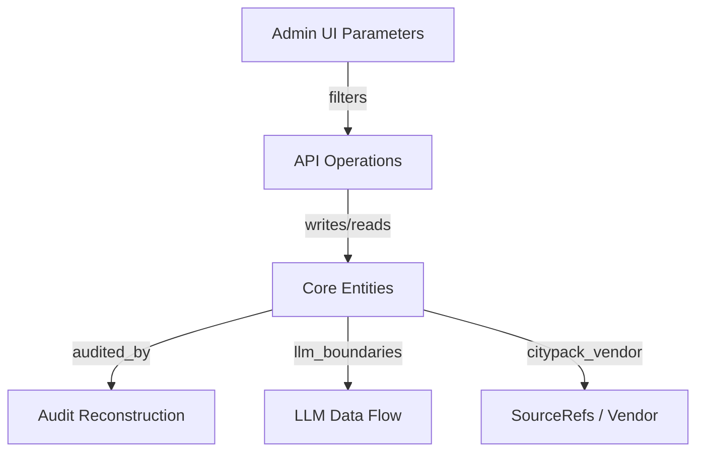

# ADMIN_UI_DATA_RELATION_MAP

- generatedAt: 2026-03-08T03:08:08.731Z
- source: docs/knowledge-graph/*.md + docs/knowledge-graph/runtime_probe.json

## UI Parameter Links
| Parameter | Entity | Relation | Evidence |
| --- | --- | --- | --- |
| notificationType | UNOBSERVED_IN_DOCS | UNOBSERVED_IN_DOCS | docs/knowledge-graph/ENTITY_SCHEMA.md:1 |
| scenario | UNOBSERVED_IN_DOCS | UNOBSERVED_IN_DOCS | docs/knowledge-graph/ENTITY_SCHEMA.md:1 |
| step | Checklists | field:step | src/repos/firestore/analyticsReadRepo.js:212 docs/knowledge-graph/ENTITY_SCHEMA.md:24 |
| step | Events | field:step | src/repos/firestore/analyticsReadRepo.js:212 docs/knowledge-graph/ENTITY_SCHEMA.md:242 |
| step | NotificationDeliveries | field:step | src/repos/firestore/analyticsReadRepo.js:212 docs/knowledge-graph/ENTITY_SCHEMA.md:312 |
| step | Notifications | field:step | src/repos/firestore/analyticsReadRepo.js:212 docs/knowledge-graph/ENTITY_SCHEMA.md:320 |
| step | Notifications | field:stepKey | src/repos/firestore/notificationsRepo.js:63 docs/knowledge-graph/ENTITY_SCHEMA.md:321 |
| step | StepRules | field:stepKey | src/repos/firestore/stepRulesRepo.js:265 docs/knowledge-graph/ENTITY_SCHEMA.md:409 |
| step | UserChecklists | field:step | src/repos/firestore/analyticsReadRepo.js:212 docs/knowledge-graph/ENTITY_SCHEMA.md:439 |
| step | Users | field:step | src/repos/firestore/analyticsReadRepo.js:212 docs/knowledge-graph/ENTITY_SCHEMA.md:452 |
| step | Users | field:stepKey | src/repos/firestore/usersRepo.js:132 docs/knowledge-graph/ENTITY_SCHEMA.md:453 |
| area | UNOBSERVED_IN_DOCS | UNOBSERVED_IN_DOCS | docs/knowledge-graph/ENTITY_SCHEMA.md:1 |
| cityPack | CityPackBulletins | field:cityPackId | src/repos/firestore/cityPackBulletinsRepo.js:45 docs/knowledge-graph/ENTITY_SCHEMA.md:26 |
| cityPack | CityPackMetricsDaily | field:cityPackId | src/repos/firestore/cityPackMetricsDailyRepo.js:97 docs/knowledge-graph/ENTITY_SCHEMA.md:64 |
| cityPack | CityPackRequests | field:draftCityPackIds | src/repos/firestore/cityPackRequestsRepo.js:77 docs/knowledge-graph/ENTITY_SCHEMA.md:67 |
| cityPack | CityPackUpdateProposals | field:cityPackId | src/repos/firestore/cityPackUpdateProposalsRepo.js:28 docs/knowledge-graph/ENTITY_SCHEMA.md:133 |
| cityPack | SourceRefs | field:usedByCityPackIds | src/repos/firestore/sourceRefsRepo.js:198 docs/knowledge-graph/ENTITY_SCHEMA.md:403 |
| vendor | AuditLogs | api_token_match | src/routes/admin/vendors.js:1 docs/REPO_AUDIT_INPUTS/dependency_graph.json:1234 docs/knowledge-graph/ENTITY_RELATIONS.md:341 src/index.js:1069 docs/knowledge-graph/ENTITY_API_MAP.md:365 src/repos/firestore/auditLogsRepo.js:51 docs/knowledge-graph/ENTITY_SCHEMA.md:13 |
| vendor | LinkRegistry | api_token_match | src/routes/admin/vendors.js:1 docs/REPO_AUDIT_INPUTS/dependency_graph.json:1234 docs/knowledge-graph/ENTITY_RELATIONS.md:341 src/index.js:1069 docs/knowledge-graph/ENTITY_API_MAP.md:366 src/repos/firestore/linkRegistryRepo.js:208 docs/knowledge-graph/ENTITY_SCHEMA.md:276 |
| vendor | AuditLogs | api_token_match | src/routes/admin/vendors.js:1 docs/REPO_AUDIT_INPUTS/dependency_graph.json:1234 docs/knowledge-graph/ENTITY_RELATIONS.md:341 src/index.js:1069 docs/knowledge-graph/ENTITY_API_MAP.md:367 src/repos/firestore/auditLogsRepo.js:51 docs/knowledge-graph/ENTITY_SCHEMA.md:13 |
| vendor | LinkRegistry | api_token_match | src/routes/admin/vendors.js:1 docs/REPO_AUDIT_INPUTS/dependency_graph.json:1234 docs/knowledge-graph/ENTITY_RELATIONS.md:341 src/index.js:1069 docs/knowledge-graph/ENTITY_API_MAP.md:368 src/repos/firestore/linkRegistryRepo.js:208 docs/knowledge-graph/ENTITY_SCHEMA.md:276 |
| vendor | AuditLogs | api_token_match | src/routes/admin/vendors.js:1 docs/REPO_AUDIT_INPUTS/dependency_graph.json:1234 docs/knowledge-graph/ENTITY_RELATIONS.md:341 src/index.js:1069 docs/knowledge-graph/ENTITY_API_MAP.md:1246 src/repos/firestore/auditLogsRepo.js:51 docs/knowledge-graph/ENTITY_SCHEMA.md:13 |
| vendor | LinkRegistry | api_token_match | src/routes/admin/vendors.js:1 docs/REPO_AUDIT_INPUTS/dependency_graph.json:1234 docs/knowledge-graph/ENTITY_RELATIONS.md:341 src/index.js:1069 docs/knowledge-graph/ENTITY_API_MAP.md:1247 src/repos/firestore/linkRegistryRepo.js:208 docs/knowledge-graph/ENTITY_SCHEMA.md:276 |
| vendor | AuditLogs | api_token_match | src/routes/admin/vendors.js:1 docs/REPO_AUDIT_INPUTS/dependency_graph.json:1234 docs/knowledge-graph/ENTITY_RELATIONS.md:341 src/index.js:1069 docs/knowledge-graph/ENTITY_API_MAP.md:1248 src/repos/firestore/auditLogsRepo.js:51 docs/knowledge-graph/ENTITY_SCHEMA.md:13 |
| vendor | LinkRegistry | api_token_match | src/routes/admin/vendors.js:1 docs/REPO_AUDIT_INPUTS/dependency_graph.json:1234 docs/knowledge-graph/ENTITY_RELATIONS.md:341 src/index.js:1069 docs/knowledge-graph/ENTITY_API_MAP.md:1249 src/repos/firestore/linkRegistryRepo.js:208 docs/knowledge-graph/ENTITY_SCHEMA.md:276 |
| vendor | AuditLogs | api_token_match | src/routes/admin/vendors.js:1 docs/REPO_AUDIT_INPUTS/dependency_graph.json:1234 docs/knowledge-graph/ENTITY_RELATIONS.md:341 src/index.js:1069 docs/knowledge-graph/ENTITY_API_MAP.md:1250 src/repos/firestore/auditLogsRepo.js:51 docs/knowledge-graph/ENTITY_SCHEMA.md:13 |
| vendor | LinkRegistry | api_token_match | src/routes/admin/vendors.js:1 docs/REPO_AUDIT_INPUTS/dependency_graph.json:1234 docs/knowledge-graph/ENTITY_RELATIONS.md:341 src/index.js:1069 docs/knowledge-graph/ENTITY_API_MAP.md:1251 src/repos/firestore/linkRegistryRepo.js:208 docs/knowledge-graph/ENTITY_SCHEMA.md:276 |
| vendor | AuditLogs | api_token_match | src/routes/admin/vendors.js:1 docs/REPO_AUDIT_INPUTS/dependency_graph.json:1234 docs/knowledge-graph/ENTITY_RELATIONS.md:341 src/index.js:1069 docs/knowledge-graph/ENTITY_API_MAP.md:1252 src/repos/firestore/auditLogsRepo.js:51 docs/knowledge-graph/ENTITY_SCHEMA.md:13 |
| vendor | LinkRegistry | api_token_match | src/routes/admin/vendors.js:1 docs/REPO_AUDIT_INPUTS/dependency_graph.json:1234 docs/knowledge-graph/ENTITY_RELATIONS.md:341 src/index.js:1069 docs/knowledge-graph/ENTITY_API_MAP.md:1253 src/repos/firestore/linkRegistryRepo.js:208 docs/knowledge-graph/ENTITY_SCHEMA.md:276 |
| vendor | AuditLogs | api_token_match | src/routes/admin/vendors.js:1 docs/REPO_AUDIT_INPUTS/dependency_graph.json:1234 docs/knowledge-graph/ENTITY_RELATIONS.md:342 src/index.js:1069 docs/knowledge-graph/ENTITY_API_MAP.md:365 src/repos/firestore/auditLogsRepo.js:51 docs/knowledge-graph/ENTITY_SCHEMA.md:13 |
| vendor | LinkRegistry | api_token_match | src/routes/admin/vendors.js:1 docs/REPO_AUDIT_INPUTS/dependency_graph.json:1234 docs/knowledge-graph/ENTITY_RELATIONS.md:342 src/index.js:1069 docs/knowledge-graph/ENTITY_API_MAP.md:366 src/repos/firestore/linkRegistryRepo.js:208 docs/knowledge-graph/ENTITY_SCHEMA.md:276 |
| vendor | AuditLogs | api_token_match | src/routes/admin/vendors.js:1 docs/REPO_AUDIT_INPUTS/dependency_graph.json:1234 docs/knowledge-graph/ENTITY_RELATIONS.md:342 src/index.js:1069 docs/knowledge-graph/ENTITY_API_MAP.md:367 src/repos/firestore/auditLogsRepo.js:51 docs/knowledge-graph/ENTITY_SCHEMA.md:13 |
| vendor | LinkRegistry | api_token_match | src/routes/admin/vendors.js:1 docs/REPO_AUDIT_INPUTS/dependency_graph.json:1234 docs/knowledge-graph/ENTITY_RELATIONS.md:342 src/index.js:1069 docs/knowledge-graph/ENTITY_API_MAP.md:368 src/repos/firestore/linkRegistryRepo.js:208 docs/knowledge-graph/ENTITY_SCHEMA.md:276 |
| vendor | AuditLogs | api_token_match | src/routes/admin/vendors.js:1 docs/REPO_AUDIT_INPUTS/dependency_graph.json:1234 docs/knowledge-graph/ENTITY_RELATIONS.md:342 src/index.js:1069 docs/knowledge-graph/ENTITY_API_MAP.md:1246 src/repos/firestore/auditLogsRepo.js:51 docs/knowledge-graph/ENTITY_SCHEMA.md:13 |
| vendor | LinkRegistry | api_token_match | src/routes/admin/vendors.js:1 docs/REPO_AUDIT_INPUTS/dependency_graph.json:1234 docs/knowledge-graph/ENTITY_RELATIONS.md:342 src/index.js:1069 docs/knowledge-graph/ENTITY_API_MAP.md:1247 src/repos/firestore/linkRegistryRepo.js:208 docs/knowledge-graph/ENTITY_SCHEMA.md:276 |
| vendor | AuditLogs | api_token_match | src/routes/admin/vendors.js:1 docs/REPO_AUDIT_INPUTS/dependency_graph.json:1234 docs/knowledge-graph/ENTITY_RELATIONS.md:342 src/index.js:1069 docs/knowledge-graph/ENTITY_API_MAP.md:1248 src/repos/firestore/auditLogsRepo.js:51 docs/knowledge-graph/ENTITY_SCHEMA.md:13 |
| vendor | LinkRegistry | api_token_match | src/routes/admin/vendors.js:1 docs/REPO_AUDIT_INPUTS/dependency_graph.json:1234 docs/knowledge-graph/ENTITY_RELATIONS.md:342 src/index.js:1069 docs/knowledge-graph/ENTITY_API_MAP.md:1249 src/repos/firestore/linkRegistryRepo.js:208 docs/knowledge-graph/ENTITY_SCHEMA.md:276 |
| vendor | AuditLogs | api_token_match | src/routes/admin/vendors.js:1 docs/REPO_AUDIT_INPUTS/dependency_graph.json:1234 docs/knowledge-graph/ENTITY_RELATIONS.md:342 src/index.js:1069 docs/knowledge-graph/ENTITY_API_MAP.md:1250 src/repos/firestore/auditLogsRepo.js:51 docs/knowledge-graph/ENTITY_SCHEMA.md:13 |
| vendor | LinkRegistry | api_token_match | src/routes/admin/vendors.js:1 docs/REPO_AUDIT_INPUTS/dependency_graph.json:1234 docs/knowledge-graph/ENTITY_RELATIONS.md:342 src/index.js:1069 docs/knowledge-graph/ENTITY_API_MAP.md:1251 src/repos/firestore/linkRegistryRepo.js:208 docs/knowledge-graph/ENTITY_SCHEMA.md:276 |
| vendor | AuditLogs | api_token_match | src/routes/admin/vendors.js:1 docs/REPO_AUDIT_INPUTS/dependency_graph.json:1234 docs/knowledge-graph/ENTITY_RELATIONS.md:342 src/index.js:1069 docs/knowledge-graph/ENTITY_API_MAP.md:1252 src/repos/firestore/auditLogsRepo.js:51 docs/knowledge-graph/ENTITY_SCHEMA.md:13 |
| vendor | LinkRegistry | api_token_match | src/routes/admin/vendors.js:1 docs/REPO_AUDIT_INPUTS/dependency_graph.json:1234 docs/knowledge-graph/ENTITY_RELATIONS.md:342 src/index.js:1069 docs/knowledge-graph/ENTITY_API_MAP.md:1253 src/repos/firestore/linkRegistryRepo.js:208 docs/knowledge-graph/ENTITY_SCHEMA.md:276 |
| vendor | AuditLogs | api_token_match | src/routes/admin/vendors.js:1 docs/REPO_AUDIT_INPUTS/dependency_graph.json:1234 docs/knowledge-graph/ENTITY_RELATIONS.md:343 src/index.js:1069 docs/knowledge-graph/ENTITY_API_MAP.md:365 src/repos/firestore/auditLogsRepo.js:51 docs/knowledge-graph/ENTITY_SCHEMA.md:13 |
| vendor | LinkRegistry | api_token_match | src/routes/admin/vendors.js:1 docs/REPO_AUDIT_INPUTS/dependency_graph.json:1234 docs/knowledge-graph/ENTITY_RELATIONS.md:343 src/index.js:1069 docs/knowledge-graph/ENTITY_API_MAP.md:366 src/repos/firestore/linkRegistryRepo.js:208 docs/knowledge-graph/ENTITY_SCHEMA.md:276 |
| vendor | AuditLogs | api_token_match | src/routes/admin/vendors.js:1 docs/REPO_AUDIT_INPUTS/dependency_graph.json:1234 docs/knowledge-graph/ENTITY_RELATIONS.md:343 src/index.js:1069 docs/knowledge-graph/ENTITY_API_MAP.md:367 src/repos/firestore/auditLogsRepo.js:51 docs/knowledge-graph/ENTITY_SCHEMA.md:13 |
| vendor | LinkRegistry | api_token_match | src/routes/admin/vendors.js:1 docs/REPO_AUDIT_INPUTS/dependency_graph.json:1234 docs/knowledge-graph/ENTITY_RELATIONS.md:343 src/index.js:1069 docs/knowledge-graph/ENTITY_API_MAP.md:368 src/repos/firestore/linkRegistryRepo.js:208 docs/knowledge-graph/ENTITY_SCHEMA.md:276 |
| vendor | AuditLogs | api_token_match | src/routes/admin/vendors.js:1 docs/REPO_AUDIT_INPUTS/dependency_graph.json:1234 docs/knowledge-graph/ENTITY_RELATIONS.md:343 src/index.js:1069 docs/knowledge-graph/ENTITY_API_MAP.md:1246 src/repos/firestore/auditLogsRepo.js:51 docs/knowledge-graph/ENTITY_SCHEMA.md:13 |
| vendor | LinkRegistry | api_token_match | src/routes/admin/vendors.js:1 docs/REPO_AUDIT_INPUTS/dependency_graph.json:1234 docs/knowledge-graph/ENTITY_RELATIONS.md:343 src/index.js:1069 docs/knowledge-graph/ENTITY_API_MAP.md:1247 src/repos/firestore/linkRegistryRepo.js:208 docs/knowledge-graph/ENTITY_SCHEMA.md:276 |
| vendor | AuditLogs | api_token_match | src/routes/admin/vendors.js:1 docs/REPO_AUDIT_INPUTS/dependency_graph.json:1234 docs/knowledge-graph/ENTITY_RELATIONS.md:343 src/index.js:1069 docs/knowledge-graph/ENTITY_API_MAP.md:1248 src/repos/firestore/auditLogsRepo.js:51 docs/knowledge-graph/ENTITY_SCHEMA.md:13 |
| vendor | LinkRegistry | api_token_match | src/routes/admin/vendors.js:1 docs/REPO_AUDIT_INPUTS/dependency_graph.json:1234 docs/knowledge-graph/ENTITY_RELATIONS.md:343 src/index.js:1069 docs/knowledge-graph/ENTITY_API_MAP.md:1249 src/repos/firestore/linkRegistryRepo.js:208 docs/knowledge-graph/ENTITY_SCHEMA.md:276 |
| vendor | AuditLogs | api_token_match | src/routes/admin/vendors.js:1 docs/REPO_AUDIT_INPUTS/dependency_graph.json:1234 docs/knowledge-graph/ENTITY_RELATIONS.md:343 src/index.js:1069 docs/knowledge-graph/ENTITY_API_MAP.md:1250 src/repos/firestore/auditLogsRepo.js:51 docs/knowledge-graph/ENTITY_SCHEMA.md:13 |
| vendor | LinkRegistry | api_token_match | src/routes/admin/vendors.js:1 docs/REPO_AUDIT_INPUTS/dependency_graph.json:1234 docs/knowledge-graph/ENTITY_RELATIONS.md:343 src/index.js:1069 docs/knowledge-graph/ENTITY_API_MAP.md:1251 src/repos/firestore/linkRegistryRepo.js:208 docs/knowledge-graph/ENTITY_SCHEMA.md:276 |
| vendor | AuditLogs | api_token_match | src/routes/admin/vendors.js:1 docs/REPO_AUDIT_INPUTS/dependency_graph.json:1234 docs/knowledge-graph/ENTITY_RELATIONS.md:343 src/index.js:1069 docs/knowledge-graph/ENTITY_API_MAP.md:1252 src/repos/firestore/auditLogsRepo.js:51 docs/knowledge-graph/ENTITY_SCHEMA.md:13 |
| vendor | LinkRegistry | api_token_match | src/routes/admin/vendors.js:1 docs/REPO_AUDIT_INPUTS/dependency_graph.json:1234 docs/knowledge-graph/ENTITY_RELATIONS.md:343 src/index.js:1069 docs/knowledge-graph/ENTITY_API_MAP.md:1253 src/repos/firestore/linkRegistryRepo.js:208 docs/knowledge-graph/ENTITY_SCHEMA.md:276 |
| audience | UNOBSERVED_IN_DOCS | UNOBSERVED_IN_DOCS | docs/knowledge-graph/ENTITY_SCHEMA.md:1 |
| category | EmergencyBulletins | field:category | src/repos/firestore/emergencyBulletinsRepo.js:42 docs/knowledge-graph/ENTITY_SCHEMA.md:159 |
| category | EmergencyDiffs | field:category | src/repos/firestore/emergencyDiffsRepo.js:43 docs/knowledge-graph/ENTITY_SCHEMA.md:176 |
| category | EmergencyEventsNormalized | field:category | src/repos/firestore/emergencyEventsRepo.js:27 docs/knowledge-graph/ENTITY_SCHEMA.md:192 |
| category | NotificationDeliveries | field:notificationCategory | src/repos/firestore/deliveriesRepo.js:72 docs/knowledge-graph/ENTITY_SCHEMA.md:301 |
| status | CityPackBulletins | field:status | src/repos/firestore/cityPackBulletinsRepo.js:106 docs/knowledge-graph/ENTITY_SCHEMA.md:38 |
| status | CityPackBulletins | field:status | src/repos/firestore/cityPackBulletinsRepo.js:44 docs/knowledge-graph/ENTITY_SCHEMA.md:39 |
| status | CityPackFeedback | field:status | src/repos/firestore/cityPackFeedbackRepo.js:130 docs/knowledge-graph/ENTITY_SCHEMA.md:59 |
| status | CityPackFeedback | field:status | src/repos/firestore/cityPackFeedbackRepo.js:65 docs/knowledge-graph/ENTITY_SCHEMA.md:60 |
| status | CityPackRequests | field:status | src/repos/firestore/cityPackRequestsRepo.js:140 docs/knowledge-graph/ENTITY_SCHEMA.md:86 |
| status | CityPackRequests | field:status | src/repos/firestore/cityPackRequestsRepo.js:67 docs/knowledge-graph/ENTITY_SCHEMA.md:87 |
| status | CityPacks | field:status | src/repos/firestore/cityPacksRepo.js:210 docs/knowledge-graph/ENTITY_SCHEMA.md:111 |
| status | CityPacks | field:status | src/repos/firestore/cityPacksRepo.js:435 docs/knowledge-graph/ENTITY_SCHEMA.md:112 |
| status | CityPackTemplateLibrary | field:status | src/repos/firestore/cityPackTemplateLibraryRepo.js:32 docs/knowledge-graph/ENTITY_SCHEMA.md:125 |
| status | CityPackTemplateLibrary | field:status | src/repos/firestore/cityPackTemplateLibraryRepo.js:85 docs/knowledge-graph/ENTITY_SCHEMA.md:126 |
| status | CityPackUpdateProposals | field:status | src/repos/firestore/cityPackUpdateProposalsRepo.js:27 docs/knowledge-graph/ENTITY_SCHEMA.md:140 |
| status | CityPackUpdateProposals | field:status | src/repos/firestore/cityPackUpdateProposalsRepo.js:82 docs/knowledge-graph/ENTITY_SCHEMA.md:141 |
| status | EmergencyBulletins | field:status | src/repos/firestore/emergencyBulletinsRepo.js:40 docs/knowledge-graph/ENTITY_SCHEMA.md:172 |
| status | EmergencyBulletins | field:status | src/repos/firestore/emergencyBulletinsRepo.js:92 docs/knowledge-graph/ENTITY_SCHEMA.md:173 |
| status | EmergencyProviders | field:status | src/repos/firestore/emergencyProvidersRepo.js:69 docs/knowledge-graph/ENTITY_SCHEMA.md:220 |
| status | FaqArticles | field:status | src/repos/firestore/faqArticlesRepo.js:204 docs/knowledge-graph/ENTITY_SCHEMA.md:247 |
| status | FaqArticles | field:status | src/repos/firestore/faqArticlesRepo.js:247 docs/knowledge-graph/ENTITY_SCHEMA.md:248 |
| status | JourneyBranchQueue | field:status | src/repos/firestore/journeyBranchQueueRepo.js:165 docs/knowledge-graph/ENTITY_SCHEMA.md:253 |
| status | JourneyTodoItems | field:graphStatus | src/repos/firestore/journeyTodoItemsRepo.js:298 docs/knowledge-graph/ENTITY_SCHEMA.md:263 |
| status | JourneyTodoItems | field:status | src/repos/firestore/journeyTodoItemsRepo.js:296 docs/knowledge-graph/ENTITY_SCHEMA.md:270 |
| status | JourneyTodoItems | field:status | src/repos/firestore/journeyTodoItemsRepo.js:333 docs/knowledge-graph/ENTITY_SCHEMA.md:271 |
| status | Notices | field:status | src/repos/firestore/noticesRepo.js:58 docs/knowledge-graph/ENTITY_SCHEMA.md:289 |

## Operation Links (Top 120)
| Operation | Entity | API | Evidence |
| --- | --- | --- | --- |
| appendAuditLog | AuditLogs | GET /^\/api\/admin\/city-pack-bulletins\/[^/]+(\/(approve|reject|send))?$/ | src/routes/admin/cityPackBulletins.js:1 docs/REPO_AUDIT_INPUTS/dependency_graph.json:951 docs/knowledge-graph/ENTITY_RELATIONS.md:109 src/index.js:1242 docs/knowledge-graph/ENTITY_API_MAP.md:13 src/repos/firestore/auditLogsRepo.js:51 docs/knowledge-graph/ENTITY_SCHEMA.md:13 |
| appendAuditLog | DecisionTimeline | GET /^\/api\/admin\/city-pack-bulletins\/[^/]+(\/(approve|reject|send))?$/ | src/routes/admin/cityPackBulletins.js:1 docs/REPO_AUDIT_INPUTS/dependency_graph.json:951 docs/knowledge-graph/ENTITY_RELATIONS.md:109 src/index.js:1242 docs/knowledge-graph/ENTITY_API_MAP.md:14 src/repos/firestore/decisionTimelineRepo.js:40 docs/knowledge-graph/ENTITY_SCHEMA.md:153 |
| appendAuditLog | LinkRegistry | GET /^\/api\/admin\/city-pack-bulletins\/[^/]+(\/(approve|reject|send))?$/ | src/routes/admin/cityPackBulletins.js:1 docs/REPO_AUDIT_INPUTS/dependency_graph.json:951 docs/knowledge-graph/ENTITY_RELATIONS.md:109 src/index.js:1242 docs/knowledge-graph/ENTITY_API_MAP.md:15 src/repos/firestore/linkRegistryRepo.js:208 docs/knowledge-graph/ENTITY_SCHEMA.md:276 |
| appendAuditLog | NotificationDeliveries | GET /^\/api\/admin\/city-pack-bulletins\/[^/]+(\/(approve|reject|send))?$/ | src/routes/admin/cityPackBulletins.js:1 docs/REPO_AUDIT_INPUTS/dependency_graph.json:951 docs/knowledge-graph/ENTITY_RELATIONS.md:109 src/index.js:1242 docs/knowledge-graph/ENTITY_API_MAP.md:16 src/repos/firestore/deliveriesRepo.js:270 docs/knowledge-graph/ENTITY_SCHEMA.md:292 |
| appendAuditLog | Notifications | GET /^\/api\/admin\/city-pack-bulletins\/[^/]+(\/(approve|reject|send))?$/ | src/routes/admin/cityPackBulletins.js:1 docs/REPO_AUDIT_INPUTS/dependency_graph.json:951 docs/knowledge-graph/ENTITY_RELATIONS.md:109 src/index.js:1242 docs/knowledge-graph/ENTITY_API_MAP.md:17 src/repos/firestore/analyticsReadRepo.js:84 docs/knowledge-graph/ENTITY_SCHEMA.md:313 |
| appendAuditLog | UserCityPackPreferences | GET /^\/api\/admin\/city-pack-bulletins\/[^/]+(\/(approve|reject|send))?$/ | src/routes/admin/cityPackBulletins.js:1 docs/REPO_AUDIT_INPUTS/dependency_graph.json:951 docs/knowledge-graph/ENTITY_RELATIONS.md:109 src/index.js:1242 docs/knowledge-graph/ENTITY_API_MAP.md:18 docs/REPO_AUDIT_INPUTS/data_model_map.json:1334 docs/knowledge-graph/ENTITY_SCHEMA.md:440 |
| appendAuditLog | UserJourneyProfiles | GET /^\/api\/admin\/city-pack-bulletins\/[^/]+(\/(approve|reject|send))?$/ | src/routes/admin/cityPackBulletins.js:1 docs/REPO_AUDIT_INPUTS/dependency_graph.json:951 docs/knowledge-graph/ENTITY_RELATIONS.md:109 src/index.js:1242 docs/knowledge-graph/ENTITY_API_MAP.md:19 docs/REPO_AUDIT_INPUTS/data_model_map.json:1382 src/repos/firestore/userJourneyProfilesRepo.js:5 |
| appendAuditLog | Users | GET /^\/api\/admin\/city-pack-bulletins\/[^/]+(\/(approve|reject|send))?$/ | src/routes/admin/cityPackBulletins.js:1 docs/REPO_AUDIT_INPUTS/dependency_graph.json:951 docs/knowledge-graph/ENTITY_RELATIONS.md:109 src/index.js:1242 docs/knowledge-graph/ENTITY_API_MAP.md:20 src/repos/firestore/analyticsReadRepo.js:84 docs/knowledge-graph/ENTITY_SCHEMA.md:445 |
| appendAuditLog | AuditLogs | POST /^\/api\/admin\/city-pack-bulletins\/[^/]+(\/(approve|reject|send))?$/ | src/routes/admin/cityPackBulletins.js:1 docs/REPO_AUDIT_INPUTS/dependency_graph.json:951 docs/knowledge-graph/ENTITY_RELATIONS.md:109 src/index.js:1242 docs/knowledge-graph/ENTITY_API_MAP.md:21 src/repos/firestore/auditLogsRepo.js:51 docs/knowledge-graph/ENTITY_SCHEMA.md:13 |
| appendAuditLog | DecisionTimeline | POST /^\/api\/admin\/city-pack-bulletins\/[^/]+(\/(approve|reject|send))?$/ | src/routes/admin/cityPackBulletins.js:1 docs/REPO_AUDIT_INPUTS/dependency_graph.json:951 docs/knowledge-graph/ENTITY_RELATIONS.md:109 src/index.js:1242 docs/knowledge-graph/ENTITY_API_MAP.md:22 src/repos/firestore/decisionTimelineRepo.js:40 docs/knowledge-graph/ENTITY_SCHEMA.md:153 |
| appendAuditLog | LinkRegistry | POST /^\/api\/admin\/city-pack-bulletins\/[^/]+(\/(approve|reject|send))?$/ | src/routes/admin/cityPackBulletins.js:1 docs/REPO_AUDIT_INPUTS/dependency_graph.json:951 docs/knowledge-graph/ENTITY_RELATIONS.md:109 src/index.js:1242 docs/knowledge-graph/ENTITY_API_MAP.md:23 src/repos/firestore/linkRegistryRepo.js:208 docs/knowledge-graph/ENTITY_SCHEMA.md:276 |
| appendAuditLog | NotificationDeliveries | POST /^\/api\/admin\/city-pack-bulletins\/[^/]+(\/(approve|reject|send))?$/ | src/routes/admin/cityPackBulletins.js:1 docs/REPO_AUDIT_INPUTS/dependency_graph.json:951 docs/knowledge-graph/ENTITY_RELATIONS.md:109 src/index.js:1242 docs/knowledge-graph/ENTITY_API_MAP.md:24 src/repos/firestore/deliveriesRepo.js:270 docs/knowledge-graph/ENTITY_SCHEMA.md:292 |
| appendAuditLog | Notifications | POST /^\/api\/admin\/city-pack-bulletins\/[^/]+(\/(approve|reject|send))?$/ | src/routes/admin/cityPackBulletins.js:1 docs/REPO_AUDIT_INPUTS/dependency_graph.json:951 docs/knowledge-graph/ENTITY_RELATIONS.md:109 src/index.js:1242 docs/knowledge-graph/ENTITY_API_MAP.md:25 src/repos/firestore/analyticsReadRepo.js:84 docs/knowledge-graph/ENTITY_SCHEMA.md:313 |
| appendAuditLog | UserCityPackPreferences | POST /^\/api\/admin\/city-pack-bulletins\/[^/]+(\/(approve|reject|send))?$/ | src/routes/admin/cityPackBulletins.js:1 docs/REPO_AUDIT_INPUTS/dependency_graph.json:951 docs/knowledge-graph/ENTITY_RELATIONS.md:109 src/index.js:1242 docs/knowledge-graph/ENTITY_API_MAP.md:26 docs/REPO_AUDIT_INPUTS/data_model_map.json:1334 docs/knowledge-graph/ENTITY_SCHEMA.md:440 |
| appendAuditLog | UserJourneyProfiles | POST /^\/api\/admin\/city-pack-bulletins\/[^/]+(\/(approve|reject|send))?$/ | src/routes/admin/cityPackBulletins.js:1 docs/REPO_AUDIT_INPUTS/dependency_graph.json:951 docs/knowledge-graph/ENTITY_RELATIONS.md:109 src/index.js:1242 docs/knowledge-graph/ENTITY_API_MAP.md:27 docs/REPO_AUDIT_INPUTS/data_model_map.json:1382 src/repos/firestore/userJourneyProfilesRepo.js:5 |
| appendAuditLog | Users | POST /^\/api\/admin\/city-pack-bulletins\/[^/]+(\/(approve|reject|send))?$/ | src/routes/admin/cityPackBulletins.js:1 docs/REPO_AUDIT_INPUTS/dependency_graph.json:951 docs/knowledge-graph/ENTITY_RELATIONS.md:109 src/index.js:1242 docs/knowledge-graph/ENTITY_API_MAP.md:28 src/repos/firestore/analyticsReadRepo.js:84 docs/knowledge-graph/ENTITY_SCHEMA.md:445 |
| appendAuditLog | AuditLogs | GET /api/admin/city-pack-bulletins | src/routes/admin/cityPackBulletins.js:1 docs/REPO_AUDIT_INPUTS/dependency_graph.json:951 docs/knowledge-graph/ENTITY_RELATIONS.md:109 src/index.js:1242 docs/knowledge-graph/ENTITY_API_MAP.md:396 src/repos/firestore/auditLogsRepo.js:51 docs/knowledge-graph/ENTITY_SCHEMA.md:13 |
| appendAuditLog | DecisionTimeline | GET /api/admin/city-pack-bulletins | src/routes/admin/cityPackBulletins.js:1 docs/REPO_AUDIT_INPUTS/dependency_graph.json:951 docs/knowledge-graph/ENTITY_RELATIONS.md:109 src/index.js:1242 docs/knowledge-graph/ENTITY_API_MAP.md:397 src/repos/firestore/decisionTimelineRepo.js:40 docs/knowledge-graph/ENTITY_SCHEMA.md:153 |
| appendAuditLog | LinkRegistry | GET /api/admin/city-pack-bulletins | src/routes/admin/cityPackBulletins.js:1 docs/REPO_AUDIT_INPUTS/dependency_graph.json:951 docs/knowledge-graph/ENTITY_RELATIONS.md:109 src/index.js:1242 docs/knowledge-graph/ENTITY_API_MAP.md:398 src/repos/firestore/linkRegistryRepo.js:208 docs/knowledge-graph/ENTITY_SCHEMA.md:276 |
| appendAuditLog | NotificationDeliveries | GET /api/admin/city-pack-bulletins | src/routes/admin/cityPackBulletins.js:1 docs/REPO_AUDIT_INPUTS/dependency_graph.json:951 docs/knowledge-graph/ENTITY_RELATIONS.md:109 src/index.js:1242 docs/knowledge-graph/ENTITY_API_MAP.md:399 src/repos/firestore/deliveriesRepo.js:270 docs/knowledge-graph/ENTITY_SCHEMA.md:292 |
| appendAuditLog | Notifications | GET /api/admin/city-pack-bulletins | src/routes/admin/cityPackBulletins.js:1 docs/REPO_AUDIT_INPUTS/dependency_graph.json:951 docs/knowledge-graph/ENTITY_RELATIONS.md:109 src/index.js:1242 docs/knowledge-graph/ENTITY_API_MAP.md:400 src/repos/firestore/analyticsReadRepo.js:84 docs/knowledge-graph/ENTITY_SCHEMA.md:313 |
| appendAuditLog | UserCityPackPreferences | GET /api/admin/city-pack-bulletins | src/routes/admin/cityPackBulletins.js:1 docs/REPO_AUDIT_INPUTS/dependency_graph.json:951 docs/knowledge-graph/ENTITY_RELATIONS.md:109 src/index.js:1242 docs/knowledge-graph/ENTITY_API_MAP.md:401 docs/REPO_AUDIT_INPUTS/data_model_map.json:1334 docs/knowledge-graph/ENTITY_SCHEMA.md:440 |
| appendAuditLog | UserJourneyProfiles | GET /api/admin/city-pack-bulletins | src/routes/admin/cityPackBulletins.js:1 docs/REPO_AUDIT_INPUTS/dependency_graph.json:951 docs/knowledge-graph/ENTITY_RELATIONS.md:109 src/index.js:1242 docs/knowledge-graph/ENTITY_API_MAP.md:402 docs/REPO_AUDIT_INPUTS/data_model_map.json:1382 src/repos/firestore/userJourneyProfilesRepo.js:5 |
| appendAuditLog | Users | GET /api/admin/city-pack-bulletins | src/routes/admin/cityPackBulletins.js:1 docs/REPO_AUDIT_INPUTS/dependency_graph.json:951 docs/knowledge-graph/ENTITY_RELATIONS.md:109 src/index.js:1242 docs/knowledge-graph/ENTITY_API_MAP.md:403 src/repos/firestore/analyticsReadRepo.js:84 docs/knowledge-graph/ENTITY_SCHEMA.md:445 |
| appendAuditLog | AuditLogs | POST /api/admin/city-pack-bulletins | src/routes/admin/cityPackBulletins.js:1 docs/REPO_AUDIT_INPUTS/dependency_graph.json:951 docs/knowledge-graph/ENTITY_RELATIONS.md:109 src/index.js:1242 docs/knowledge-graph/ENTITY_API_MAP.md:404 src/repos/firestore/auditLogsRepo.js:51 docs/knowledge-graph/ENTITY_SCHEMA.md:13 |
| appendAuditLog | DecisionTimeline | POST /api/admin/city-pack-bulletins | src/routes/admin/cityPackBulletins.js:1 docs/REPO_AUDIT_INPUTS/dependency_graph.json:951 docs/knowledge-graph/ENTITY_RELATIONS.md:109 src/index.js:1242 docs/knowledge-graph/ENTITY_API_MAP.md:405 src/repos/firestore/decisionTimelineRepo.js:40 docs/knowledge-graph/ENTITY_SCHEMA.md:153 |
| appendAuditLog | LinkRegistry | POST /api/admin/city-pack-bulletins | src/routes/admin/cityPackBulletins.js:1 docs/REPO_AUDIT_INPUTS/dependency_graph.json:951 docs/knowledge-graph/ENTITY_RELATIONS.md:109 src/index.js:1242 docs/knowledge-graph/ENTITY_API_MAP.md:406 src/repos/firestore/linkRegistryRepo.js:208 docs/knowledge-graph/ENTITY_SCHEMA.md:276 |
| appendAuditLog | NotificationDeliveries | POST /api/admin/city-pack-bulletins | src/routes/admin/cityPackBulletins.js:1 docs/REPO_AUDIT_INPUTS/dependency_graph.json:951 docs/knowledge-graph/ENTITY_RELATIONS.md:109 src/index.js:1242 docs/knowledge-graph/ENTITY_API_MAP.md:407 src/repos/firestore/deliveriesRepo.js:270 docs/knowledge-graph/ENTITY_SCHEMA.md:292 |
| appendAuditLog | Notifications | POST /api/admin/city-pack-bulletins | src/routes/admin/cityPackBulletins.js:1 docs/REPO_AUDIT_INPUTS/dependency_graph.json:951 docs/knowledge-graph/ENTITY_RELATIONS.md:109 src/index.js:1242 docs/knowledge-graph/ENTITY_API_MAP.md:408 src/repos/firestore/analyticsReadRepo.js:84 docs/knowledge-graph/ENTITY_SCHEMA.md:313 |
| appendAuditLog | UserCityPackPreferences | POST /api/admin/city-pack-bulletins | src/routes/admin/cityPackBulletins.js:1 docs/REPO_AUDIT_INPUTS/dependency_graph.json:951 docs/knowledge-graph/ENTITY_RELATIONS.md:109 src/index.js:1242 docs/knowledge-graph/ENTITY_API_MAP.md:409 docs/REPO_AUDIT_INPUTS/data_model_map.json:1334 docs/knowledge-graph/ENTITY_SCHEMA.md:440 |
| appendAuditLog | UserJourneyProfiles | POST /api/admin/city-pack-bulletins | src/routes/admin/cityPackBulletins.js:1 docs/REPO_AUDIT_INPUTS/dependency_graph.json:951 docs/knowledge-graph/ENTITY_RELATIONS.md:109 src/index.js:1242 docs/knowledge-graph/ENTITY_API_MAP.md:410 docs/REPO_AUDIT_INPUTS/data_model_map.json:1382 src/repos/firestore/userJourneyProfilesRepo.js:5 |
| appendAuditLog | Users | POST /api/admin/city-pack-bulletins | src/routes/admin/cityPackBulletins.js:1 docs/REPO_AUDIT_INPUTS/dependency_graph.json:951 docs/knowledge-graph/ENTITY_RELATIONS.md:109 src/index.js:1242 docs/knowledge-graph/ENTITY_API_MAP.md:411 src/repos/firestore/analyticsReadRepo.js:84 docs/knowledge-graph/ENTITY_SCHEMA.md:445 |
| sendNotification | AuditLogs | GET /^\/api\/admin\/city-pack-bulletins\/[^/]+(\/(approve|reject|send))?$/ | src/routes/admin/cityPackBulletins.js:1 docs/REPO_AUDIT_INPUTS/dependency_graph.json:951 docs/knowledge-graph/ENTITY_RELATIONS.md:110 src/index.js:1242 docs/knowledge-graph/ENTITY_API_MAP.md:13 src/repos/firestore/auditLogsRepo.js:51 docs/knowledge-graph/ENTITY_SCHEMA.md:13 |
| sendNotification | DecisionTimeline | GET /^\/api\/admin\/city-pack-bulletins\/[^/]+(\/(approve|reject|send))?$/ | src/routes/admin/cityPackBulletins.js:1 docs/REPO_AUDIT_INPUTS/dependency_graph.json:951 docs/knowledge-graph/ENTITY_RELATIONS.md:110 src/index.js:1242 docs/knowledge-graph/ENTITY_API_MAP.md:14 src/repos/firestore/decisionTimelineRepo.js:40 docs/knowledge-graph/ENTITY_SCHEMA.md:153 |
| sendNotification | LinkRegistry | GET /^\/api\/admin\/city-pack-bulletins\/[^/]+(\/(approve|reject|send))?$/ | src/routes/admin/cityPackBulletins.js:1 docs/REPO_AUDIT_INPUTS/dependency_graph.json:951 docs/knowledge-graph/ENTITY_RELATIONS.md:110 src/index.js:1242 docs/knowledge-graph/ENTITY_API_MAP.md:15 src/repos/firestore/linkRegistryRepo.js:208 docs/knowledge-graph/ENTITY_SCHEMA.md:276 |
| sendNotification | NotificationDeliveries | GET /^\/api\/admin\/city-pack-bulletins\/[^/]+(\/(approve|reject|send))?$/ | src/routes/admin/cityPackBulletins.js:1 docs/REPO_AUDIT_INPUTS/dependency_graph.json:951 docs/knowledge-graph/ENTITY_RELATIONS.md:110 src/index.js:1242 docs/knowledge-graph/ENTITY_API_MAP.md:16 src/repos/firestore/deliveriesRepo.js:270 docs/knowledge-graph/ENTITY_SCHEMA.md:292 |
| sendNotification | Notifications | GET /^\/api\/admin\/city-pack-bulletins\/[^/]+(\/(approve|reject|send))?$/ | src/routes/admin/cityPackBulletins.js:1 docs/REPO_AUDIT_INPUTS/dependency_graph.json:951 docs/knowledge-graph/ENTITY_RELATIONS.md:110 src/index.js:1242 docs/knowledge-graph/ENTITY_API_MAP.md:17 src/repos/firestore/analyticsReadRepo.js:84 docs/knowledge-graph/ENTITY_SCHEMA.md:313 |
| sendNotification | UserCityPackPreferences | GET /^\/api\/admin\/city-pack-bulletins\/[^/]+(\/(approve|reject|send))?$/ | src/routes/admin/cityPackBulletins.js:1 docs/REPO_AUDIT_INPUTS/dependency_graph.json:951 docs/knowledge-graph/ENTITY_RELATIONS.md:110 src/index.js:1242 docs/knowledge-graph/ENTITY_API_MAP.md:18 docs/REPO_AUDIT_INPUTS/data_model_map.json:1334 docs/knowledge-graph/ENTITY_SCHEMA.md:440 |
| sendNotification | UserJourneyProfiles | GET /^\/api\/admin\/city-pack-bulletins\/[^/]+(\/(approve|reject|send))?$/ | src/routes/admin/cityPackBulletins.js:1 docs/REPO_AUDIT_INPUTS/dependency_graph.json:951 docs/knowledge-graph/ENTITY_RELATIONS.md:110 src/index.js:1242 docs/knowledge-graph/ENTITY_API_MAP.md:19 docs/REPO_AUDIT_INPUTS/data_model_map.json:1382 src/repos/firestore/userJourneyProfilesRepo.js:5 |
| sendNotification | Users | GET /^\/api\/admin\/city-pack-bulletins\/[^/]+(\/(approve|reject|send))?$/ | src/routes/admin/cityPackBulletins.js:1 docs/REPO_AUDIT_INPUTS/dependency_graph.json:951 docs/knowledge-graph/ENTITY_RELATIONS.md:110 src/index.js:1242 docs/knowledge-graph/ENTITY_API_MAP.md:20 src/repos/firestore/analyticsReadRepo.js:84 docs/knowledge-graph/ENTITY_SCHEMA.md:445 |
| sendNotification | AuditLogs | POST /^\/api\/admin\/city-pack-bulletins\/[^/]+(\/(approve|reject|send))?$/ | src/routes/admin/cityPackBulletins.js:1 docs/REPO_AUDIT_INPUTS/dependency_graph.json:951 docs/knowledge-graph/ENTITY_RELATIONS.md:110 src/index.js:1242 docs/knowledge-graph/ENTITY_API_MAP.md:21 src/repos/firestore/auditLogsRepo.js:51 docs/knowledge-graph/ENTITY_SCHEMA.md:13 |
| sendNotification | DecisionTimeline | POST /^\/api\/admin\/city-pack-bulletins\/[^/]+(\/(approve|reject|send))?$/ | src/routes/admin/cityPackBulletins.js:1 docs/REPO_AUDIT_INPUTS/dependency_graph.json:951 docs/knowledge-graph/ENTITY_RELATIONS.md:110 src/index.js:1242 docs/knowledge-graph/ENTITY_API_MAP.md:22 src/repos/firestore/decisionTimelineRepo.js:40 docs/knowledge-graph/ENTITY_SCHEMA.md:153 |
| sendNotification | LinkRegistry | POST /^\/api\/admin\/city-pack-bulletins\/[^/]+(\/(approve|reject|send))?$/ | src/routes/admin/cityPackBulletins.js:1 docs/REPO_AUDIT_INPUTS/dependency_graph.json:951 docs/knowledge-graph/ENTITY_RELATIONS.md:110 src/index.js:1242 docs/knowledge-graph/ENTITY_API_MAP.md:23 src/repos/firestore/linkRegistryRepo.js:208 docs/knowledge-graph/ENTITY_SCHEMA.md:276 |
| sendNotification | NotificationDeliveries | POST /^\/api\/admin\/city-pack-bulletins\/[^/]+(\/(approve|reject|send))?$/ | src/routes/admin/cityPackBulletins.js:1 docs/REPO_AUDIT_INPUTS/dependency_graph.json:951 docs/knowledge-graph/ENTITY_RELATIONS.md:110 src/index.js:1242 docs/knowledge-graph/ENTITY_API_MAP.md:24 src/repos/firestore/deliveriesRepo.js:270 docs/knowledge-graph/ENTITY_SCHEMA.md:292 |
| sendNotification | Notifications | POST /^\/api\/admin\/city-pack-bulletins\/[^/]+(\/(approve|reject|send))?$/ | src/routes/admin/cityPackBulletins.js:1 docs/REPO_AUDIT_INPUTS/dependency_graph.json:951 docs/knowledge-graph/ENTITY_RELATIONS.md:110 src/index.js:1242 docs/knowledge-graph/ENTITY_API_MAP.md:25 src/repos/firestore/analyticsReadRepo.js:84 docs/knowledge-graph/ENTITY_SCHEMA.md:313 |
| sendNotification | UserCityPackPreferences | POST /^\/api\/admin\/city-pack-bulletins\/[^/]+(\/(approve|reject|send))?$/ | src/routes/admin/cityPackBulletins.js:1 docs/REPO_AUDIT_INPUTS/dependency_graph.json:951 docs/knowledge-graph/ENTITY_RELATIONS.md:110 src/index.js:1242 docs/knowledge-graph/ENTITY_API_MAP.md:26 docs/REPO_AUDIT_INPUTS/data_model_map.json:1334 docs/knowledge-graph/ENTITY_SCHEMA.md:440 |
| sendNotification | UserJourneyProfiles | POST /^\/api\/admin\/city-pack-bulletins\/[^/]+(\/(approve|reject|send))?$/ | src/routes/admin/cityPackBulletins.js:1 docs/REPO_AUDIT_INPUTS/dependency_graph.json:951 docs/knowledge-graph/ENTITY_RELATIONS.md:110 src/index.js:1242 docs/knowledge-graph/ENTITY_API_MAP.md:27 docs/REPO_AUDIT_INPUTS/data_model_map.json:1382 src/repos/firestore/userJourneyProfilesRepo.js:5 |
| sendNotification | Users | POST /^\/api\/admin\/city-pack-bulletins\/[^/]+(\/(approve|reject|send))?$/ | src/routes/admin/cityPackBulletins.js:1 docs/REPO_AUDIT_INPUTS/dependency_graph.json:951 docs/knowledge-graph/ENTITY_RELATIONS.md:110 src/index.js:1242 docs/knowledge-graph/ENTITY_API_MAP.md:28 src/repos/firestore/analyticsReadRepo.js:84 docs/knowledge-graph/ENTITY_SCHEMA.md:445 |
| sendNotification | AuditLogs | GET /api/admin/city-pack-bulletins | src/routes/admin/cityPackBulletins.js:1 docs/REPO_AUDIT_INPUTS/dependency_graph.json:951 docs/knowledge-graph/ENTITY_RELATIONS.md:110 src/index.js:1242 docs/knowledge-graph/ENTITY_API_MAP.md:396 src/repos/firestore/auditLogsRepo.js:51 docs/knowledge-graph/ENTITY_SCHEMA.md:13 |
| sendNotification | DecisionTimeline | GET /api/admin/city-pack-bulletins | src/routes/admin/cityPackBulletins.js:1 docs/REPO_AUDIT_INPUTS/dependency_graph.json:951 docs/knowledge-graph/ENTITY_RELATIONS.md:110 src/index.js:1242 docs/knowledge-graph/ENTITY_API_MAP.md:397 src/repos/firestore/decisionTimelineRepo.js:40 docs/knowledge-graph/ENTITY_SCHEMA.md:153 |
| sendNotification | LinkRegistry | GET /api/admin/city-pack-bulletins | src/routes/admin/cityPackBulletins.js:1 docs/REPO_AUDIT_INPUTS/dependency_graph.json:951 docs/knowledge-graph/ENTITY_RELATIONS.md:110 src/index.js:1242 docs/knowledge-graph/ENTITY_API_MAP.md:398 src/repos/firestore/linkRegistryRepo.js:208 docs/knowledge-graph/ENTITY_SCHEMA.md:276 |
| sendNotification | NotificationDeliveries | GET /api/admin/city-pack-bulletins | src/routes/admin/cityPackBulletins.js:1 docs/REPO_AUDIT_INPUTS/dependency_graph.json:951 docs/knowledge-graph/ENTITY_RELATIONS.md:110 src/index.js:1242 docs/knowledge-graph/ENTITY_API_MAP.md:399 src/repos/firestore/deliveriesRepo.js:270 docs/knowledge-graph/ENTITY_SCHEMA.md:292 |
| sendNotification | Notifications | GET /api/admin/city-pack-bulletins | src/routes/admin/cityPackBulletins.js:1 docs/REPO_AUDIT_INPUTS/dependency_graph.json:951 docs/knowledge-graph/ENTITY_RELATIONS.md:110 src/index.js:1242 docs/knowledge-graph/ENTITY_API_MAP.md:400 src/repos/firestore/analyticsReadRepo.js:84 docs/knowledge-graph/ENTITY_SCHEMA.md:313 |
| sendNotification | UserCityPackPreferences | GET /api/admin/city-pack-bulletins | src/routes/admin/cityPackBulletins.js:1 docs/REPO_AUDIT_INPUTS/dependency_graph.json:951 docs/knowledge-graph/ENTITY_RELATIONS.md:110 src/index.js:1242 docs/knowledge-graph/ENTITY_API_MAP.md:401 docs/REPO_AUDIT_INPUTS/data_model_map.json:1334 docs/knowledge-graph/ENTITY_SCHEMA.md:440 |
| sendNotification | UserJourneyProfiles | GET /api/admin/city-pack-bulletins | src/routes/admin/cityPackBulletins.js:1 docs/REPO_AUDIT_INPUTS/dependency_graph.json:951 docs/knowledge-graph/ENTITY_RELATIONS.md:110 src/index.js:1242 docs/knowledge-graph/ENTITY_API_MAP.md:402 docs/REPO_AUDIT_INPUTS/data_model_map.json:1382 src/repos/firestore/userJourneyProfilesRepo.js:5 |
| sendNotification | Users | GET /api/admin/city-pack-bulletins | src/routes/admin/cityPackBulletins.js:1 docs/REPO_AUDIT_INPUTS/dependency_graph.json:951 docs/knowledge-graph/ENTITY_RELATIONS.md:110 src/index.js:1242 docs/knowledge-graph/ENTITY_API_MAP.md:403 src/repos/firestore/analyticsReadRepo.js:84 docs/knowledge-graph/ENTITY_SCHEMA.md:445 |
| sendNotification | AuditLogs | POST /api/admin/city-pack-bulletins | src/routes/admin/cityPackBulletins.js:1 docs/REPO_AUDIT_INPUTS/dependency_graph.json:951 docs/knowledge-graph/ENTITY_RELATIONS.md:110 src/index.js:1242 docs/knowledge-graph/ENTITY_API_MAP.md:404 src/repos/firestore/auditLogsRepo.js:51 docs/knowledge-graph/ENTITY_SCHEMA.md:13 |
| sendNotification | DecisionTimeline | POST /api/admin/city-pack-bulletins | src/routes/admin/cityPackBulletins.js:1 docs/REPO_AUDIT_INPUTS/dependency_graph.json:951 docs/knowledge-graph/ENTITY_RELATIONS.md:110 src/index.js:1242 docs/knowledge-graph/ENTITY_API_MAP.md:405 src/repos/firestore/decisionTimelineRepo.js:40 docs/knowledge-graph/ENTITY_SCHEMA.md:153 |
| sendNotification | LinkRegistry | POST /api/admin/city-pack-bulletins | src/routes/admin/cityPackBulletins.js:1 docs/REPO_AUDIT_INPUTS/dependency_graph.json:951 docs/knowledge-graph/ENTITY_RELATIONS.md:110 src/index.js:1242 docs/knowledge-graph/ENTITY_API_MAP.md:406 src/repos/firestore/linkRegistryRepo.js:208 docs/knowledge-graph/ENTITY_SCHEMA.md:276 |
| sendNotification | NotificationDeliveries | POST /api/admin/city-pack-bulletins | src/routes/admin/cityPackBulletins.js:1 docs/REPO_AUDIT_INPUTS/dependency_graph.json:951 docs/knowledge-graph/ENTITY_RELATIONS.md:110 src/index.js:1242 docs/knowledge-graph/ENTITY_API_MAP.md:407 src/repos/firestore/deliveriesRepo.js:270 docs/knowledge-graph/ENTITY_SCHEMA.md:292 |
| sendNotification | Notifications | POST /api/admin/city-pack-bulletins | src/routes/admin/cityPackBulletins.js:1 docs/REPO_AUDIT_INPUTS/dependency_graph.json:951 docs/knowledge-graph/ENTITY_RELATIONS.md:110 src/index.js:1242 docs/knowledge-graph/ENTITY_API_MAP.md:408 src/repos/firestore/analyticsReadRepo.js:84 docs/knowledge-graph/ENTITY_SCHEMA.md:313 |
| sendNotification | UserCityPackPreferences | POST /api/admin/city-pack-bulletins | src/routes/admin/cityPackBulletins.js:1 docs/REPO_AUDIT_INPUTS/dependency_graph.json:951 docs/knowledge-graph/ENTITY_RELATIONS.md:110 src/index.js:1242 docs/knowledge-graph/ENTITY_API_MAP.md:409 docs/REPO_AUDIT_INPUTS/data_model_map.json:1334 docs/knowledge-graph/ENTITY_SCHEMA.md:440 |
| sendNotification | UserJourneyProfiles | POST /api/admin/city-pack-bulletins | src/routes/admin/cityPackBulletins.js:1 docs/REPO_AUDIT_INPUTS/dependency_graph.json:951 docs/knowledge-graph/ENTITY_RELATIONS.md:110 src/index.js:1242 docs/knowledge-graph/ENTITY_API_MAP.md:410 docs/REPO_AUDIT_INPUTS/data_model_map.json:1382 src/repos/firestore/userJourneyProfilesRepo.js:5 |
| sendNotification | Users | POST /api/admin/city-pack-bulletins | src/routes/admin/cityPackBulletins.js:1 docs/REPO_AUDIT_INPUTS/dependency_graph.json:951 docs/knowledge-graph/ENTITY_RELATIONS.md:110 src/index.js:1242 docs/knowledge-graph/ENTITY_API_MAP.md:411 src/repos/firestore/analyticsReadRepo.js:84 docs/knowledge-graph/ENTITY_SCHEMA.md:445 |
| runCityPackDraftJob | CityPackRequests | POST /internal/jobs/city-pack-draft-generator | src/routes/internal/cityPackDraftGeneratorJob.js:1 docs/REPO_AUDIT_INPUTS/dependency_graph.json:1239 docs/knowledge-graph/ENTITY_RELATIONS.md:111 src/index.js:1387 docs/knowledge-graph/ENTITY_API_MAP.md:1399 src/repos/firestore/cityPackRequestsRepo.js:113 docs/knowledge-graph/ENTITY_SCHEMA.md:66 |
| runCityPackDraftJob | CityPacks | POST /internal/jobs/city-pack-draft-generator | src/routes/internal/cityPackDraftGeneratorJob.js:1 docs/REPO_AUDIT_INPUTS/dependency_graph.json:1239 docs/knowledge-graph/ENTITY_RELATIONS.md:111 src/index.js:1387 docs/knowledge-graph/ENTITY_API_MAP.md:1400 src/repos/firestore/cityPacksRepo.js:296 docs/knowledge-graph/ENTITY_SCHEMA.md:91 |
| runCityPackDraftJob | SourceRefs | POST /internal/jobs/city-pack-draft-generator | src/routes/internal/cityPackDraftGeneratorJob.js:1 docs/REPO_AUDIT_INPUTS/dependency_graph.json:1239 docs/knowledge-graph/ENTITY_RELATIONS.md:111 src/index.js:1387 docs/knowledge-graph/ENTITY_API_MAP.md:1401 src/repos/firestore/sourceRefsRepo.js:190 docs/knowledge-graph/ENTITY_SCHEMA.md:381 |
| appendAuditLog | AuditLogs | GET /^\/api\/admin\/city-pack-education-links\/[^/]+\/(replace|retire)$/ | src/routes/admin/cityPackEducationLinks.js:1 docs/REPO_AUDIT_INPUTS/dependency_graph.json:955 docs/knowledge-graph/ENTITY_RELATIONS.md:112 src/index.js:1249 docs/knowledge-graph/ENTITY_API_MAP.md:29 src/repos/firestore/auditLogsRepo.js:51 docs/knowledge-graph/ENTITY_SCHEMA.md:13 |
| appendAuditLog | AuditLogs | POST /^\/api\/admin\/city-pack-education-links\/[^/]+\/(replace|retire)$/ | src/routes/admin/cityPackEducationLinks.js:1 docs/REPO_AUDIT_INPUTS/dependency_graph.json:955 docs/knowledge-graph/ENTITY_RELATIONS.md:112 src/index.js:1249 docs/knowledge-graph/ENTITY_API_MAP.md:30 src/repos/firestore/auditLogsRepo.js:51 docs/knowledge-graph/ENTITY_SCHEMA.md:13 |
| appendAuditLog | AuditLogs | GET /api/admin/city-pack-education-links | src/routes/admin/cityPackEducationLinks.js:1 docs/REPO_AUDIT_INPUTS/dependency_graph.json:955 docs/knowledge-graph/ENTITY_RELATIONS.md:112 src/index.js:1249 docs/knowledge-graph/ENTITY_API_MAP.md:412 src/repos/firestore/auditLogsRepo.js:51 docs/knowledge-graph/ENTITY_SCHEMA.md:13 |
| appendAuditLog | AuditLogs | POST /api/admin/city-pack-education-links | src/routes/admin/cityPackEducationLinks.js:1 docs/REPO_AUDIT_INPUTS/dependency_graph.json:955 docs/knowledge-graph/ENTITY_RELATIONS.md:112 src/index.js:1249 docs/knowledge-graph/ENTITY_API_MAP.md:413 src/repos/firestore/auditLogsRepo.js:51 docs/knowledge-graph/ENTITY_SCHEMA.md:13 |
| appendAuditLog | AuditLogs | * /^\/api\/admin\/source-evidence\/[^/]+$/ | src/routes/admin/cityPackEvidence.js:1 docs/REPO_AUDIT_INPUTS/dependency_graph.json:958 docs/knowledge-graph/ENTITY_RELATIONS.md:113 src/index.js:1274 docs/knowledge-graph/ENTITY_API_MAP.md:260 src/repos/firestore/auditLogsRepo.js:51 docs/knowledge-graph/ENTITY_SCHEMA.md:13 |
| appendAuditLog | AuditLogs | * /^\/api\/admin\/city-pack-feedback\/[^/]+(\/(ack|triage|resolve|reject|propose))?$/ | src/routes/admin/cityPackFeedback.js:1 docs/REPO_AUDIT_INPUTS/dependency_graph.json:961 docs/knowledge-graph/ENTITY_RELATIONS.md:114 src/index.js:1235 docs/knowledge-graph/ENTITY_API_MAP.md:31 src/repos/firestore/auditLogsRepo.js:51 docs/knowledge-graph/ENTITY_SCHEMA.md:13 |
| appendAuditLog | AuditLogs | * /api/admin/city-pack-feedback | src/routes/admin/cityPackFeedback.js:1 docs/REPO_AUDIT_INPUTS/dependency_graph.json:961 docs/knowledge-graph/ENTITY_RELATIONS.md:114 src/index.js:1235 docs/knowledge-graph/ENTITY_API_MAP.md:414 src/repos/firestore/auditLogsRepo.js:51 docs/knowledge-graph/ENTITY_SCHEMA.md:13 |
| activateCityPack | AuditLogs | GET /^\/api\/admin\/city-pack-requests\/[^/]+(\/(approve|reject|request-changes|retry-job|activate))?$/ | src/routes/admin/cityPackRequests.js:1 docs/REPO_AUDIT_INPUTS/dependency_graph.json:964 docs/knowledge-graph/ENTITY_RELATIONS.md:115 src/index.js:1228 docs/knowledge-graph/ENTITY_API_MAP.md:32 src/repos/firestore/auditLogsRepo.js:51 docs/knowledge-graph/ENTITY_SCHEMA.md:13 |
| activateCityPack | CityPackRequests | GET /^\/api\/admin\/city-pack-requests\/[^/]+(\/(approve|reject|request-changes|retry-job|activate))?$/ | src/routes/admin/cityPackRequests.js:1 docs/REPO_AUDIT_INPUTS/dependency_graph.json:964 docs/knowledge-graph/ENTITY_RELATIONS.md:115 src/index.js:1228 docs/knowledge-graph/ENTITY_API_MAP.md:33 src/repos/firestore/cityPackRequestsRepo.js:113 docs/knowledge-graph/ENTITY_SCHEMA.md:66 |
| activateCityPack | CityPacks | GET /^\/api\/admin\/city-pack-requests\/[^/]+(\/(approve|reject|request-changes|retry-job|activate))?$/ | src/routes/admin/cityPackRequests.js:1 docs/REPO_AUDIT_INPUTS/dependency_graph.json:964 docs/knowledge-graph/ENTITY_RELATIONS.md:115 src/index.js:1228 docs/knowledge-graph/ENTITY_API_MAP.md:34 src/repos/firestore/cityPacksRepo.js:296 docs/knowledge-graph/ENTITY_SCHEMA.md:91 |
| activateCityPack | SourceRefs | GET /^\/api\/admin\/city-pack-requests\/[^/]+(\/(approve|reject|request-changes|retry-job|activate))?$/ | src/routes/admin/cityPackRequests.js:1 docs/REPO_AUDIT_INPUTS/dependency_graph.json:964 docs/knowledge-graph/ENTITY_RELATIONS.md:115 src/index.js:1228 docs/knowledge-graph/ENTITY_API_MAP.md:35 src/repos/firestore/sourceRefsRepo.js:190 docs/knowledge-graph/ENTITY_SCHEMA.md:381 |
| activateCityPack | AuditLogs | POST /^\/api\/admin\/city-pack-requests\/[^/]+(\/(approve|reject|request-changes|retry-job|activate))?$/ | src/routes/admin/cityPackRequests.js:1 docs/REPO_AUDIT_INPUTS/dependency_graph.json:964 docs/knowledge-graph/ENTITY_RELATIONS.md:115 src/index.js:1228 docs/knowledge-graph/ENTITY_API_MAP.md:36 src/repos/firestore/auditLogsRepo.js:51 docs/knowledge-graph/ENTITY_SCHEMA.md:13 |
| activateCityPack | CityPackRequests | POST /^\/api\/admin\/city-pack-requests\/[^/]+(\/(approve|reject|request-changes|retry-job|activate))?$/ | src/routes/admin/cityPackRequests.js:1 docs/REPO_AUDIT_INPUTS/dependency_graph.json:964 docs/knowledge-graph/ENTITY_RELATIONS.md:115 src/index.js:1228 docs/knowledge-graph/ENTITY_API_MAP.md:37 src/repos/firestore/cityPackRequestsRepo.js:113 docs/knowledge-graph/ENTITY_SCHEMA.md:66 |
| activateCityPack | CityPacks | POST /^\/api\/admin\/city-pack-requests\/[^/]+(\/(approve|reject|request-changes|retry-job|activate))?$/ | src/routes/admin/cityPackRequests.js:1 docs/REPO_AUDIT_INPUTS/dependency_graph.json:964 docs/knowledge-graph/ENTITY_RELATIONS.md:115 src/index.js:1228 docs/knowledge-graph/ENTITY_API_MAP.md:38 src/repos/firestore/cityPacksRepo.js:296 docs/knowledge-graph/ENTITY_SCHEMA.md:91 |
| activateCityPack | SourceRefs | POST /^\/api\/admin\/city-pack-requests\/[^/]+(\/(approve|reject|request-changes|retry-job|activate))?$/ | src/routes/admin/cityPackRequests.js:1 docs/REPO_AUDIT_INPUTS/dependency_graph.json:964 docs/knowledge-graph/ENTITY_RELATIONS.md:115 src/index.js:1228 docs/knowledge-graph/ENTITY_API_MAP.md:39 src/repos/firestore/sourceRefsRepo.js:190 docs/knowledge-graph/ENTITY_SCHEMA.md:381 |
| activateCityPack | AuditLogs | GET /api/admin/city-pack-requests | src/routes/admin/cityPackRequests.js:1 docs/REPO_AUDIT_INPUTS/dependency_graph.json:964 docs/knowledge-graph/ENTITY_RELATIONS.md:115 src/index.js:1228 docs/knowledge-graph/ENTITY_API_MAP.md:519 src/repos/firestore/auditLogsRepo.js:51 docs/knowledge-graph/ENTITY_SCHEMA.md:13 |
| activateCityPack | CityPackRequests | GET /api/admin/city-pack-requests | src/routes/admin/cityPackRequests.js:1 docs/REPO_AUDIT_INPUTS/dependency_graph.json:964 docs/knowledge-graph/ENTITY_RELATIONS.md:115 src/index.js:1228 docs/knowledge-graph/ENTITY_API_MAP.md:520 src/repos/firestore/cityPackRequestsRepo.js:113 docs/knowledge-graph/ENTITY_SCHEMA.md:66 |
| activateCityPack | CityPacks | GET /api/admin/city-pack-requests | src/routes/admin/cityPackRequests.js:1 docs/REPO_AUDIT_INPUTS/dependency_graph.json:964 docs/knowledge-graph/ENTITY_RELATIONS.md:115 src/index.js:1228 docs/knowledge-graph/ENTITY_API_MAP.md:521 src/repos/firestore/cityPacksRepo.js:296 docs/knowledge-graph/ENTITY_SCHEMA.md:91 |
| activateCityPack | SourceRefs | GET /api/admin/city-pack-requests | src/routes/admin/cityPackRequests.js:1 docs/REPO_AUDIT_INPUTS/dependency_graph.json:964 docs/knowledge-graph/ENTITY_RELATIONS.md:115 src/index.js:1228 docs/knowledge-graph/ENTITY_API_MAP.md:522 src/repos/firestore/sourceRefsRepo.js:190 docs/knowledge-graph/ENTITY_SCHEMA.md:381 |
| activateCityPack | AuditLogs | POST /api/admin/city-pack-requests | src/routes/admin/cityPackRequests.js:1 docs/REPO_AUDIT_INPUTS/dependency_graph.json:964 docs/knowledge-graph/ENTITY_RELATIONS.md:115 src/index.js:1228 docs/knowledge-graph/ENTITY_API_MAP.md:523 src/repos/firestore/auditLogsRepo.js:51 docs/knowledge-graph/ENTITY_SCHEMA.md:13 |
| activateCityPack | CityPackRequests | POST /api/admin/city-pack-requests | src/routes/admin/cityPackRequests.js:1 docs/REPO_AUDIT_INPUTS/dependency_graph.json:964 docs/knowledge-graph/ENTITY_RELATIONS.md:115 src/index.js:1228 docs/knowledge-graph/ENTITY_API_MAP.md:524 src/repos/firestore/cityPackRequestsRepo.js:113 docs/knowledge-graph/ENTITY_SCHEMA.md:66 |
| activateCityPack | CityPacks | POST /api/admin/city-pack-requests | src/routes/admin/cityPackRequests.js:1 docs/REPO_AUDIT_INPUTS/dependency_graph.json:964 docs/knowledge-graph/ENTITY_RELATIONS.md:115 src/index.js:1228 docs/knowledge-graph/ENTITY_API_MAP.md:525 src/repos/firestore/cityPacksRepo.js:296 docs/knowledge-graph/ENTITY_SCHEMA.md:91 |
| activateCityPack | SourceRefs | POST /api/admin/city-pack-requests | src/routes/admin/cityPackRequests.js:1 docs/REPO_AUDIT_INPUTS/dependency_graph.json:964 docs/knowledge-graph/ENTITY_RELATIONS.md:115 src/index.js:1228 docs/knowledge-graph/ENTITY_API_MAP.md:526 src/repos/firestore/sourceRefsRepo.js:190 docs/knowledge-graph/ENTITY_SCHEMA.md:381 |
| appendAuditLog | AuditLogs | GET /^\/api\/admin\/city-pack-requests\/[^/]+(\/(approve|reject|request-changes|retry-job|activate))?$/ | src/routes/admin/cityPackRequests.js:1 docs/REPO_AUDIT_INPUTS/dependency_graph.json:964 docs/knowledge-graph/ENTITY_RELATIONS.md:116 src/index.js:1228 docs/knowledge-graph/ENTITY_API_MAP.md:32 src/repos/firestore/auditLogsRepo.js:51 docs/knowledge-graph/ENTITY_SCHEMA.md:13 |
| appendAuditLog | CityPackRequests | GET /^\/api\/admin\/city-pack-requests\/[^/]+(\/(approve|reject|request-changes|retry-job|activate))?$/ | src/routes/admin/cityPackRequests.js:1 docs/REPO_AUDIT_INPUTS/dependency_graph.json:964 docs/knowledge-graph/ENTITY_RELATIONS.md:116 src/index.js:1228 docs/knowledge-graph/ENTITY_API_MAP.md:33 src/repos/firestore/cityPackRequestsRepo.js:113 docs/knowledge-graph/ENTITY_SCHEMA.md:66 |
| appendAuditLog | CityPacks | GET /^\/api\/admin\/city-pack-requests\/[^/]+(\/(approve|reject|request-changes|retry-job|activate))?$/ | src/routes/admin/cityPackRequests.js:1 docs/REPO_AUDIT_INPUTS/dependency_graph.json:964 docs/knowledge-graph/ENTITY_RELATIONS.md:116 src/index.js:1228 docs/knowledge-graph/ENTITY_API_MAP.md:34 src/repos/firestore/cityPacksRepo.js:296 docs/knowledge-graph/ENTITY_SCHEMA.md:91 |
| appendAuditLog | SourceRefs | GET /^\/api\/admin\/city-pack-requests\/[^/]+(\/(approve|reject|request-changes|retry-job|activate))?$/ | src/routes/admin/cityPackRequests.js:1 docs/REPO_AUDIT_INPUTS/dependency_graph.json:964 docs/knowledge-graph/ENTITY_RELATIONS.md:116 src/index.js:1228 docs/knowledge-graph/ENTITY_API_MAP.md:35 src/repos/firestore/sourceRefsRepo.js:190 docs/knowledge-graph/ENTITY_SCHEMA.md:381 |
| appendAuditLog | AuditLogs | POST /^\/api\/admin\/city-pack-requests\/[^/]+(\/(approve|reject|request-changes|retry-job|activate))?$/ | src/routes/admin/cityPackRequests.js:1 docs/REPO_AUDIT_INPUTS/dependency_graph.json:964 docs/knowledge-graph/ENTITY_RELATIONS.md:116 src/index.js:1228 docs/knowledge-graph/ENTITY_API_MAP.md:36 src/repos/firestore/auditLogsRepo.js:51 docs/knowledge-graph/ENTITY_SCHEMA.md:13 |
| appendAuditLog | CityPackRequests | POST /^\/api\/admin\/city-pack-requests\/[^/]+(\/(approve|reject|request-changes|retry-job|activate))?$/ | src/routes/admin/cityPackRequests.js:1 docs/REPO_AUDIT_INPUTS/dependency_graph.json:964 docs/knowledge-graph/ENTITY_RELATIONS.md:116 src/index.js:1228 docs/knowledge-graph/ENTITY_API_MAP.md:37 src/repos/firestore/cityPackRequestsRepo.js:113 docs/knowledge-graph/ENTITY_SCHEMA.md:66 |
| appendAuditLog | CityPacks | POST /^\/api\/admin\/city-pack-requests\/[^/]+(\/(approve|reject|request-changes|retry-job|activate))?$/ | src/routes/admin/cityPackRequests.js:1 docs/REPO_AUDIT_INPUTS/dependency_graph.json:964 docs/knowledge-graph/ENTITY_RELATIONS.md:116 src/index.js:1228 docs/knowledge-graph/ENTITY_API_MAP.md:38 src/repos/firestore/cityPacksRepo.js:296 docs/knowledge-graph/ENTITY_SCHEMA.md:91 |
| appendAuditLog | SourceRefs | POST /^\/api\/admin\/city-pack-requests\/[^/]+(\/(approve|reject|request-changes|retry-job|activate))?$/ | src/routes/admin/cityPackRequests.js:1 docs/REPO_AUDIT_INPUTS/dependency_graph.json:964 docs/knowledge-graph/ENTITY_RELATIONS.md:116 src/index.js:1228 docs/knowledge-graph/ENTITY_API_MAP.md:39 src/repos/firestore/sourceRefsRepo.js:190 docs/knowledge-graph/ENTITY_SCHEMA.md:381 |
| appendAuditLog | AuditLogs | GET /api/admin/city-pack-requests | src/routes/admin/cityPackRequests.js:1 docs/REPO_AUDIT_INPUTS/dependency_graph.json:964 docs/knowledge-graph/ENTITY_RELATIONS.md:116 src/index.js:1228 docs/knowledge-graph/ENTITY_API_MAP.md:519 src/repos/firestore/auditLogsRepo.js:51 docs/knowledge-graph/ENTITY_SCHEMA.md:13 |
| appendAuditLog | CityPackRequests | GET /api/admin/city-pack-requests | src/routes/admin/cityPackRequests.js:1 docs/REPO_AUDIT_INPUTS/dependency_graph.json:964 docs/knowledge-graph/ENTITY_RELATIONS.md:116 src/index.js:1228 docs/knowledge-graph/ENTITY_API_MAP.md:520 src/repos/firestore/cityPackRequestsRepo.js:113 docs/knowledge-graph/ENTITY_SCHEMA.md:66 |
| appendAuditLog | CityPacks | GET /api/admin/city-pack-requests | src/routes/admin/cityPackRequests.js:1 docs/REPO_AUDIT_INPUTS/dependency_graph.json:964 docs/knowledge-graph/ENTITY_RELATIONS.md:116 src/index.js:1228 docs/knowledge-graph/ENTITY_API_MAP.md:521 src/repos/firestore/cityPacksRepo.js:296 docs/knowledge-graph/ENTITY_SCHEMA.md:91 |
| appendAuditLog | SourceRefs | GET /api/admin/city-pack-requests | src/routes/admin/cityPackRequests.js:1 docs/REPO_AUDIT_INPUTS/dependency_graph.json:964 docs/knowledge-graph/ENTITY_RELATIONS.md:116 src/index.js:1228 docs/knowledge-graph/ENTITY_API_MAP.md:522 src/repos/firestore/sourceRefsRepo.js:190 docs/knowledge-graph/ENTITY_SCHEMA.md:381 |
| appendAuditLog | AuditLogs | POST /api/admin/city-pack-requests | src/routes/admin/cityPackRequests.js:1 docs/REPO_AUDIT_INPUTS/dependency_graph.json:964 docs/knowledge-graph/ENTITY_RELATIONS.md:116 src/index.js:1228 docs/knowledge-graph/ENTITY_API_MAP.md:523 src/repos/firestore/auditLogsRepo.js:51 docs/knowledge-graph/ENTITY_SCHEMA.md:13 |
| appendAuditLog | CityPackRequests | POST /api/admin/city-pack-requests | src/routes/admin/cityPackRequests.js:1 docs/REPO_AUDIT_INPUTS/dependency_graph.json:964 docs/knowledge-graph/ENTITY_RELATIONS.md:116 src/index.js:1228 docs/knowledge-graph/ENTITY_API_MAP.md:524 src/repos/firestore/cityPackRequestsRepo.js:113 docs/knowledge-graph/ENTITY_SCHEMA.md:66 |
| appendAuditLog | CityPacks | POST /api/admin/city-pack-requests | src/routes/admin/cityPackRequests.js:1 docs/REPO_AUDIT_INPUTS/dependency_graph.json:964 docs/knowledge-graph/ENTITY_RELATIONS.md:116 src/index.js:1228 docs/knowledge-graph/ENTITY_API_MAP.md:525 src/repos/firestore/cityPacksRepo.js:296 docs/knowledge-graph/ENTITY_SCHEMA.md:91 |
| appendAuditLog | SourceRefs | POST /api/admin/city-pack-requests | src/routes/admin/cityPackRequests.js:1 docs/REPO_AUDIT_INPUTS/dependency_graph.json:964 docs/knowledge-graph/ENTITY_RELATIONS.md:116 src/index.js:1228 docs/knowledge-graph/ENTITY_API_MAP.md:526 src/repos/firestore/sourceRefsRepo.js:190 docs/knowledge-graph/ENTITY_SCHEMA.md:381 |
| runCityPackDraftJob | AuditLogs | GET /^\/api\/admin\/city-pack-requests\/[^/]+(\/(approve|reject|request-changes|retry-job|activate))?$/ | src/routes/admin/cityPackRequests.js:1 docs/REPO_AUDIT_INPUTS/dependency_graph.json:964 docs/knowledge-graph/ENTITY_RELATIONS.md:117 src/index.js:1228 docs/knowledge-graph/ENTITY_API_MAP.md:32 src/repos/firestore/auditLogsRepo.js:51 docs/knowledge-graph/ENTITY_SCHEMA.md:13 |
| runCityPackDraftJob | CityPackRequests | GET /^\/api\/admin\/city-pack-requests\/[^/]+(\/(approve|reject|request-changes|retry-job|activate))?$/ | src/routes/admin/cityPackRequests.js:1 docs/REPO_AUDIT_INPUTS/dependency_graph.json:964 docs/knowledge-graph/ENTITY_RELATIONS.md:117 src/index.js:1228 docs/knowledge-graph/ENTITY_API_MAP.md:33 src/repos/firestore/cityPackRequestsRepo.js:113 docs/knowledge-graph/ENTITY_SCHEMA.md:66 |
| runCityPackDraftJob | CityPacks | GET /^\/api\/admin\/city-pack-requests\/[^/]+(\/(approve|reject|request-changes|retry-job|activate))?$/ | src/routes/admin/cityPackRequests.js:1 docs/REPO_AUDIT_INPUTS/dependency_graph.json:964 docs/knowledge-graph/ENTITY_RELATIONS.md:117 src/index.js:1228 docs/knowledge-graph/ENTITY_API_MAP.md:34 src/repos/firestore/cityPacksRepo.js:296 docs/knowledge-graph/ENTITY_SCHEMA.md:91 |
| runCityPackDraftJob | SourceRefs | GET /^\/api\/admin\/city-pack-requests\/[^/]+(\/(approve|reject|request-changes|retry-job|activate))?$/ | src/routes/admin/cityPackRequests.js:1 docs/REPO_AUDIT_INPUTS/dependency_graph.json:964 docs/knowledge-graph/ENTITY_RELATIONS.md:117 src/index.js:1228 docs/knowledge-graph/ENTITY_API_MAP.md:35 src/repos/firestore/sourceRefsRepo.js:190 docs/knowledge-graph/ENTITY_SCHEMA.md:381 |
| runCityPackDraftJob | AuditLogs | POST /^\/api\/admin\/city-pack-requests\/[^/]+(\/(approve|reject|request-changes|retry-job|activate))?$/ | src/routes/admin/cityPackRequests.js:1 docs/REPO_AUDIT_INPUTS/dependency_graph.json:964 docs/knowledge-graph/ENTITY_RELATIONS.md:117 src/index.js:1228 docs/knowledge-graph/ENTITY_API_MAP.md:36 src/repos/firestore/auditLogsRepo.js:51 docs/knowledge-graph/ENTITY_SCHEMA.md:13 |
| runCityPackDraftJob | CityPackRequests | POST /^\/api\/admin\/city-pack-requests\/[^/]+(\/(approve|reject|request-changes|retry-job|activate))?$/ | src/routes/admin/cityPackRequests.js:1 docs/REPO_AUDIT_INPUTS/dependency_graph.json:964 docs/knowledge-graph/ENTITY_RELATIONS.md:117 src/index.js:1228 docs/knowledge-graph/ENTITY_API_MAP.md:37 src/repos/firestore/cityPackRequestsRepo.js:113 docs/knowledge-graph/ENTITY_SCHEMA.md:66 |
| runCityPackDraftJob | CityPacks | POST /^\/api\/admin\/city-pack-requests\/[^/]+(\/(approve|reject|request-changes|retry-job|activate))?$/ | src/routes/admin/cityPackRequests.js:1 docs/REPO_AUDIT_INPUTS/dependency_graph.json:964 docs/knowledge-graph/ENTITY_RELATIONS.md:117 src/index.js:1228 docs/knowledge-graph/ENTITY_API_MAP.md:38 src/repos/firestore/cityPacksRepo.js:296 docs/knowledge-graph/ENTITY_SCHEMA.md:91 |
| runCityPackDraftJob | SourceRefs | POST /^\/api\/admin\/city-pack-requests\/[^/]+(\/(approve|reject|request-changes|retry-job|activate))?$/ | src/routes/admin/cityPackRequests.js:1 docs/REPO_AUDIT_INPUTS/dependency_graph.json:964 docs/knowledge-graph/ENTITY_RELATIONS.md:117 src/index.js:1228 docs/knowledge-graph/ENTITY_API_MAP.md:39 src/repos/firestore/sourceRefsRepo.js:190 docs/knowledge-graph/ENTITY_SCHEMA.md:381 |
| runCityPackDraftJob | AuditLogs | GET /api/admin/city-pack-requests | src/routes/admin/cityPackRequests.js:1 docs/REPO_AUDIT_INPUTS/dependency_graph.json:964 docs/knowledge-graph/ENTITY_RELATIONS.md:117 src/index.js:1228 docs/knowledge-graph/ENTITY_API_MAP.md:519 src/repos/firestore/auditLogsRepo.js:51 docs/knowledge-graph/ENTITY_SCHEMA.md:13 |
| runCityPackDraftJob | CityPackRequests | GET /api/admin/city-pack-requests | src/routes/admin/cityPackRequests.js:1 docs/REPO_AUDIT_INPUTS/dependency_graph.json:964 docs/knowledge-graph/ENTITY_RELATIONS.md:117 src/index.js:1228 docs/knowledge-graph/ENTITY_API_MAP.md:520 src/repos/firestore/cityPackRequestsRepo.js:113 docs/knowledge-graph/ENTITY_SCHEMA.md:66 |
| runCityPackDraftJob | CityPacks | GET /api/admin/city-pack-requests | src/routes/admin/cityPackRequests.js:1 docs/REPO_AUDIT_INPUTS/dependency_graph.json:964 docs/knowledge-graph/ENTITY_RELATIONS.md:117 src/index.js:1228 docs/knowledge-graph/ENTITY_API_MAP.md:521 src/repos/firestore/cityPacksRepo.js:296 docs/knowledge-graph/ENTITY_SCHEMA.md:91 |
| runCityPackDraftJob | SourceRefs | GET /api/admin/city-pack-requests | src/routes/admin/cityPackRequests.js:1 docs/REPO_AUDIT_INPUTS/dependency_graph.json:964 docs/knowledge-graph/ENTITY_RELATIONS.md:117 src/index.js:1228 docs/knowledge-graph/ENTITY_API_MAP.md:522 src/repos/firestore/sourceRefsRepo.js:190 docs/knowledge-graph/ENTITY_SCHEMA.md:381 |
| runCityPackDraftJob | AuditLogs | POST /api/admin/city-pack-requests | src/routes/admin/cityPackRequests.js:1 docs/REPO_AUDIT_INPUTS/dependency_graph.json:964 docs/knowledge-graph/ENTITY_RELATIONS.md:117 src/index.js:1228 docs/knowledge-graph/ENTITY_API_MAP.md:523 src/repos/firestore/auditLogsRepo.js:51 docs/knowledge-graph/ENTITY_SCHEMA.md:13 |
| runCityPackDraftJob | CityPackRequests | POST /api/admin/city-pack-requests | src/routes/admin/cityPackRequests.js:1 docs/REPO_AUDIT_INPUTS/dependency_graph.json:964 docs/knowledge-graph/ENTITY_RELATIONS.md:117 src/index.js:1228 docs/knowledge-graph/ENTITY_API_MAP.md:524 src/repos/firestore/cityPackRequestsRepo.js:113 docs/knowledge-graph/ENTITY_SCHEMA.md:66 |
