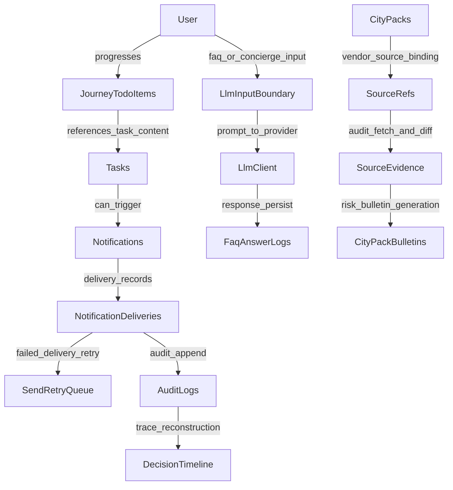

# PROJECT_DATA_RELATION_MAP

- generatedAt: 2026-03-08T03:08:07.132Z
- gitCommit: 8bae8342b36e44b086956dc2e1ec93d72398e0a5
- branch: codex/knowledge-graph-v2-finalize
- sourceDigest: abc077ebe50af3043a56474579a2842968ebd435af568f87aadc09d56fba3eb4
- runtime.cloudRun: OBSERVED_RUNTIME
- runtime.secretManager: OBSERVED_RUNTIME
- runtime.firestore: OBSERVED_RUNTIME

## Overview
This map explains the canonical project data path with City Pack vendor flow, notification generation, LLM boundaries, and evidence reconstruction anchors.

## Graph

## Core Relations
| From | To | Relation | Evidence |
| --- | --- | --- | --- |
| User | JourneyTodoItems | progresses | src/routes/webhookLine.js:2399 src/repos/firestore/journeyTodoItemsRepo.js:1 |
| JourneyTodoItems | Tasks | references_task_content | src/repos/firestore/taskContentsRepo.js:1 src/usecases/tasks/computeUserTasks.js:1 |
| Tasks | Notifications | can_trigger | src/usecases/notifications/createNotification.js:1 src/routes/admin/osNotifications.js:1 |
| Notifications | NotificationDeliveries | delivery_records | src/usecases/notifications/sendNotification.js:1 src/repos/firestore/deliveriesRepo.js:1 |
| NotificationDeliveries | SendRetryQueue | failed_delivery_retry | src/usecases/phase68/executeSegmentSend.js:540 src/usecases/phase73/retryQueuedSend.js:22 |
| NotificationDeliveries | AuditLogs | audit_append | src/repos/firestore/auditLogsRepo.js:1 |
| AuditLogs | DecisionTimeline | trace_reconstruction | src/repos/firestore/decisionTimelineRepo.js:1 src/repos/firestore/auditLogsRepo.js:36 |
| CityPacks | SourceRefs | vendor_source_binding | src/usecases/cityPack/runCityPackDraftJob.js:159 src/repos/firestore/sourceRefsRepo.js:1 |
| SourceRefs | SourceEvidence | audit_fetch_and_diff | src/usecases/cityPack/runCityPackSourceAuditJob.js:249 src/repos/firestore/sourceEvidenceRepo.js:1 |
| SourceEvidence | CityPackBulletins | risk_bulletin_generation | src/usecases/cityPack/runCityPackSourceAuditJob.js:399 src/repos/firestore/cityPackBulletinsRepo.js:1 |
| User | LlmInputBoundary | faq_or_concierge_input | src/routes/phaseLLM4FaqAnswer.js:1 src/usecases/llm/buildLlmInputView.js:1 |
| LlmInputBoundary | LlmClient | prompt_to_provider | src/infra/llmClient.js:46 src/infra/llmClient.js:69 |
| LlmClient | FaqAnswerLogs | response_persist | src/usecases/faq/answerFaqFromKb.js:1 src/repos/firestore/faqAnswerLogsRepo.js:1 |

## Notes
- Notification generation path is anchored by `osNotifications -> create/approve -> sendNotification -> notification_deliveries`.
- City Pack and vendor linkage is anchored by `city_packs -> source_refs -> source_evidence -> city_pack_bulletins`.
- LLM path is anchored by `buildLlmInputView -> llmClient -> faqAnswerLogs/llmUsageLogs`.
- Trace reconstruction is anchored by `traceId` across webhook, audit_logs, decision_timeline, and delivery rows.
