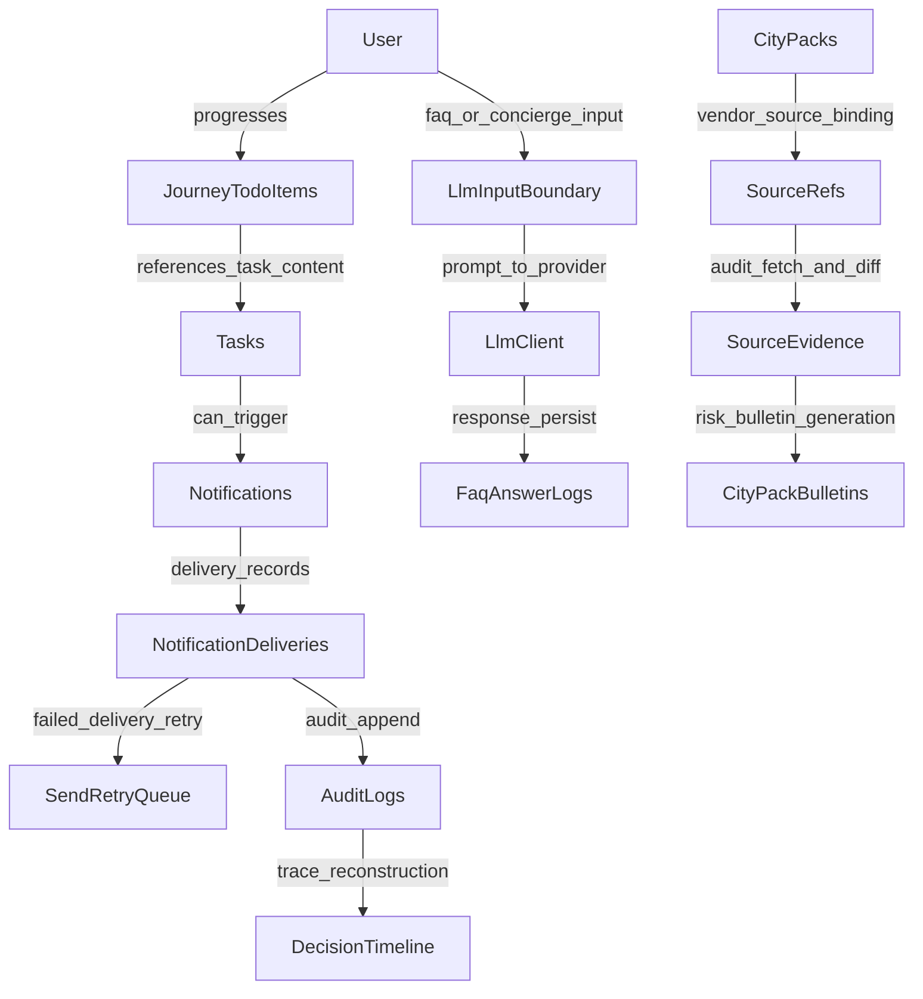

# PROJECT_DATA_SCHEMA_GRAPH

- generatedAt: 2026-03-08T02:42:23.550Z
- gitCommit: 746298fa07a773f7a9e066c29481c8c44c9ca081
- branch: main
- sourceDigest: c397ec60bcaa3c38e83a8a1a404a0c1861bcdcf50abe8ff0ff9cf730041f2d71
- runtime.cloudRun: OBSERVED_RUNTIME
- runtime.secretManager: OBSERVED_RUNTIME
- runtime.firestore: OBSERVED_RUNTIME

## Mermaid


## Machine Readable
```json
{
  "nodes": [
    {
      "id": "User",
      "label": "User"
    },
    {
      "id": "JourneyTodoItems",
      "label": "JourneyTodoItems"
    },
    {
      "id": "Tasks",
      "label": "Tasks"
    },
    {
      "id": "Notifications",
      "label": "Notifications"
    },
    {
      "id": "NotificationDeliveries",
      "label": "NotificationDeliveries"
    },
    {
      "id": "SendRetryQueue",
      "label": "SendRetryQueue"
    },
    {
      "id": "AuditLogs",
      "label": "AuditLogs"
    },
    {
      "id": "DecisionTimeline",
      "label": "DecisionTimeline"
    },
    {
      "id": "CityPacks",
      "label": "CityPacks"
    },
    {
      "id": "SourceRefs",
      "label": "SourceRefs"
    },
    {
      "id": "SourceEvidence",
      "label": "SourceEvidence"
    },
    {
      "id": "CityPackBulletins",
      "label": "CityPackBulletins"
    },
    {
      "id": "LlmInputBoundary",
      "label": "LlmInputBoundary"
    },
    {
      "id": "LlmClient",
      "label": "LlmClient"
    },
    {
      "id": "FaqAnswerLogs",
      "label": "FaqAnswerLogs"
    }
  ],
  "edges": [
    {
      "from": "User",
      "to": "JourneyTodoItems",
      "relation": "progresses",
      "evidence": [
        "src/routes/webhookLine.js:2399",
        "src/repos/firestore/journeyTodoItemsRepo.js:1"
      ],
      "evidenceIds": [
        "E1",
        "E2"
      ]
    },
    {
      "from": "JourneyTodoItems",
      "to": "Tasks",
      "relation": "references_task_content",
      "evidence": [
        "src/repos/firestore/taskContentsRepo.js:1",
        "src/usecases/tasks/computeUserTasks.js:1"
      ],
      "evidenceIds": [
        "E3",
        "E4"
      ]
    },
    {
      "from": "Tasks",
      "to": "Notifications",
      "relation": "can_trigger",
      "evidence": [
        "src/usecases/notifications/createNotification.js:1",
        "src/routes/admin/osNotifications.js:1"
      ],
      "evidenceIds": [
        "E5",
        "E6"
      ]
    },
    {
      "from": "Notifications",
      "to": "NotificationDeliveries",
      "relation": "delivery_records",
      "evidence": [
        "src/usecases/notifications/sendNotification.js:1",
        "src/repos/firestore/deliveriesRepo.js:1"
      ],
      "evidenceIds": [
        "E7",
        "E8"
      ]
    },
    {
      "from": "NotificationDeliveries",
      "to": "SendRetryQueue",
      "relation": "failed_delivery_retry",
      "evidence": [
        "src/usecases/phase68/executeSegmentSend.js:540",
        "src/usecases/phase73/retryQueuedSend.js:22"
      ],
      "evidenceIds": [
        "E9",
        "E10"
      ]
    },
    {
      "from": "NotificationDeliveries",
      "to": "AuditLogs",
      "relation": "audit_append",
      "evidence": [
        "src/repos/firestore/auditLogsRepo.js:1"
      ],
      "evidenceIds": [
        "E11"
      ]
    },
    {
      "from": "AuditLogs",
      "to": "DecisionTimeline",
      "relation": "trace_reconstruction",
      "evidence": [
        "src/repos/firestore/decisionTimelineRepo.js:1",
        "src/repos/firestore/auditLogsRepo.js:36"
      ],
      "evidenceIds": [
        "E12",
        "E13"
      ]
    },
    {
      "from": "CityPacks",
      "to": "SourceRefs",
      "relation": "vendor_source_binding",
      "evidence": [
        "src/usecases/cityPack/runCityPackDraftJob.js:159",
        "src/repos/firestore/sourceRefsRepo.js:1"
      ],
      "evidenceIds": [
        "E14",
        "E15"
      ]
    },
    {
      "from": "SourceRefs",
      "to": "SourceEvidence",
      "relation": "audit_fetch_and_diff",
      "evidence": [
        "src/usecases/cityPack/runCityPackSourceAuditJob.js:249",
        "src/repos/firestore/sourceEvidenceRepo.js:1"
      ],
      "evidenceIds": [
        "E16",
        "E17"
      ]
    },
    {
      "from": "SourceEvidence",
      "to": "CityPackBulletins",
      "relation": "risk_bulletin_generation",
      "evidence": [
        "src/usecases/cityPack/runCityPackSourceAuditJob.js:399",
        "src/repos/firestore/cityPackBulletinsRepo.js:1"
      ],
      "evidenceIds": [
        "E18",
        "E19"
      ]
    },
    {
      "from": "User",
      "to": "LlmInputBoundary",
      "relation": "faq_or_concierge_input",
      "evidence": [
        "src/routes/phaseLLM4FaqAnswer.js:1",
        "src/usecases/llm/buildLlmInputView.js:1"
      ],
      "evidenceIds": [
        "E20",
        "E21"
      ]
    },
    {
      "from": "LlmInputBoundary",
      "to": "LlmClient",
      "relation": "prompt_to_provider",
      "evidence": [
        "src/infra/llmClient.js:46",
        "src/infra/llmClient.js:69"
      ],
      "evidenceIds": [
        "E22",
        "E23"
      ]
    },
    {
      "from": "LlmClient",
      "to": "FaqAnswerLogs",
      "relation": "response_persist",
      "evidence": [
        "src/usecases/faq/answerFaqFromKb.js:1",
        "src/repos/firestore/faqAnswerLogsRepo.js:1"
      ],
      "evidenceIds": [
        "E24",
        "E25"
      ]
    }
  ],
  "evidence": {
    "E1": "src/routes/webhookLine.js:2399",
    "E2": "src/repos/firestore/journeyTodoItemsRepo.js:1",
    "E3": "src/repos/firestore/taskContentsRepo.js:1",
    "E4": "src/usecases/tasks/computeUserTasks.js:1",
    "E5": "src/usecases/notifications/createNotification.js:1",
    "E6": "src/routes/admin/osNotifications.js:1",
    "E7": "src/usecases/notifications/sendNotification.js:1",
    "E8": "src/repos/firestore/deliveriesRepo.js:1",
    "E9": "src/usecases/phase68/executeSegmentSend.js:540",
    "E10": "src/usecases/phase73/retryQueuedSend.js:22",
    "E11": "src/repos/firestore/auditLogsRepo.js:1",
    "E12": "src/repos/firestore/decisionTimelineRepo.js:1",
    "E13": "src/repos/firestore/auditLogsRepo.js:36",
    "E14": "src/usecases/cityPack/runCityPackDraftJob.js:159",
    "E15": "src/repos/firestore/sourceRefsRepo.js:1",
    "E16": "src/usecases/cityPack/runCityPackSourceAuditJob.js:249",
    "E17": "src/repos/firestore/sourceEvidenceRepo.js:1",
    "E18": "src/usecases/cityPack/runCityPackSourceAuditJob.js:399",
    "E19": "src/repos/firestore/cityPackBulletinsRepo.js:1",
    "E20": "src/routes/phaseLLM4FaqAnswer.js:1",
    "E21": "src/usecases/llm/buildLlmInputView.js:1",
    "E22": "src/infra/llmClient.js:46",
    "E23": "src/infra/llmClient.js:69",
    "E24": "src/usecases/faq/answerFaqFromKb.js:1",
    "E25": "src/repos/firestore/faqAnswerLogsRepo.js:1"
  }
}
```

## Evidence Index
| Evidence ID | Evidence |
| --- | --- |
| E1 | src/routes/webhookLine.js:2399 |
| E10 | src/usecases/phase73/retryQueuedSend.js:22 |
| E11 | src/repos/firestore/auditLogsRepo.js:1 |
| E12 | src/repos/firestore/decisionTimelineRepo.js:1 |
| E13 | src/repos/firestore/auditLogsRepo.js:36 |
| E14 | src/usecases/cityPack/runCityPackDraftJob.js:159 |
| E15 | src/repos/firestore/sourceRefsRepo.js:1 |
| E16 | src/usecases/cityPack/runCityPackSourceAuditJob.js:249 |
| E17 | src/repos/firestore/sourceEvidenceRepo.js:1 |
| E18 | src/usecases/cityPack/runCityPackSourceAuditJob.js:399 |
| E19 | src/repos/firestore/cityPackBulletinsRepo.js:1 |
| E2 | src/repos/firestore/journeyTodoItemsRepo.js:1 |
| E20 | src/routes/phaseLLM4FaqAnswer.js:1 |
| E21 | src/usecases/llm/buildLlmInputView.js:1 |
| E22 | src/infra/llmClient.js:46 |
| E23 | src/infra/llmClient.js:69 |
| E24 | src/usecases/faq/answerFaqFromKb.js:1 |
| E25 | src/repos/firestore/faqAnswerLogsRepo.js:1 |
| E3 | src/repos/firestore/taskContentsRepo.js:1 |
| E4 | src/usecases/tasks/computeUserTasks.js:1 |
| E5 | src/usecases/notifications/createNotification.js:1 |
| E6 | src/routes/admin/osNotifications.js:1 |
| E7 | src/usecases/notifications/sendNotification.js:1 |
| E8 | src/repos/firestore/deliveriesRepo.js:1 |
| E9 | src/usecases/phase68/executeSegmentSend.js:540 |
