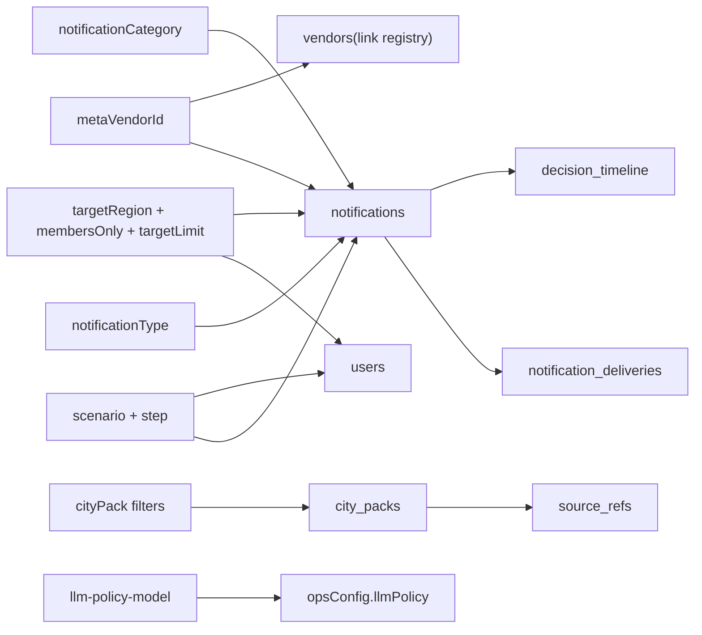

# UI_PARAMETER_RELATIONS

- generatedAt: 2026-03-11T23:59:00-05:00
- scope: canonical Admin shell parameters only (`apps/admin/app.html` + `apps/admin/assets/admin_app.js`)
- method: DOM id -> payload builder -> API endpoint -> route/usecase/repo

## Parameter Graph

| Parameter | UI Control (DOM) | Entity | Relation | Operation/API | Evidence |
| --- | --- | --- | --- | --- | --- |
| `notificationType` | `#notificationType` | `notifications.notificationType` | composer input -> draft payload field | `POST /api/admin/os/notifications/draft` | `apps/admin/app.html:710-712` / `apps/admin/assets/admin_app.js:14299-14324` / `src/routes/admin/osNotifications.js:122-133` / `src/usecases/notifications/createNotification.js:201-206,225` |
| `scenario` | `#scenarioKey` | `notifications.scenarioKey`, `users.scenarioKey` | campaign key + target selection key | `draft/preview/send` | `apps/admin/app.html:848-850` / `apps/admin/assets/admin_app.js:14308` / `src/usecases/adminOs/planNotificationSend.js:116-123` / `src/repos/firestore/usersRepo.js:135-137` |
| `step` | `#stepKey` | `notifications.stepKey`, `users.stepKey` | workflow step key | `draft/preview/send` | `apps/admin/app.html:857-859` / `apps/admin/assets/admin_app.js:14309` / `src/usecases/notifications/createNotification.js:168-172,221` / `src/repos/firestore/usersRepo.js:136-137` |
| `area` | `#targetRegion` + city filters | `notifications.target.region`, `users.regionKey/regionCity` | delivery region filter | `send plan/execute`, users list | `apps/admin/app.html:871-872,2495-2496` / `apps/admin/assets/admin_app.js:14337,2314-2317` / `src/usecases/adminOs/planNotificationSend.js:114-121` / `docs/knowledge-graph/runtime_probe.json:2207-2211` |
| `cityPack` | city pack pane filters / IDs | `city_packs.id`, `source_refs.usedByCityPackIds` | pack object + source linkage | `GET/POST /api/admin/city-packs*` | `apps/admin/app.html:2364,2488-2542` / `src/routes/admin/cityPacks.js:195-207,366-399,490-559` / `src/usecases/cityPack/activateCityPack.js:131-133` / `docs/knowledge-graph/runtime_probe.json:1286-1312,2008-2032` |
| `vendor` | `#metaVendorId` + vendor filters | `notifications.notificationMeta.vendorId`, link registry rows | vendor scoped messaging/review | `draft`, `/api/admin/vendors*` | `apps/admin/app.html:820-821,3698-3727` / `src/usecases/notifications/createNotification.js:206-213` / `src/routes/admin/vendors.js:66-82,203-227` |
| `audience` | `#membersOnly`, `#targetLimit` | `notifications.target.membersOnly/limit` | target cohort/volume constraint | `send plan/execute` | `apps/admin/app.html:875-879` / `apps/admin/assets/admin_app.js:14328-14340` / `src/routes/admin/osNotifications.js:64-79` / `src/usecases/adminOs/planNotificationSend.js:112-122` |
| `category` | `#notificationCategory` | `notifications.notificationCategory` | policy + analytics category | draft/list/filter | `apps/admin/app.html:767-768` / `apps/admin/assets/admin_app.js:14310` / `src/usecases/notifications/createNotification.js:199,224` / `src/routes/admin/osNotifications.js:333-339` |
| `status` | saved list/status filters across panes | `notifications.status`, `city_packs.status`, vendor health/status | lifecycle state filtering | list/read/update | `apps/admin/app.html:2501-2502,3706-3707,971` / `src/routes/admin/osNotifications.js:303-332` / `src/repos/firestore/notificationsRepo.js:61` / `src/repos/firestore/cityPacksRepo.js:435` / `src/routes/admin/vendors.js:229-245` |
| `llmSource` | `#llm-policy-model` (+ llm policy controls) | `opsConfig.llmPolicy.model` | model/provider choice for admin LLM policy | `/api/admin/llm/policy/*` | `apps/admin/app.html:4326,4390-4393` / `src/routes/admin/llmPolicyConfig.js:152-200,202-304` |

## Supporting Parameters (Observed)

| Parameter | UI Control | Entity | Relation | Evidence |
| --- | --- | --- | --- | --- |
| `linkRegistryId` | `#linkRegistryId`, `#secondaryLinkRegistryId1`, `#secondaryLinkRegistryId2` | `notifications.linkRegistryId`, `notifications.secondaryCtas[].linkRegistryId` | CTA destination binding | `apps/admin/app.html:758,742,752` / `src/usecases/notifications/createNotification.js:181-192,219` |
| `metaAbVariants` | `#metaAbVariants` | `notifications.notificationMeta` | AB option metadata | `apps/admin/app.html:832-833` / `src/usecases/notifications/createNotification.js:202` |
| `planHash` | hidden workflow state | `audit_logs(templateKey)` + execute guard | plan/execute consistency key | `apps/admin/assets/admin_app.js:15271-15274` / `src/usecases/adminOs/planNotificationSend.js:130-136` / `src/usecases/adminOs/executeNotificationSend.js:119-128` |
| `confirmToken` | hidden workflow state | signed confirm token | irreversible send guard | `apps/admin/assets/admin_app.js:15273-15274` / `src/usecases/adminOs/planNotificationSend.js:131-136` / `src/usecases/adminOs/executeNotificationSend.js:159-163` |

## Parameter Relationship Graph (Mermaid)

## Unobserved / Not Directly Bound
- `audience` は単独の DOM id は未観測。現実装では `membersOnly + targetLimit (+ scenario/step)` の合成で表現される（`apps/admin/app.html:875-879`, `apps/admin/assets/admin_app.js:14327-14340`）。
- `llmSource` は文言としての単一キー未観測。`llm-policy-model` が実質パラメータ。

